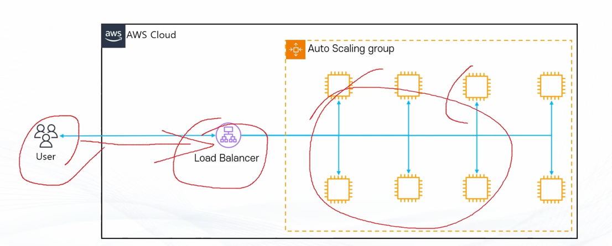
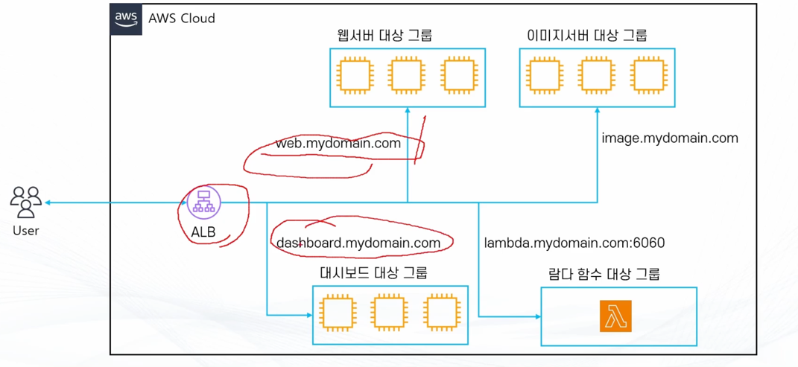
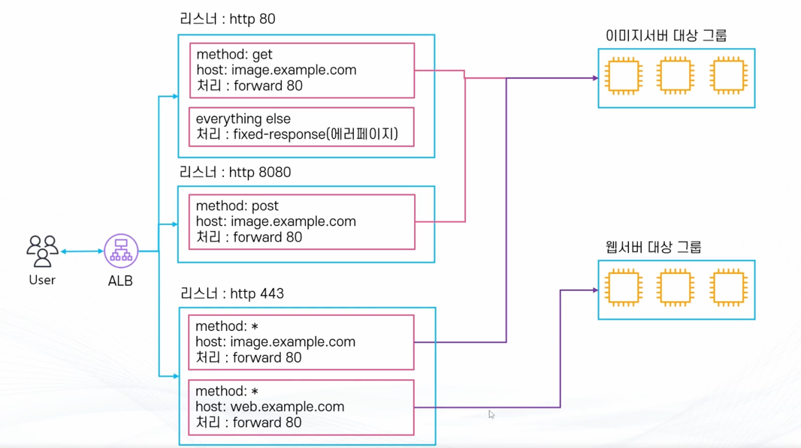

# 35. Elastic Load Balancer (ELB)

- EC2 인스턴스가 트래픽 못받을 때는 ELB가 트래픽 전송 안 함 (느슨한 연결)
    - 클라이언트는 뒷단에서 무슨 일이 일어나는지 모르므로 클라이언트 변경 불필요.

## ELB

- 다수의 EC2에 트래픽을 분산 시켜주는 서비스
- 총 4가지 종류
  - Application Load Balancer
  - Network Load Balancer
  - Classic Load Balancer
  - Gateway Load Balancer
- Health Check: 직접 트래픽을 발생시켜 인스턴스가 살아있는지 체크
- Autoscaling 과 연동 가능
- 지속적으로 IP 주소가 바뀌며 IP 고정 불가능: **항상 도메인 기반으로 사용**

## ELB 종류

### Application Load Balancer

- 똑똑한 녀석
- OSI Model Layer 7
- 트래픽을 모니터링 하여 라우팅 가능
    - 예: image.sample.com -> 이미지 서버로, web.sample.com->웹 서버로 트래픽 분산

### Network Load Balancer

- 빠른 녀석
- OSI Model Layer 4
- TCP, UDP 기반 빠른 트래픽 분산
- Elastic IP 할당 가능(IP 고정 가능).

### Classic Load Balancer

- 옛날 녀석
- 예전에 사용되던 타입으로 현재는 잘 사용하지 않음

### Gateway Load Balancer

- 먼저 트래픽 체크하는 녀석
- OSI Layer 3
- 가상 어플라이언스 배포/확장 관리를 위한 서비스

# 대상 그룹(Target Group)

## 대상 그룹이란?

- ELB가 라우팅 할 대상의 집합
- 구성
    - 대상 종류
        - Instance
        - IP
        - Lambda
        - ALB
    - 프로토콜(HTTP, HTTPS, gRPC,TCP등)
    - 기타 설정
        - 트래픽 분산 알고리즘, 고정 세션 등

# 리스너

## 리스너

- ALB로 들어오는 요청을 처리하는 주체
    - 들어오는 트래픽의 프로토콜 + 포트 단위
- 규칙(Rule)으로 ALB에서 어떤 요청을 받을지, 요청을 어떻게 어디로 처리 할지 결정
    - 예: http : 8080 포트로 트래픽을 받아서 A 대상그룹의 80번 포트로 배분
    - 예: https 프로토콜(443) 포트로 트래픽을 받아 B 대상그룹의 80번 포트로 배분
    - 예: http post 요청이 들어왔을 경우 지정된 응답 전달(에러페이지 등)
- 규칙을 활용해 다양한 조건에 따라 트래픽 배분 가능
    - 활용 가능한 조건 : Header, QueryString, source IP, Method 등
- 들어온 트래픽 처리 방식 : forward, redirect , fixed-response, cognito 인증 등