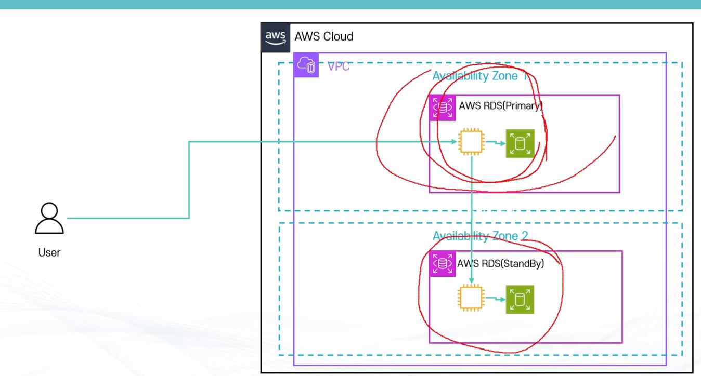

# RDS와 EC2

- 내부에서는 EC2를 활용
- VPC안에서 동작 
  - 기본적으로 Public IP를 부여하지 않으면 외부에서 접근 불가능
  - 설정에 따라 Public IP 부여하여 인터넷에서 접근 가능(DNS 로 접근)
- 서브넷과 보안그룹 지정 필요
- EC2 타입의 지정 필요
- 스토리지는 EBS를 활용
  -  EBS 타입 및 용량 선택 필요
- 중지 가능. **단 7일 후에 다시 시작됨** ⚠️
- 이외에 백업으로 스냅샷 생성 가능
- 별도로 Reserved Instance 구매 가능

# RDS 아키텍처

# RDS 인증 방식

- 전통적인 유저/패스워드 방식
  - AWS Secrets Mananger와 연동하여 자동 로테이션 가능
- IAM DB 인증
 -  