> 25.07.23(수)

# 이슈 상황

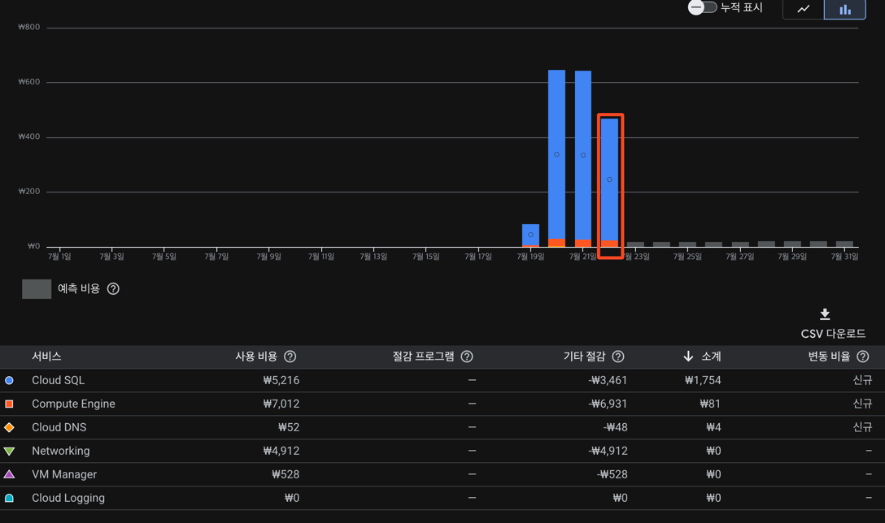

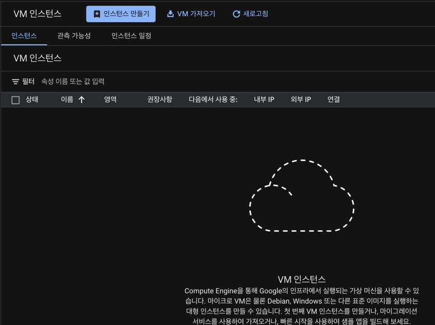

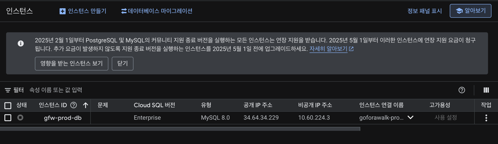

- 활성 상태의 Compute Engine, SQL 인스턴스가 없는데도 불구하고, 비용 발생
- 예약 중인 외부 IP도 없고, 사용중인 `Compute Engine > 스토리지 > 디스크`도 없음.

# 원인

## 1. 디스크 스냅샷

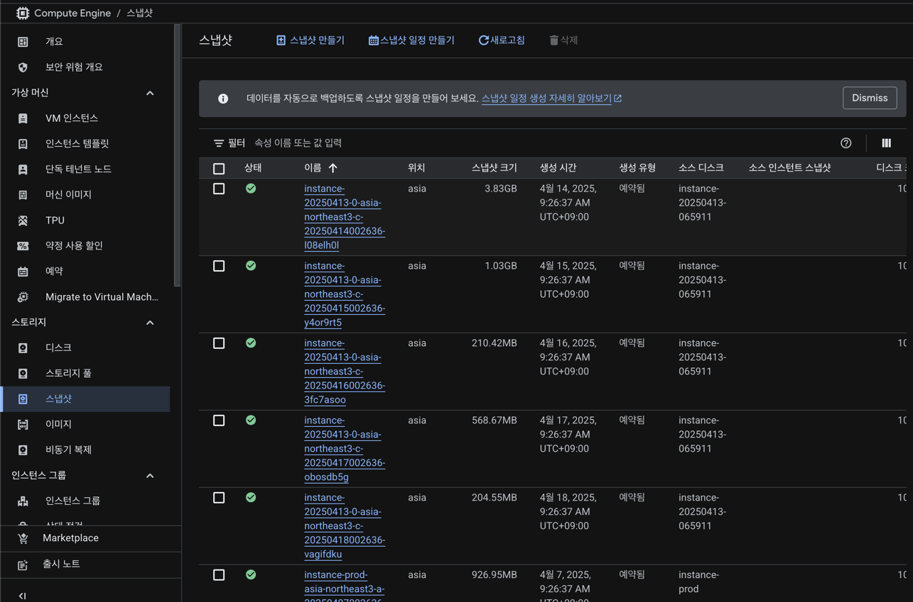

- 저장된 디스크 스냅샷(=VM의 특정 시점의 백업) 삭제.

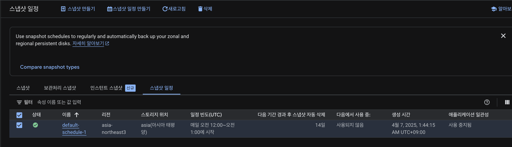

- 스냅샷 일정 삭제.

## 2. SQL 인스턴스의 삭제가 아니라 중지 상태

- 클라우드 리소스는 실행 중이 아니더라도 프로비저닝(할당)되어 있는 상태만으로도 비용이 발생할 수 있음.
- Cloud SQL 인스턴스는 **'중지'하더라도 데이터를 보관하는 스토리지(영구 디스크)와 예약된 공개 IP 주소에 대한 비용이 계속 청구**됨. 
- 중지 시에는 vCPU와 메모리 사용 요금만 부과되지 않음.

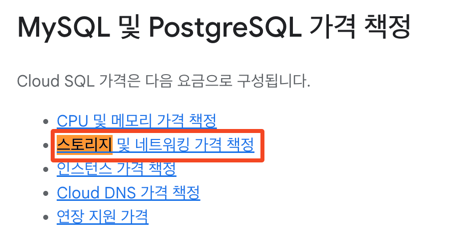

> [Cloud SQL 가격 정보](https://cloud.google.com/sql/pricing?_gl=1*1bvb1n8*_up*MQ..&gclid=Cj0KCQjwkILEBhDeARIsAL--pjy9ywDnYVmIz_GjbsS88HS2mVoTz_KGZrLLFaX4UBd9kiKhcLeOanYaAoMKEALw_wcB&gclsrc=aw.ds)

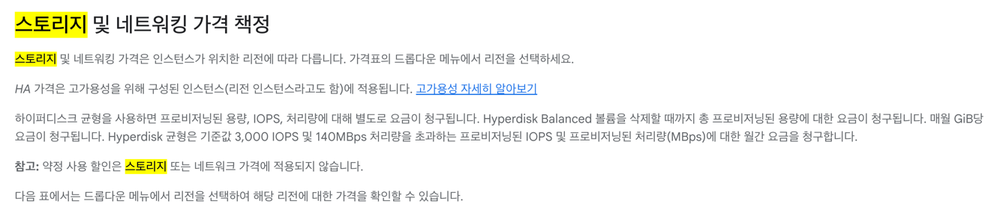

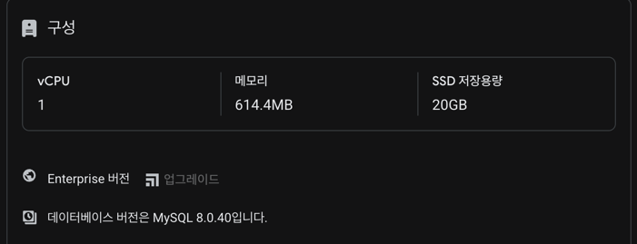

- SQL의 SSD 디스크는 20GB 였고, asia-northeast3 에 프로비저닝 되어있으므로,
  - 시간 당 $0.00030274 가 부가되었고, 20GB에 대한 일 요금을 계산하면,
  - 20GB * \$0.00030274 * 24시간 = \$0.1453128 = 약 200

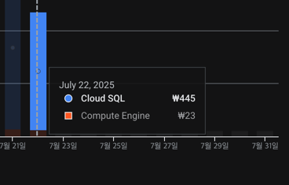

- 그런데 22일 하루에 445원이 청구되었다?

### 유휴 상태의 인스턴스에 대한 공개 IP에 대한 요금

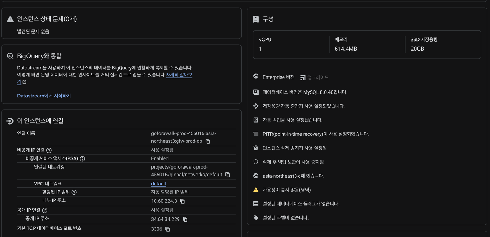

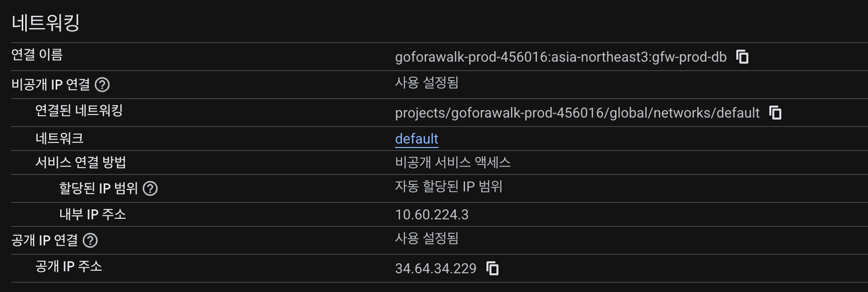

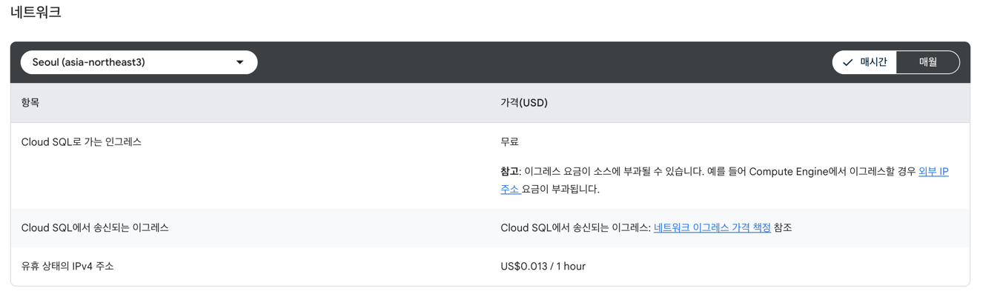

- \$0.013 * 24 = \$0.312 = 427.44원 (환율 1370원 기준)

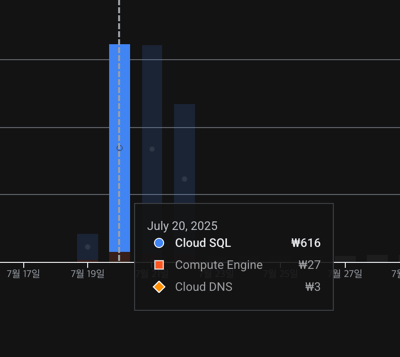

- 7월 20일 616원 부과.

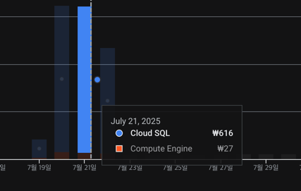

- 7월 21일 616원 부과.

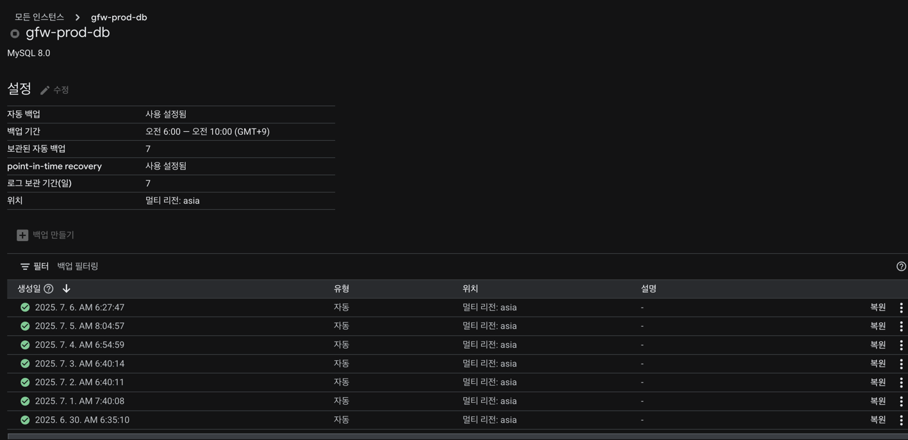

## 결과

