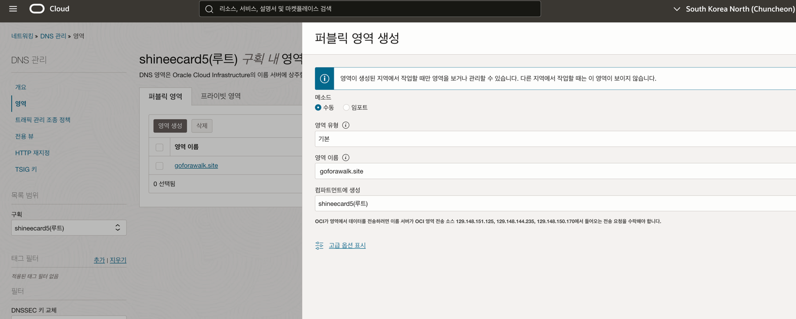
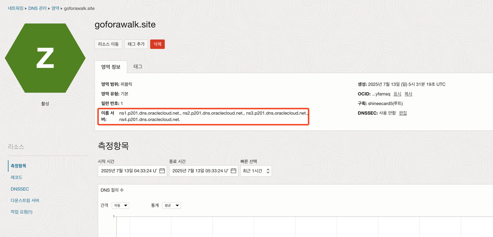
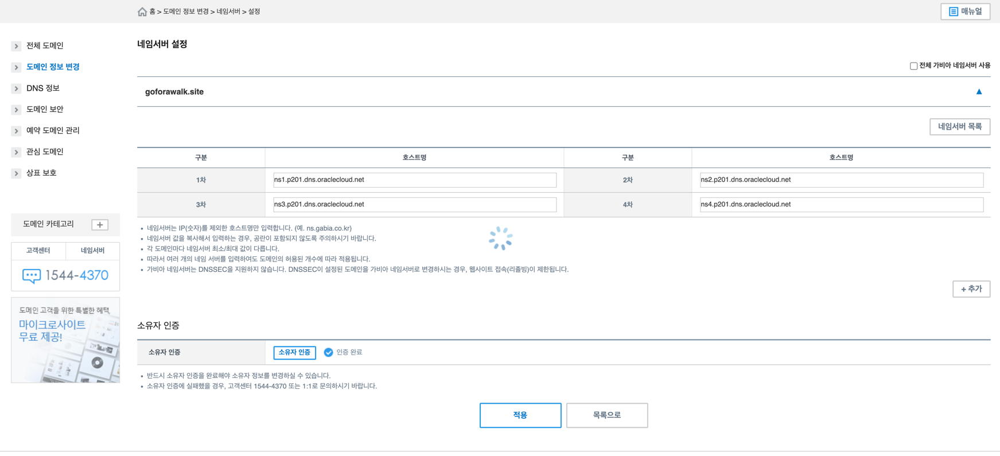
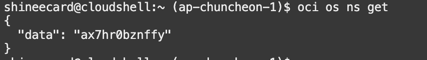

> _[OCI Certificates - Let’s Encrypt로 생성한 인증서를 OCI 인증서 서비스에 Import 하기](https://team-okitoki.github.io/cloudnative/oci-certificate-import-letsencrypt-cert/) 실습_

> 🔥 이 글의 핵심
> 
> - **_OCI의 DNS 서비스를 이용해 Let's Encrypt의 소유권 인증을 자동화_**

## 사전 준비 사항

- Public 도메인
- Oracle Cloud Infrastructure 계정
- OCI Compute VM (Oracle Linux 8.x)

## DNS 영역 생성



1. **네트워킹 > DNS 관리 > 영역** 이동 후 퍼블릭 영역 생성.
2. 영역 생성 완료 후 네임 서버 확인.



3. 가비아 네임서버 변경.
   - 도메인과 연관된 정보를 가비아에서 오라클로 변경.
   - "내 도메인의 IP 주소가 어디인지 궁금해? 이제부터 가비아가 아니라 오라클한테 물어봐!"라고 도메인의 '주소 안내원'을 바꾸는 과정.



4. 변경한 DNS 정보가 적용되었는지 dnschecker를 통해 확인.

> https://dnschecker.org/

```
> dig NS goforawalk.site

; <<>> DiG 9.10.6 <<>> NS goforawalk.site
;; global options: +cmd
;; Got answer:
;; ->>HEADER<<- opcode: QUERY, status: NOERROR, id: 56834
;; flags: qr rd ra; QUERY: 1, ANSWER: 4, AUTHORITY: 0, ADDITIONAL: 9

;; OPT PSEUDOSECTION:
; EDNS: version: 0, flags:; udp: 1232
;; QUESTION SECTION:
;goforawalk.site.		IN	NS

;; ANSWER SECTION:
goforawalk.site.	3600	IN	NS	ns2.p201.dns.oraclecloud.net.
goforawalk.site.	3600	IN	NS	ns3.p201.dns.oraclecloud.net.
goforawalk.site.	3600	IN	NS	ns4.p201.dns.oraclecloud.net.
goforawalk.site.	3600	IN	NS	ns1.p201.dns.oraclecloud.net.

;; ADDITIONAL SECTION:
ns1.p201.dns.oraclecloud.net. 1746 IN	A	108.59.166.201
ns2.p201.dns.oraclecloud.net. 1746 IN	A	108.59.168.201
ns3.p201.dns.oraclecloud.net. 1757 IN	A	108.59.170.201
ns4.p201.dns.oraclecloud.net. 1757 IN	A	108.59.172.201
ns1.p201.dns.oraclecloud.net. 1746 IN	AAAA	2600:2000:2100::c9
ns2.p201.dns.oraclecloud.net. 1746 IN	AAAA	2600:2000:2110::c9
ns3.p201.dns.oraclecloud.net. 1757 IN	AAAA	2600:2000:2120::c9
ns4.p201.dns.oraclecloud.net. 1757 IN	AAAA	2600:2000:2130::c9

;; Query time: 46 msec
;; SERVER: 168.126.63.1#53(168.126.63.1)
;; WHEN: Sun Jul 13 15:07:57 KST 2025
;; MSG SIZE  rcvd: 316
```

- OCI CLI 설정이 잘 되었는지 확인하기 위해 아래와 같이 tenancy namespace 정보를 조회



### 인증서 발급

```shell
(certbot_env) shineecard@cloudshell:.oci (ap-chuncheon-1)$ certbot certonly --config-dir ~/config --work-dir ~/work --logs-dir ~/logs --authenticator dns-oci --dns-oci-propagation-seconds 120 -d goforawalk.site
Saving debug log to /home/shineecard/logs/letsencrypt.log
Requesting a certificate for goforawalk.site
Waiting 120 seconds for DNS changes to propagate

Successfully received certificate.
Certificate is saved at: /home/shineecard/config/live/goforawalk.site/fullchain.pem
Key is saved at:         /home/shineecard/config/live/goforawalk.site/privkey.pem
This certificate expires on 2025-10-11.
These files will be updated when the certificate renews.

NEXT STEPS:
- The certificate will need to be renewed before it expires. Certbot can automatically renew the certificate in the background, but you may need to take steps to enable that functionality. See https://certbot.org/renewal-setup for instructions.

- - - - - - - - - - - - - - - - - - - - - - - - - - - - - - - - - - - - - - - -
If you like Certbot, please consider supporting our work by:
 * Donating to ISRG / Let's Encrypt:   https://letsencrypt.org/donate
 * Donating to EFF:                    https://eff.org/donate-le
- - - - - - - - - - - - - - - - - - - - - - - - - - - - - - - - - - - - - - - -
```

```shell
(certbot_env) shineecard@cloudshell:goforawalk.site (ap-chuncheon-1)$ pwd
/home/shineecard/config/live/goforawalk.site
(certbot_env) shineecard@cloudshell:goforawalk.site (ap-chuncheon-1)$ ls -alt
total 4
drwxr-xr-x. 2 shineecard oci  93 Jul 13 06:38 .
drwx------. 3 shineecard oci  43 Jul 13 06:38 ..
lrwxrwxrwx. 1 shineecard oci  39 Jul 13 06:38 cert.pem -> ../../archive/goforawalk.site/cert1.pem
lrwxrwxrwx. 1 shineecard oci  40 Jul 13 06:38 chain.pem -> ../../archive/goforawalk.site/chain1.pem
lrwxrwxrwx. 1 shineecard oci  44 Jul 13 06:38 fullchain.pem -> ../../archive/goforawalk.site/fullchain1.pem
lrwxrwxrwx. 1 shineecard oci  42 Jul 13 06:38 privkey.pem -> ../../archive/goforawalk.site/privkey1.pem
-rw-r--r--. 1 shineecard oci 692 Jul 13 06:38 README
```

- 주의: 발급할 때 와일드카드 포함해서 발급해라.

- cert.pem : 요청한 도메인에 대한 인증서 파일 (Certificate)
- chain.pem : 인증서 검증을 위한 체인 파일
- isrgrootx1.txt : root_ca Let’s Encrypt의 root ca 파일 Root CA 파일 다운로드
- privkey.pem : 생성한 인증서 파일에 대한 개인키 파일
  certbot certonly --config-dir ~/config --work-dir ~/work --logs-dir ~/logs --authenticator dns-oci --dns-oci-propagation-seconds 60 -d '*.goforawalk.site' -d goforawalk.site