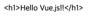

<!-- TOC -->
* [3.1 뷰 애플리케이션 기본 구조](#31-뷰-애플리케이션-기본-구조)
  * [3.1.1 package.json](#311-packagejson)
  * [3.1.2 index.html](#312-indexhtml)
  * [3.1.3 main.js](#313-mainjs)
  * [3.1.4 App.vue](#314-appvue)
* [3.2 뷰 애플리케이션 인스턴스](#32-뷰-애플리케이션-인스턴스)
  * [3.2.1 인스턴스란](#321-인스턴스란)
  * [3.2.2 인스턴스의 구성요소](#322-인스턴스의-구성요소)
  * [3.2.3 SFC의 구조](#323-sfc의-구조)
* [3.3 기본 문법 다루기](#33-기본-문법-다루기)
  * [3.3.1 뷰 애플리케이션 생성하기](#331-뷰-애플리케이션-생성하기)
  * [3.3.2 옵션스 API 사용하기](#332-옵션스-api-사용하기)
  * [3.3.3 데이터 정의하기](#333-데이터-정의하기)
  * [3.3.4 데이터 보간 사용하기](#334-데이터-보간-사용하기)
  * [3.3.5 디렉티브 사용하기](#335-디렉티브-사용하기)
* [3.4 이벤트 다루기](#34-이벤트-다루기)
  * [3.4.1 v-on 디렉티브와 methods 옵션 속성으로 이벤트 연결하기](#341-v-on-디렉티브와-methods-옵션-속성으로-이벤트-연결하기)
  * [3.4.2 이벤트 객체 사용하기](#342-이벤트-객체-사용하기-)
  * [3.4.3 수식어 사용하기](#343-수식어-사용하기)
  * [3.4.4 이벤트와 반응성](#344-이벤트와-반응성)
* [3.5 폼 다루기](#35-폼-다루기)
  * [3.5.1 폼 이해하기](#351-폼-이해하기)
  * [3.5.2 v-model 디렉티브로 폼 요소 다루기](#352-v-model-디렉티브로-폼-요소-다루기)
  * [3.5.3 폼 요소와 이벤트](#353-폼-요소와-이벤트)
* [3.6 계산된 속성과 감시자 속성](#36-계산된-속성과-감시자-속성)
  * [3.6.1 계산된 속성](#361-계산된-속성)
  * [3.6.2 감시자 속성](#362-감시자-속성)
* [3.7 스타일 다루기](#37-스타일-다루기)
  * [3.7.1 인라인 스타일](#371-인라인-스타일)
  * [3.7.2 내부 스타일](#372-내부-스타일)
  * [3.7.3 외부 스타일](#373-외부-스타일)
<!-- TOC -->

# 3.1 뷰 애플리케이션 기본 구조

## 3.1.1 package.json

- 뷰 애플리케이션에서 사용하는 기본 정보, 의존성 모듈 정보, 스크립트 명령어 정보 등을 담는다.

```json
{
  "name": "first-vue-project",
  "version": "0.0.0",
  "private": true,
  "type": "module",
  "engines": {
    "node": "^20.19.0 || >=22.12.0"
  },
  "scripts": {
    "dev": "vite",
    "build": "vite build",
    "preview": "vite preview"
  },
  "dependencies": {
    "vue": "^3.5.18"
  },
  "devDependencies": {
    "@vitejs/plugin-vue": "^6.0.1",
    "vite": "^7.0.6",
    "vite-plugin-vue-devtools": "^8.0.0"
  }
}
```

- `name`: 애플리케이션 이름
- `version`: 뷰 애플리케이션 버전
- `private`: 애플리케이션 비공개 여부.
- `scripts`: 
  - 뷰 앱을 빌드하거나 실행할 수 있는 명령어 등록.
  - 여기에 등록된 명령어는 `npm run <명령어>`로 실행할 수 있다.
- `dependencies`: 
  - 뷰 앱 실행 시 필요한 의존성 모듈 정의.
  - 여기에 정의한 모듈은 프로덕션 환경에서도 사용.
- `devDependencies`: 
  - 뷰 앱 개발 시 필요한 의존성 모듈 정의.
  - 여기에 정의한 모듈은 개발환경에서만 필요.

> 뷰 앱 실행 시 npm run dev를 입력했는데, 제대로 실행 안되면 package.json 파일의 `scripts` 속성에 `dev` 명령어가 있는지 확인해보자.

## 3.1.2 index.html

- npm run dev 입력 시 개발서버가 구동된다.
- 개발 서버 구동 시 가장 먼저 index.html 파일을 서버에 로드한다.

```html
<!DOCTYPE html>
<html lang="">
<head>
  <meta charset="UTF-8">
  <link rel="icon" href="/favicon.ico">
  <meta name="viewport" content="width=device-width, initial-scale=1.0">
  <title>Vite App</title>
</head>
<body>
<div id="app"></div>
<script type="module" src="/src/main.js"></script>
</body>
</html>
```

- `<div id="app"></div>`: 뷰 앱은 id가 app인 HTML 요소를 루트 요소로 지정한다.
- `<script type="module" src="/src/main.js"></script>`:
  - 뷰 앱의 핵심인 main.js 모듈을 불러온다.
  - main.js에 작성된 코드를 불러오고, 뷰 앱에서 사용할 패키지, 코드 실행.

## 3.1.3 main.js

- 뷰 앱을 초기화하고, 구성하는 역할.

```js
import './assets/main.css'
``
import { createApp } from 'vue'
import App from './App.vue'

createApp(App).mount('#app')
```

- `import './assets/main.css'`: main.css 파일을 불러와서 컴포넌트에 스타일을 적용.
- `import { createApp } from 'vue'`: 
  - 뷰 패키지에서 함수를 가져온다.
  - 모든 뷰 앱은 하나의 인스턴스를 가지며, 이 인스턴스를 생성하는 함수가 createApp이다.
- `import App from './App.vue'`:
  - App.vue 파일을 불러온다. 이 파일이 루트 컴포넌트가 된다.
- `createApp(App).mount('#app')`:
  - createApp 함수로 뷰 앱 인스턴스를 생성.
  - 매개변수로 루트 컴포넌트인 App을 전달.

---

- npm run dev -> index.html -> main.js -> createApp(App) -> App.vue

## 3.1.4 App.vue

- App.vue 처럼, 확장자가 .vue인 파일을 SFC, 컴포넌트라고 한다.
- App.vue 파일은 뷰 앱의 루트 컴포넌트로, 뷰 앱의 시작점이 된다.

# 3.2 뷰 애플리케이션 인스턴스

## 3.2.1 인스턴스란

- JS에서 인스턴스란, 클래스의 실체화된 객체를 의미.
- 뷰에서 인스턴스를 생성하는 코드는 main.js에 작성한다.

## 3.2.2 인스턴스의 구성요소

- data, methods, render

## 3.2.3 SFC의 구조

- script, template, style
- script: 뷰 앱의 로직을 작성하는 곳.
- template: 뷰 앱의 UI를 작성하는 곳. html.
- style: 뷰 앱의 스타일을 작성하는 곳. css.


# 3.3 기본 문법 다루기

## 3.3.1 뷰 애플리케이션 생성하기

## 3.3.2 옵션스 API 사용하기

```js
<template>

</template>

<script>
export default {}
</script>

<style>

</style>
```

- 옵션스 API: export default 키워드로 내보내는 객체({}) 안에 여러 속성을 사용하는 형태.

## 3.3.3 데이터 정의하기

```vue
<script>
export default {
  data: function() {
    return {};
  },
}
</script>

<script>
export default { 
  data() { // ES6 short name method
    return {};
  },
};
</script>
```

- **data**
  - 컴포넌트 전반에 걸쳐 사용할 값.
  - js에서는 var, let, const로 변수를 선언하지만, 뷰에서는 data 속성 안에 정의.

```vue
<script>
export default {
  data() { // ES6 short name method
    return {
      name: '철수',
      age: 19,
    };
  },
}
</script>
```

- data 옵션 속성의 return 문에 정의된 객체의 속성이 컴포넌트에서 사용할 수 있는 값. 


## 3.3.4 데이터 보간 사용하기

```vue

<template>
<h1>이름 {{ name }}</h1>
<p>나이 {{ age }</p>
</template>

<script>
export default {
  data() { // ES6 short name method
    return {
      name: '철수',
      age: 19,
    };
  },
}
</script>
```

- data에 선언한 데이터 속성은 `<template>` 영역에서 사용 가능(=뷰의 text interpolation)
- {{ }}: 중괄호 2개로 감싸서 사용. (mustache syntax)

```vue

<template>
{{ 10 * 20 * 30 }}
{{ name.toUpperCase() }}
</template>
```

- 콧수염 문법은 단순한 자바스크립트 표현식도 전개 가능.


## 3.3.5 디렉티브 사용하기

- `<script>` 태그 영역에서 정의한 data 옵션 속성을 `<template>` 태그 영역에서 사용하는 방법 중, 디렉티브가 있다.
- 디렉티브: 뷰에서만 사용하며, 접두사 v-로 시작하는 특수한 속성.

### v-html

```vue
<template>
<div v-html="message"></div>
</template>

<script>
export default {
  data() {
    return {
      message: '<h1>Hello Vue.js!!</h1>'
    }
  },
}
</script>
```

- v-html 디렉티브: HTML 문자열을 해석하여, HTML 요소로 렌더링.
- 주의: XSS 공격에 취약할 수 있으므로, 사용자가 입력한 데이터를 출력할 때는 사용하면 안 된다.

### v-text

```vue
<template>
  <div v-text="message"></div>
</template>

<script>
export default {
  data() {
    return {
      message: '<h1>Hello Vue.js!!</h1>'
    }
  },
}
</script>
```




- `v-text`: html 태그가 단순히 문자열로 출력됨.

### v-pre

### v-bind


# 3.4 이벤트 다루기

## 3.4.1 v-on 디렉티브와 methods 옵션 속성으로 이벤트 연결하기

## 3.4.2 이벤트 객체 사용하기 

## 3.4.3 수식어 사용하기

## 3.4.4 이벤트와 반응성

# 3.5 폼 다루기

## 3.5.1 폼 이해하기

## 3.5.2 v-model 디렉티브로 폼 요소 다루기

## 3.5.3 폼 요소와 이벤트

# 3.6 계산된 속성과 감시자 속성

## 3.6.1 계산된 속성

## 3.6.2 감시자 속성

# 3.7 스타일 다루기

## 3.7.1 인라인 스타일

## 3.7.2 내부 스타일

## 3.7.3 외부 스타일