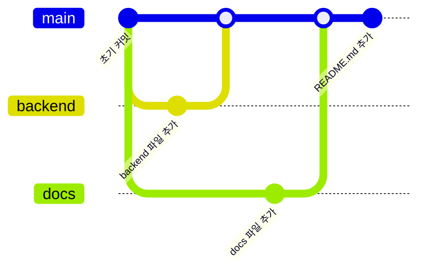
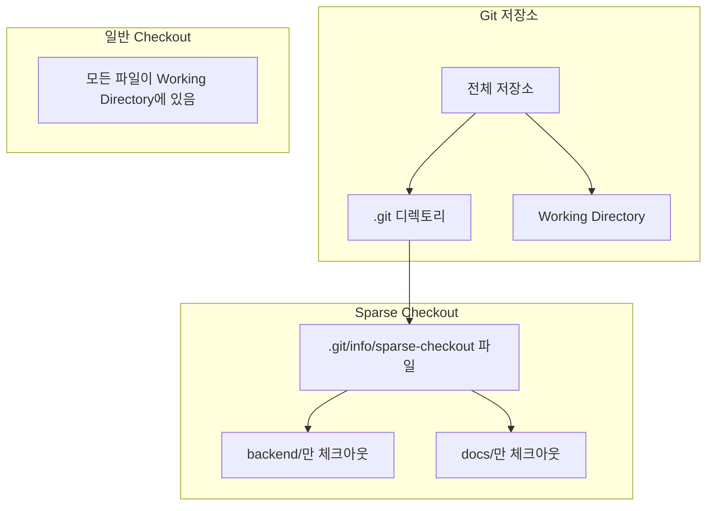

# Sparse Checkout

```mermaid
gitGraph
    commit id: "초기 커밋"
    branch backend
    branch docs
    checkout backend
    commit id: "backend 파일 추가"
    checkout main
    merge backend
    checkout docs
    commit id: "docs 파일 추가"
    checkout main
    merge docs
    
    commit id: "README.md 추가"
```

```mermaid
flowchart TB
    subgraph "Git 저장소"
    A[전체 저장소]
    B[.git 디렉토리]
    C[Working Directory]
    end
    
    subgraph "일반 Checkout"
    D[모든 파일이 Working Directory에 있음]
    end
    
    subgraph "Sparse Checkout"
    E[.git/info/sparse-checkout 파일]
    F["backend/만 체크아웃"]
    G["docs/만 체크아웃"]
    end
    
    A --> B
    A --> C
    B --> E
    E --> F
    E --> G
```