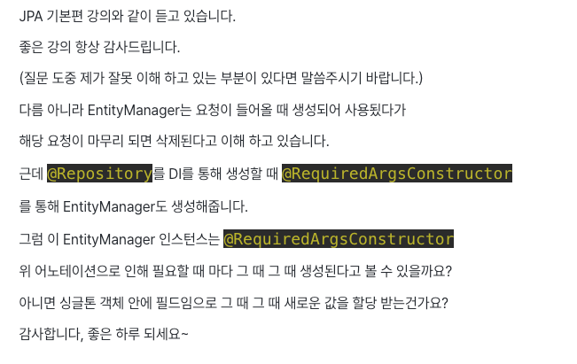
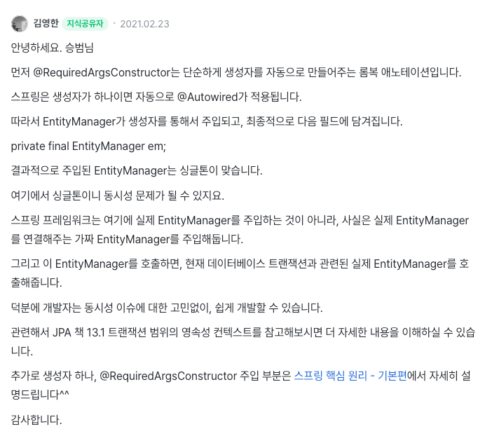
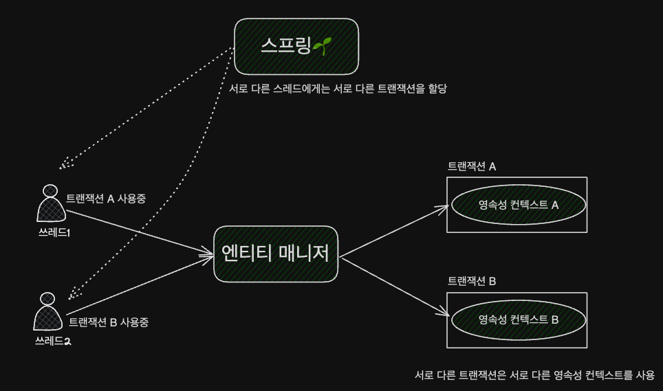

> https://www.inflearn.com/questions/158967

<!-- TOC -->
* [엔티티 매니저도 AOP에 의해 가짜가 주입된다](#엔티티-매니저도-aop에-의해-가짜가-주입된다)
* [트랜잭션과 영속성 컨텍스트](#트랜잭션과-영속성-컨텍스트)
  * [트랜잭션이 같으면 같은 영속성 컨텍스트를 사용한다.](#트랜잭션이-같으면-같은-영속성-컨텍스트를-사용한다)
  * [트랜잭션이 다르면 다른 영속성 컨텍스트를 사용한다.](#트랜잭션이-다르면-다른-영속성-컨텍스트를-사용한다)
    * [스프링의 장점: 멀티 스레드 상황을 컨테이너가 처리](#스프링의-장점-멀티-스레드-상황을-컨테이너가-처리)
<!-- TOC -->





```java
@Repository
@RequiredArgsConstructor
public class FooService {
    
    private final EntityManager em;
    
}
```

# 엔티티 매니저도 AOP에 의해 가짜가 주입된다

- 생성자가 하나 - `FooService(EntityManager em)` - 이므로, `@Autowired`가 적용된다.
- 이 때, 스프링이 실제 EntityManager를 주입하는 것이 아니라, **가짜 EntityManager를 주입한다.** 
  - 주입된 '가짜 EntityManager'가 싱글톤인 것은 맞다.
- 주입된 '가짜 EntityManager'를 호출하면, **현재 데이터베이스 트랜잭션과 관련된 실제 EntityManager를 호출**해준다.

<br>

# 트랜잭션과 영속성 컨텍스트

> _JPA 책 13.1 스프링 컨테이너의 기본 전략_

## 트랜잭션이 같으면 같은 영속성 컨텍스트를 사용한다.

 - 스프링은 `트랜잭션 범위의 영속성 컨텍스트 전략`을 사용한다.
   - `트랜잭션 범위의 영속성 컨텍스트 전략`이란, 트랜잭션 범위와 영속성 컨텍스트의 생존 범위가 같다는 뜻.
 - `트랜잭션 범위의 영속성 컨텍스트 전략`은 다양한 위치에서 엔티티 매니저를 주입 받아 사용해도, 트랜잭션이 같으면 항상 같은 영속성 컨텍스트를 사용한다.

<br>

## 트랜잭션이 다르면 다른 영속성 컨텍스트를 사용한다.



- 엔티티 매니저 팩토리는 스레드마다 엔티티 매니저를 만든다.
  - _스레드마다 엔티티 매니저를 만드는데, 책 13.1 에서의 하나의 엔티티 매니저를 쓴다고 표현한 것은,  👉 _AOP로 인해 주입되는 가짜 엔티티 매니저를 얘기하는 듯하다._
- 여러 스레드에서 동시에 요청이 와서 같은 엔티티 매니저를 사용해도, 
  - 👉 **트랜잭션에 따라 접근하는 영속성 컨텍스트가 다름**
    - 스프링 컨테이너는 스레드마다 각각 다른 트랜잭션을 할당한다.
- 트랜잭션이 다르면 영속성 컨텍스트를 다르게 사용하고, 
  - 스프링은 스레드마다 서로 다른 트랜잭션을 스레드에게 할당하기 때문에, 
    - 여러 개의 스레드가 같은 (가짜) 엔티티 매니저를 사용한다고 해도 결국 같은 영속성 컨텍스트를 사용할 일은 없다.
    - 그렇기 때문에 **멀티스레드 상황에 안전**한 것이다. (서로 다른 스레드에서는 영원히 같은 영속성 컨텍스트를 사용할 일이 없으니까!)

<br>

### 스프링의 장점: 멀티 스레드 상황을 컨테이너가 처리

- 스프링이나 J2EE 컨테이너의 가장 큰 장점은 **트랜잭션과 복잡한 멀티 스레드 상황을 컨테이너가 처리**.
  - 👉 **개발자는 싱글 스레드 애플리케이션처럼 단순하게 개발 가능하므로, 비즈니스 로직 개발에만 집중할 수 있다!**