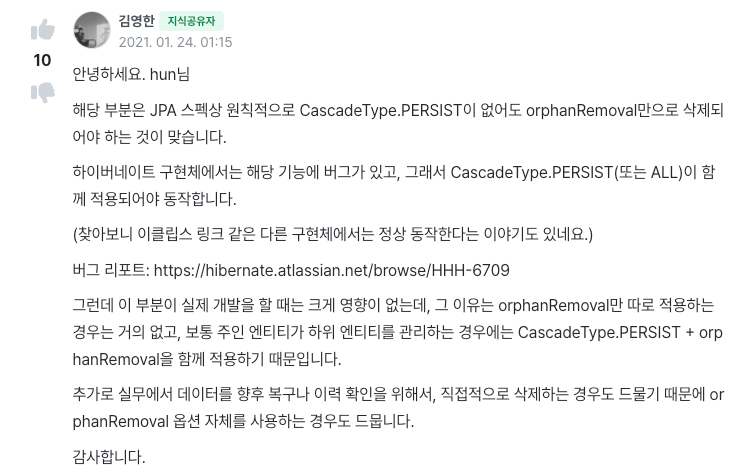

<!-- TOC -->
* [JPA 구동 방식](#jpa-구동-방식)
* [주의](#주의)
  * [엔티티 매니저 팩토리는 하나만 생성해서, 애플리케이션 전체에서 공유한다](#엔티티-매니저-팩토리는-하나만-생성해서-애플리케이션-전체에서-공유한다)
  * [엔티티 매니저는 쓰레드간에 공유하면 안 된다.](#엔티티-매니저는-쓰레드간에-공유하면-안-된다)
  * [모든 변경 작업은 트랜잭션 안에서](#모든-변경-작업은-트랜잭션-안에서)
* [엔티티 매니저를 반납하라](#엔티티-매니저를-반납하라)
  * [정석 코드](#정석-코드)
* [JPQL](#jpql)
* [기타](#기타)
  * [옵션 설정](#옵션-설정)
    * [hibernate.use_sql_comments](#hibernateuse_sql_comments)
<!-- TOC -->

# JPA 구동 방식



# 주의

## 엔티티 매니저 팩토리는 하나만 생성해서, 애플리케이션 전체에서 공유한다

## 엔티티 매니저는 쓰레드간에 공유하면 안 된다.

- 엔티티 매니저는 여러 스레드가 동시에 접근시 동시성 문제 발생.
  - 👉 쓰레드간에 절대 공유 X

## 모든 변경 작업은 트랜잭션 안에서

- JPA에서 모든 데이터를 변경하는 작업은 트랜잭션 안에서 해야한다.

---

<br>


# 엔티티 매니저를 반납하라

```java
EntityManagerFactory emf = Persistence.createEntityManagerFactory("hello");

EntityManager em = emf.createEntityManager();

EntityTransaction transaction = em.getTransaction();
transaction.begin(); // transaction start

Member member = new Member(1L, "HelloA");

em.persist(member);

transaction.commit(); // commit

em.close();
emf.close();
```

- 트랜잭션 커밋 시 문제가 생겼을 때, `em.close()`가 실행되지 않는다.

<br>

## 정석 코드

```java
EntityManagerFactory emf = Persistence.createEntityManagerFactory("hello");

EntityManager em = emf.createEntityManager();

EntityTransaction transaction = em.getTransaction();
transaction.begin(); // transaction start

try {
    Member member = new Member(1L, "HelloA");
    em.persist(member);

    transaction.commit(); // commit
} catch (Exception e) {
    transaction.rollback();
} finally {
    em.close();
}

emf.close();
```

- 스프링이 이것을 다 해주니까, 실제로 이렇게 짤 일은 없다.

---

<br>

# JPQL

- JPQL을 사용하면 엔티티 객체를 중심으로 개발한다.
- JPQL은 객체를 대상으로 검색하는 객체 지향 쿼리.
- **애플리케이션이 필요한 데이터만 DB에서 불러오려면, 결국 검색 조건이 포함된 SQL이 필요하다.**
  - **최대한 DB에서 필터링해서 가져오는 것이 필요.**

# 기타

## 옵션 설정

### hibernate.use_sql_comments

```xml
<property name="hibernate.use_sql_comments" value="true"/>
```

```sql
Hibernate: 
    /* insert for
        hellojpa.Member */insert 
    into
        Member (name, id) 
    values
        (?, ?)
```

- 이 쿼리가 왜 나왔는지 코멘트를 달아준다.