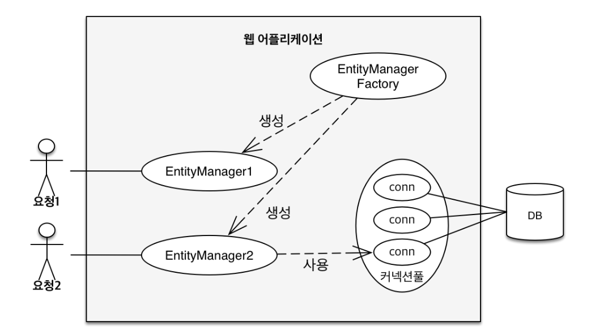
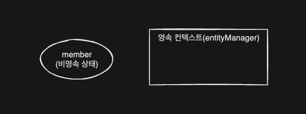
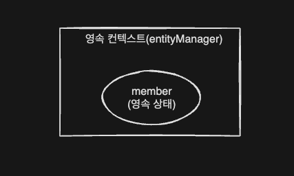

> **JPA에서 가장 중요한 2가지**
> - 객체와 관계형 데이터베이스 매핑하기 (설계 레벨)
>     - (Object Relational Mapping)
> - 영속성 컨텍스트


<!-- TOC -->
* [3.1 엔티티 매니저 팩토리와 엔티티 매니저](#31-엔티티-매니저-팩토리와-엔티티-매니저)
  * [엔티티 매니저 팩토리](#엔티티-매니저-팩토리)
  * [엔티티 매니저](#엔티티-매니저)
    * [엔티티 매니저가 커넥션을 얻는 시점](#엔티티-매니저가-커넥션을-얻는-시점)
* [3.2 영속성 컨텍스트란?](#32-영속성-컨텍스트란)
  * [엔티티 매니저와 영속성 컨텍스트의 관계](#엔티티-매니저와-영속성-컨텍스트의-관계)
* [3.3 엔티티의 생명주기 (상태)](#33-엔티티의-생명주기-상태)
  * [상태들](#상태들)
    * [비영속 상태](#비영속-상태)
    * [영속 상태](#영속-상태)
    * [준영속](#준영속)
    * [삭제](#삭제)
  * [언제 쿼리가 나가는가?](#언제-쿼리가-나가는가)
* [3.4 영속성 컨텍스트의 특징](#34-영속성-컨텍스트의-특징)
* [3.5 플러시](#35-플러시)
* [3.6 준영속](#36-준영속)
* [3.7 정리](#37-정리)
<!-- TOC -->


<br>

# 3.1 엔티티 매니저 팩토리와 엔티티 매니저



## 엔티티 매니저 팩토리

- 애플리케이션 내에서 하나만 만들어서 전체에서 공유
- 여러 스레드 동시 접근해도 안전

## 엔티티 매니저

- 스레드마다 생성
- 스레드간에 공유 절대 금지.

### 엔티티 매니저가 커넥션을 얻는 시점

- 데이터베이스 연결이 꼭 필요한 시점까지 커넥션을 얻지 않는다.
- 예를 들면, 트랜잭션을 시작할 때 커넥션을 획득.

<br>

# 3.2 영속성 컨텍스트란?

- '엔티티를 영구 저장하는 환경'이라는 뜻
- `EntityManager.persist(entity);`
  - DB에 집어넣는다는 것이 아니고, 영속성 컨텍스트에 넣어서 영속화하겠다는 뜻.

<br>

## 엔티티 매니저와 영속성 컨텍스트의 관계

- 영속성 컨텍스트는 논리적인 개념이고, 눈에 보이지 않는다.
- 엔티티 매니저를 통해 영속성 컨텍스트에 접근한다.

<br>

# 3.3 엔티티의 생명주기 (상태)

- 비영속(_new/transient_): 영속성 컨텍스트와 전혀 관계가 없는 상태
- 영속(_managed_): 영속성 컨텍스트에 저장된 상태
- 준영속(_detached_): 영속성 컨텍스트에 저장되었다가 분리된 상태
- 삭제(removed): 삭제된 상태

## 상태들

### 비영속 상태



```java
Member member = new Member(2L, "HelloB");
```

- 단순히 엔티티 객체를 생성한 상태.
- 영속성 컨텍스트나 DB와는 관계 없다.

### 영속 상태



```java
em.persist(member);
```

- 영속 상태 = 영속성 컨텍스트에 의해 관리되는 상태

### 준영속

```java
em.detach(member);
```

### 삭제

```java
em.remove(member);
```

<br>

## 언제 쿼리가 나가는가?

- **_영속 상태로 만든다고 해서 SQL이 실행되는 것은 아니다._**
- 실제로는 트랜잭션 커밋시에 영속성 컨텍스트에 있던 쿼리가 나가게 된다. 


<br>

# 3.4 영속성 컨텍스트의 특징

# 3.5 플러시

# 3.6 준영속

# 3.7 정리