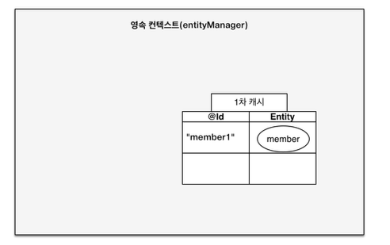
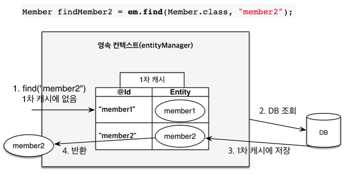
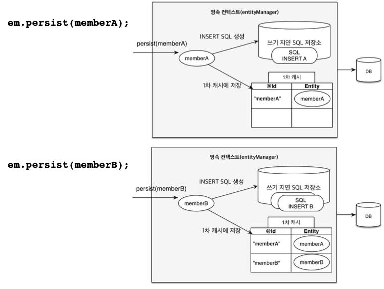
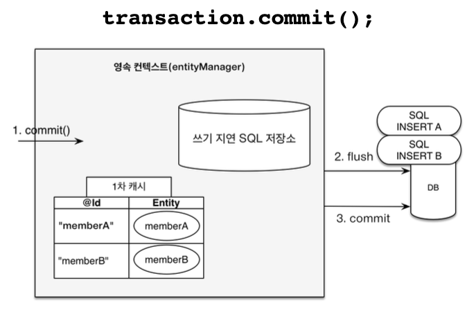

> **JPA에서 가장 중요한 2가지**
> - 객체와 관계형 데이터베이스 매핑하기 (설계 레벨)
>     - (Object Relational Mapping)
> - 영속성 컨텍스트


<!-- TOC -->
* [3.1 엔티티 매니저 팩토리와 엔티티 매니저](#31-엔티티-매니저-팩토리와-엔티티-매니저)
  * [엔티티 매니저 팩토리](#엔티티-매니저-팩토리)
  * [엔티티 매니저](#엔티티-매니저)
    * [엔티티 매니저가 커넥션을 얻는 시점](#엔티티-매니저가-커넥션을-얻는-시점)
* [3.2 영속성 컨텍스트란?](#32-영속성-컨텍스트란)
  * [엔티티 매니저와 영속성 컨텍스트의 관계](#엔티티-매니저와-영속성-컨텍스트의-관계)
* [3.3 엔티티의 생명주기 (상태)](#33-엔티티의-생명주기-상태)
  * [상태들](#상태들)
    * [비영속 상태](#비영속-상태)
    * [영속 상태](#영속-상태)
    * [준영속](#준영속)
    * [삭제](#삭제)
  * [언제 쿼리가 나가는가?](#언제-쿼리가-나가는가)
* [3.4 영속성 컨텍스트의 특징](#34-영속성-컨텍스트의-특징)
  * [특징들](#특징들)
    * [영속성 컨텍스트와 식별자 값](#영속성-컨텍스트와-식별자-값)
    * [영속성 컨텍스트와 데이터베이스 저장 (언제 데이터베이스에 저장할까?)](#영속성-컨텍스트와-데이터베이스-저장-언제-데이터베이스에-저장할까)
    * [영속성 컨텍스트가 엔티티를 관리함으로써 생기는 이점](#영속성-컨텍스트가-엔티티를-관리함으로써-생기는-이점)
  * [3.4.1 엔티티 조회](#341-엔티티-조회)
    * [1차 캐시](#1차-캐시)
    * [1차 캐시에서 조회](#1차-캐시에서-조회)
    * [데이터베이스에서 조회](#데이터베이스에서-조회)
    * [영속 엔티티의 동일성 보장](#영속-엔티티의-동일성-보장)
    * [💡JPA는 REPEATABLE READ를 애플리케이션 차원에서 제공한다.](#jpa는-repeatable-read를-애플리케이션-차원에서-제공한다)
  * [3.4.2 엔티티 등록](#342-엔티티-등록)
  * [3.4.3 엔티티 수정](#343-엔티티-수정)
  * [](#)
* [3.5 플러시](#35-플러시)
* [3.6 준영속](#36-준영속)
* [3.7 정리](#37-정리)
<!-- TOC -->


<br>

# 3.1 엔티티 매니저 팩토리와 엔티티 매니저


## 엔티티 매니저 팩토리

- 애플리케이션 내에서 하나만 만들어서 전체에서 공유
- 여러 스레드 동시 접근해도 안전

## 엔티티 매니저

- 스레드마다 생성
- 스레드간에 공유 절대 금지.

### 엔티티 매니저가 커넥션을 얻는 시점

- 데이터베이스 연결이 꼭 필요한 시점까지 커넥션을 얻지 않는다.
- 예를 들면, 트랜잭션을 시작할 때 커넥션을 획득.

<br>

# 3.2 영속성 컨텍스트란?

- '엔티티를 영구 저장하는 환경'이라는 뜻
- `EntityManager.persist(entity);`
  - DB에 집어넣는다는 것이 아니고, 영속성 컨텍스트에 넣어서 영속화하겠다는 뜻.

<br>

## 엔티티 매니저와 영속성 컨텍스트의 관계

- 영속성 컨텍스트는 논리적인 개념이고, 눈에 보이지 않는다.
- 엔티티 매니저를 통해 영속성 컨텍스트에 접근한다.

<br>

# 3.3 엔티티의 생명주기 (상태)

- 비영속(_new/transient_): 영속성 컨텍스트와 전혀 관계가 없는 상태
- 영속(_managed_): 영속성 컨텍스트에 저장된 상태
- 준영속(_detached_): 영속성 컨텍스트에 저장되었다가 분리된 상태
- 삭제(removed): 삭제된 상태

## 상태들

### 비영속 상태


```java
Member member = new Member(2L, "HelloB");
```

- 단순히 엔티티 객체를 생성한 상태.
- 영속성 컨텍스트나 DB와는 관계 없다.

### 영속 상태


```java
em.persist(member);
```

- 영속 상태 = 영속성 컨텍스트에 의해 관리되는 상태

### 준영속

```java
em.detach(member);
```

### 삭제

```java
em.remove(member);
```

<br>

## 언제 쿼리가 나가는가?

- **_영속 상태로 만든다고 해서 SQL이 실행되는 것은 아니다._**
- 실제로는 트랜잭션 커밋시에 영속성 컨텍스트에 있던 쿼리가 나가게 된다. 


<br>

# 3.4 영속성 컨텍스트의 특징

## 특징들

### 영속성 컨텍스트와 식별자 값

- 영속성 컨텍스트는 엔티티를 식별자 값(`@Id` 필드)로 구분한다.
- 따라서, _**영속 상태는 식별자 값이 반드시 있어야한다.**_
  - 식별자 값이 없을 시 예외 발생.

### 영속성 컨텍스트와 데이터베이스 저장 (언제 데이터베이스에 저장할까?)

- JPA는 보통 '트랜잭션을 커밋하는 순간' 영속성 컨텍스트에 새로 저장된 엔티티를 데이터베이스에 반영(=**플러시**)

### 영속성 컨텍스트가 엔티티를 관리함으로써 생기는 이점

1. 1차 캐시
2. 동일성 보장
3. 트랜잭션을 지원하는 쓰기 지연
4. 변경 감지
5. 지연 로딩

<br>

## 3.4.1 엔티티 조회

### 1차 캐시

- 1차 캐시: 영속성 컨텍스트가 가지는 내부의 캐시.
- 영속 상태의 엔티티는 모두 1차 캐시에 저장된다.


```java
// 엔티티를 생성한 상태(비영속)
Member member = new Member();
member.setId("member1");
member.setUsername("회원1");

// 엔티티를 영속
em.persist(member);
```



_(영속성 컨텍스트 1차 캐시)_

- 위 코드 실행 시, 1차 캐시에 회원 엔티티를 저장한다.
  - _아직 데이터베이스에 저장된 것은 아니다._
- 1차 캐시의 Key는 **식별자 값**이며, 식별자 값은 데이터베이스의 **기본키**와 매핑되어있다.

### 1차 캐시에서 조회

```java
Member member = em.find(Member.class, "member1")
```

- `em.find()` 호출 시, 우선 1차 캐시에서 식별자 값으로 엔티티를 찾는다.
- 찾는 엔티티가 있으면 데이터베이스를 조회하지 않고 **메모리에 있는 1차 캐시에서 엔티티를 조회**한다.
- 만약 찾는 엔티티가 없으면 데이터베이스에서 조회한다.


### 데이터베이스에서 조회



- `em.find()` 호출 시, 엔티티가 1차 캐시에 없으면 데이터베이스에 없으면 **엔티티 매니저는 데이터베이스를 조회해서 엔티티를 생성**한다.
  - 이후 **1차 캐시에 엔티티를 저장**한 후, **영속 상태의 엔티티를 반환**한다.
- 그림에서 `member2` 엔티티를 처음 조회 시, 1차 캐시에 없으므로 DB에서 조회한 후 1차 캐시에 엔티티를 저장하고, 영속 상태의 `member2`를 반환한다.
  - 이후 `member2`를 다시 조회하면 이제 1차 캐시에 있으므로, DB에서 조회하는 것이 아닌 메모리에 있는 1차 캐시에서 바로 불러온다.
    - 👉 **1차 캐시의 성능상 이점**

### 영속 엔티티의 동일성 보장

```java
Member a = em.find(Member.class, "member1");
Member b = em.find(Member.class, "member1");

System.out.println(a == b); // 동일성 비교
```

- 위 `a == b`의 결과는 참이다.
- `em.find(Member.class, "member1")`를 반복 호출해도, 영속성 컨텍스트는 1차 캐시에 있는 같은 인스턴스를 반환한다. 
  - 같은 인스턴스이므로 동일성 비교는 당연히 참.
- **_영속성 컨텍스트는 1차 캐시를 이용하여 성능상 이점과 (같은 트랜잭션 내) 엔티티의 동일성을 보장한다._**

### 💡JPA는 REPEATABLE READ를 애플리케이션 차원에서 제공한다.

- JPA는 1차 캐시를 통해 `REPEATABLE READ` 등급의 격리 수준을 데이터 베이스가 아닌 애플리케이션 레벨에서 제공한다는 장점이 있다.
- `REPEATABLE READ`
  - 한 번 조회한 데이터를 반복해서 조회해도 같은 데이터가 조회된다.
  - `PHANTOM READ`는 발생 가능.
    - 트랜잭션 1에서 10살 이하의 회원을 조회 후, 트랜잭션 2가 5살의 회원을 추가한 후, 트랜잭션 1에서 다시  이하의 회원을 조회하면 이전에 없던 데이터(=유령 
      데이터)
      가 생기는 현상.

<br>

## 3.4.2 엔티티 등록 (트랜잭션을 지원하는 쓰기 지연)

```java
EntityManagerFactory emf = Persistence.createEntityManagerFactory("hello");
EntityManager em = emf.createEntityManager();
EntityTransaction tx = em.getTransaction();
tx.begin(); // [트랜잭션] 시작

try {
    Member member10 = new Member(10L, "member10");
    Member member11 = new Member(11L, "member11");

    em.persist(member10);
    em.persist(member11);
    // 여기까지 INSERT SQL을 데이터베이스에 보내지 않는다.
  
    tx.commit(); // [트랜잭션] 커밋

} catch (Exception e) {
    tx.rollback();
} finally {
    em.close();
}

emf.close();
```

### 트랜잭션을 지원하는 쓰기 지연





- 엔티티는 트랜잭션을 커밋하기 직전까지 데이터베이스에 엔티티를 저장하지 않고, 내부 쿼리 저장소에서 INSERT SQL을 차곡차곡 저장한다.
- 그리고 `em.persist()`가 아니라, 트랜잭션 커밋 시에 모아둔 쿼리를 데이터베이스에 보내게 되는데, 이것을 트랜잭션을 지원하는 쓰기 지연
  (transactional write-behind)라고 한다.
  - **트랜잭션을 커밋 시, 엔티티 매니저는 우선 영속성 컨텍스트를 플러시 하는데**, 이 때 쓰기 지연 SQL 저장소에 모인 쿼리를 데이터베이스에 보낸다.
  - 이렇게 **영속성 컨텍스트의 변경 내용을 데이터베이스에 동기화한 후에, 실제 데이터베이스 트랜잭션을 커밋**한다.

<br>

## 3.4.3 엔티티 수정

<br>

## 

# 3.5 플러시

# 3.6 준영속

# 3.7 정리