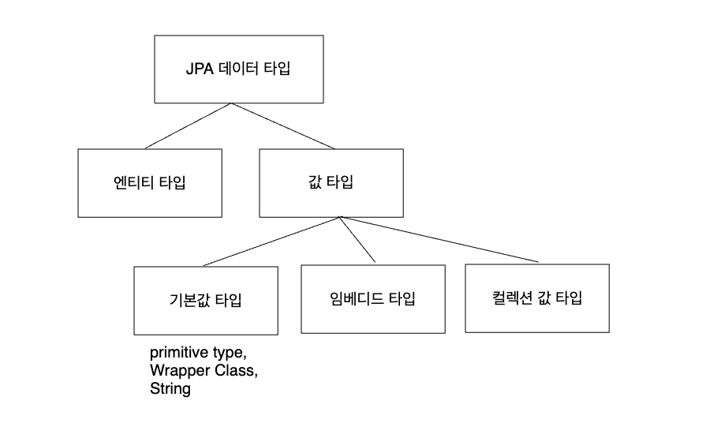
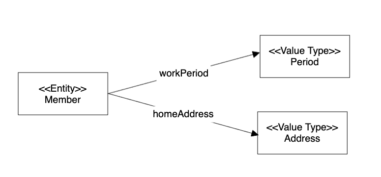

<!-- TOC -->
* [9. 값 타입](#9-값-타입)
  * [JPA 데이터 타입](#jpa-데이터-타입)
* [9.1 기본값 타입](#91-기본값-타입)
* [9.2 임베디드 타입(복합 값 타입)](#92-임베디드-타입복합-값-타입)
  * [기본값 타입](#기본값-타입)
  * [임베디드 타입](#임베디드-타입)
    * [임베디드 타입은 생성자 필수.](#임베디드-타입은-생성자-필수)
    * [임베디드 타입의 생명 주기](#임베디드-타입의-생명-주기)
* [9.3 값 타임과 불변 객체](#93-값-타임과-불변-객체)
* [9.4 값 타입의 비교](#94-값-타입의-비교)
* [9.5 값 타입 컬렉션](#95-값-타입-컬렉션)
* [9.6 정리](#96-정리)
<!-- TOC -->

# 9. 값 타입

## JPA 데이터 타입



- 엔티티 타입
- 값 타입
    - 기본값 타입
        - Primitive type
        - Wrapper Class(Integer...)
        - String
    - 임베디드 타입
    - 컬렉션 값 타입


# 9.1 기본값 타입

```java
@Entity
public class Member {

    @Id
    @GeneratedValue
    private Long id;
    private String name;
    private int age;

}
```

- `String`, `int`가 값 타입.
- Member 엔티티는 id라는 '식별자' 값을 가지고, '생명주기'도 존재.
  - 반면 값 타입인 name, age 속성은 **식별자가 없고,** **생명주기도 회원 엔티티에 의존.**


# 9.2 임베디드 타입(복합 값 타입)

## 기본값 타입

```java
@Entity
public class Member {

    @Id
    @GeneratedValue
    private Long id;
    private String name;
    private int age;
    
    // 근무 기간
    private LocalDateTime startDate;
    private LocalDateTime endDate;
    
    // 집 주소 표현
    private String city;
    private String street;
    private String zipcode;

}
```

- 속성을 늘어놓는 것은 정보를 풀어둔 것.
  - 근무 시작일과 우편 변호는 서로 아무 관련이 없음.

## 임베디드 타입

```java
@Entity
public class Member {

    @Id
    @GeneratedValue
    private Long id;
    private String name;
    private int age;

    @Embedded
    private Period workPeriod; // 근무 기간

    @Embedded
    private Address homeAddress; // 집 주소

}

@Embeddable
public class Period { // 기간 임베디드 타입

    private LocalDateTime startDate;
    private LocalDateTime endDate;

    public boolean isWork() { // 의미 있는 메서드 추가 가능.
        // ... 
    }

}

@Embeddable
public class Address { // 주소 임베디드 타입

    @Column(name = "city") // 매핑할 컬럼 정의 가능
    private String city;
    private String street;
    private String zipcode;

}
```



_(회원-컴포지션 관계 UML)_

- 회원 엔티티가 의미 있고 **응집력** 있게 변함.
- `Period.isWork()`처럼 의미 있는 메서드 추가 가능. (객체지향적인 코드 작성 가능)

### 임베디드 타입은 생성자 필수.

- 임베디드 타입은 기본 생성자 필수이다.

### 임베디드 타입의 생명 주기

- 임베디드 타입을 포함한 모든 값 타입의 생명주기는 **엔티티의 생명주기에 의존.**
  - 👉 엔티티와 임베디드 타입의 관계를 UML로 그리면 **컴포지션 관계**가 됨.

<br>

# 9.3 값 타임과 불변 객체
# 9.4 값 타입의 비교
# 9.5 값 타입 컬렉션
# 9.6 정리