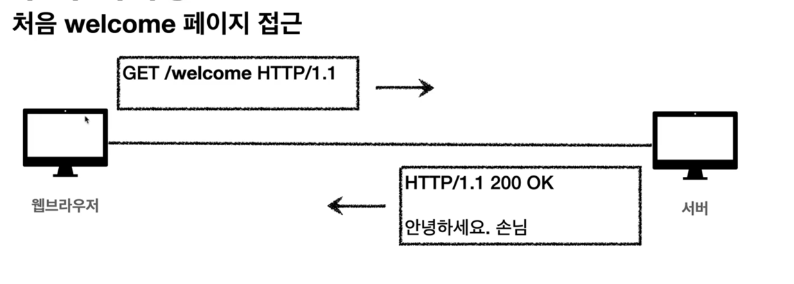
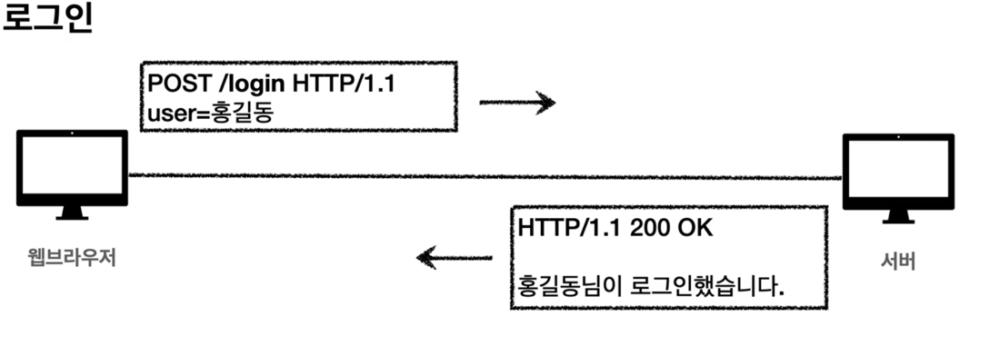
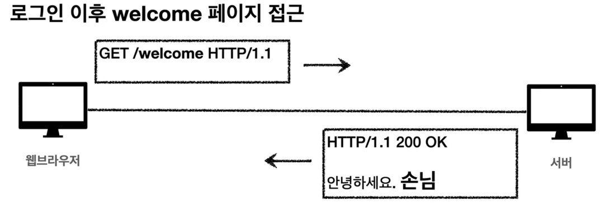
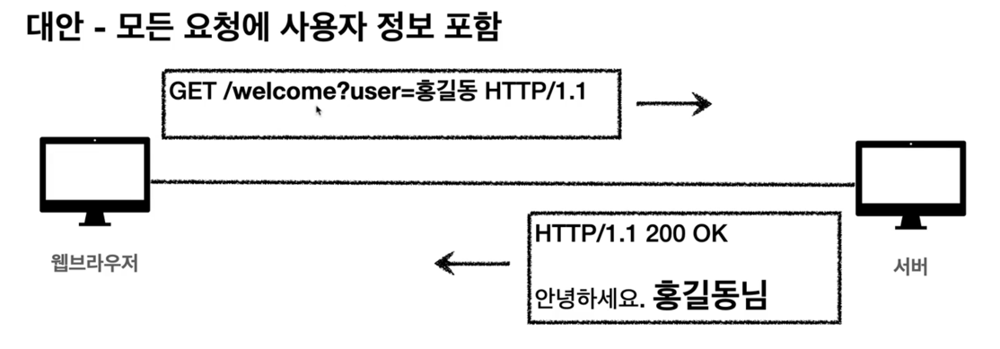
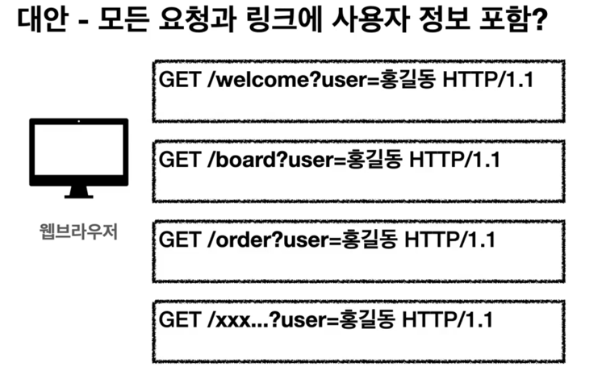
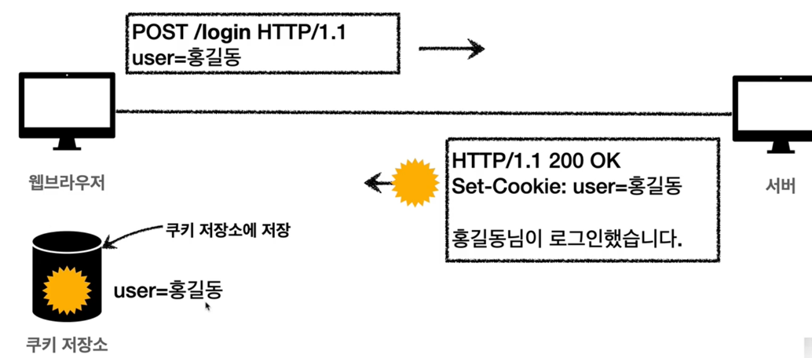
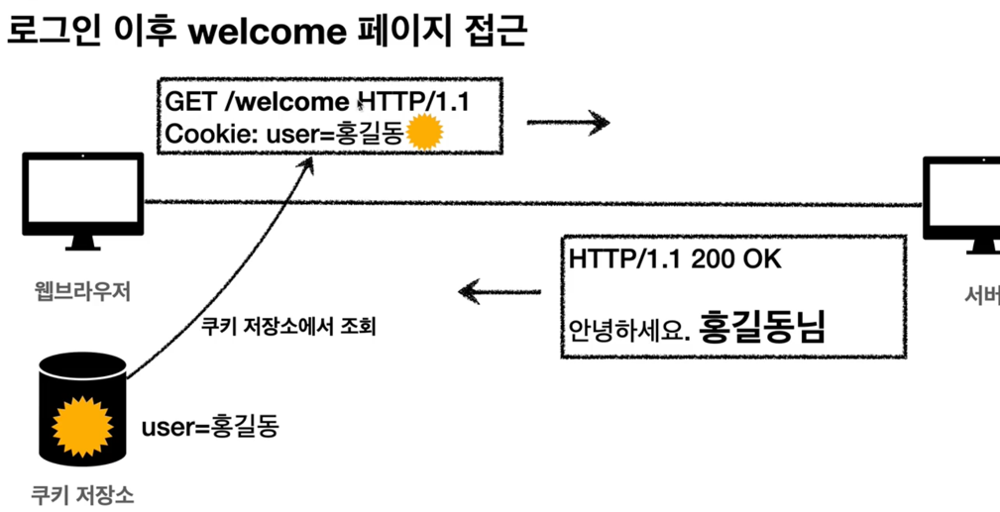
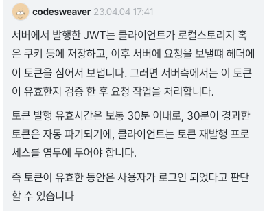

<!-- TOC -->
* [HTTP 헤더 개요](#http-헤더-개요)
* [표현](#표현)
* [콘텐츠 협상](#콘텐츠-협상)
* [전송 방식](#전송-방식)
* [일반 정보](#일반-정보)
* [특별한 정보](#특별한-정보)
* [인증](#인증)
  * [Authorization](#authorization)
  * [WWW-Authenticate](#www-authenticate)
* [쿠키](#쿠키)
  * [쿠키를 사용 안 한다면?](#쿠키를-사용-안-한다면)
    * [서버는 계속 처음 보는 유저로 인식](#서버는-계속-처음-보는-유저로-인식)
    * [대안 - 항상 정보를 같이 넘기면 되지 않을까?](#대안---항상-정보를-같이-넘기면-되지-않을까)
  * [HTTP는 Stateless](#http는-stateless)
  * [쿠키의 등장](#쿠키의-등장)
    * [모든 곳에 쿠키 정보를 다 보내면 문제가 된다.](#모든-곳에-쿠키-정보를-다-보내면-문제가-된다)
  * [쿠키에 생명을: Expires, max-age](#쿠키에-생명을-expires-max-age)
    * [영속 쿠키, 세션 쿠키](#영속-쿠키-세션-쿠키)
  * [쿠키의 도메인 지정](#쿠키의-도메인-지정)
    * [도메인 명시할 경우](#도메인-명시할-경우)
    * [도메인을 생략할 경우](#도메인을-생략할-경우)
  * [쿠키의 경로 지정](#쿠키의-경로-지정)
  * [쿠키와 보안: Secure, HttpOnly, SameSite](#쿠키와-보안-secure-httponly-samesite)
    * [Secure](#secure)
    * [HttpOnly](#httponly)
    * [SameSite](#samesite)
* [참고하면 좋은 질답들](#참고하면-좋은-질답들)
    * [인증과 JWT에 대해](#인증과-jwt에-대해)
<!-- TOC -->

# HTTP 헤더 개요

# 표현

# 콘텐츠 협상

# 전송 방식

# 일반 정보

# 특별한 정보

# 인증

- `Authorization`: 클라이언트 인증 정보를 서버에 전달
- `WWW-Authenticate`: 리소스 접근 시 필요한 인증 방법 정의

## Authorization

> 클라이언트 인증 정보를 서버에 전달

- Authorization: Basic xxxxxxxxxx
	- 인증을 공부하다보면, Authorization에 어떤 값을 넣어야할 지 감을 잡게 될 것.

## WWW-Authenticate

- 리소스 접근 시 필요한 인증 방법 정의
- 401 Unauthorized 응답과 함께 사용
- 401 오류가 날 때 아래 헤더를 같이 넣어줘야한다.
	- WWW-Authenticate: Newauth realm="apps", type=1,
	  title="Login to \"apps\"", Basic realm="simple"

---

# 쿠키

- Set-Cookie: 서버에서 클라이언트로 쿠키 전달(응답)
- Cookie: 클라이언트가 서버에서 받은 쿠키를 저장하고, HTTP 요청 시 서버로 전달

## 쿠키를 사용 안 한다면?

### 서버는 계속 처음 보는 유저로 인식

- 처음 접속한 사용자. 로그인을 하러간다.

- 로그인을 하기 위해 정보를 같이 넘긴다.

- 로그인 이후에 welcome페이지를 들어갔을 때 홍길동이라고 반겨주길 기대했지만, 어째서인지 또 손님이라고 반긴다.
	- 👉 서버 입장에서는 `GET /welcome` 요청에 대해서 이것을 홍길동이 보냈는지, 아니면 제삼자가 보냈는지 알 수 있는 방법이 없다.
	- ⭐️ 기억하라! HTTP는 메시지 전송이 다 되고나면 연결을 끊어버린다!

### 대안 - 항상 정보를 같이 넘기면 되지 않을까?

- 그냥, 모든 요청마다 필요한 정보를 같이 넘겨버리면 되지 않을까?

- That's no no. 그렇지 않다.
- 보안에도 문제가 있고 개발도 힘들다.
	- 모든 요청마다 매번 정보를 추가하니 매우 번거롭지 않겠는가.

- **모든 요청에 정보를 넘기는 문제**
	- 모든 요청에 사용자 정보가 포함되도록 개발 해야함
		- 일단 개발자가 힘들다.
	- 브라우저를 완전히 종료하고 다시 열면?
		- 요즘에는 웹 스토리지가 있어서 거기에 저장

## HTTP는 Stateless

- HTTP는 Stateless(무상태) 프로토콜이다.
- 클라이언트와 서버가 요청과 응답을 주고 받으면 연결이 끊어진다.
- 클라이언트가 다시 요청하면 서버는 이전 요청을 기억하지 못한다.
- 클라이언트와 서버는 서로 상태를 유지하지 않는다.

## 쿠키의 등장

- 서버가 쿠키 헤더를 통해 값을 세팅한다.
- 클라이언트는 이것을 받아서 쿠키 저장소에 쿠키 헤더의 값을 저장한다.

- 로그인 이후에 유저가 /welcome에 접속한다.
- 이 때, 자동으로, 웹 브라우저는 이 서버에 요청을 보낼 때마다 쿠키 저장소에서 쿠키를 꺼내 헤더에 담아서 보낸다.
	- 웹 브라우저는 쿠키 저장소를 무조건 뒤진다.

- 쿠키는 위의 모든 요청 정보에 쿠키 정보를 자동으로 포함한다.
	- `/welcome` 으로 보내든, `/order`로 보내든, 지정한 서버에 대해서는 쿠키의 데이터를 자동으로 뽑아서 헤더에 쿠키를 포함해서 서버로 전송한다.

### 모든 곳에 쿠키 정보를 다 보내면 문제가 된다.

- 그래서 제약하는 방법들이 있다.

- 예) `set-cookie: sessionId=abcde1234; expires=Sat, 26-Dec-2020 00:00:00 GMT; path=/; domain=.
  google.com; Secure`

- 사용처
	- 쿠키의 주 사용처는 사용자 로그인 세션 관리할 때이다.
		- 사용자의 정보(예. 홍길동)를 그대로 쿠키로 내리는 것은 위험하다.
			- 그래서 로그인이 성공하면 SessionId를 만들어서 서버 DB에 저장해놓고 클라이언트에게 내린다.
	- 광고 정보 트래킹할 때 사용

- 쿠키 정보는 항상 서버에 전송된다.
	- 그래서 단점으로, 네트워크 추가 트래픽이 유발된다.
	- 그러므로 최소한의 정보만 사용해야한다.(세션 ID, 인증 토큰 - OAuth를 사용하면 발급된다.)
	- 서버에 전송하지 않고, 웹 브라우저 내부에 데이터를 저장하고 싶으면 웹 스토리지(localStorage, sessionStorage)를 참고하라.
		- 요청할 때마다 서버에 데이터를 보내지 않고, 그냥 클라이언트에 보관해놓고 필요할 때만 자바스크립트 로직에서 꺼내서 쓰는 경우 👉 웹 스토리지

- **주의!**
	- 보안에 민감한 데이터는 쿠키든 웹 스토리지든 절대 저장하면 안 된다!
		- 주민번호, 신용카드 번호 등등

	
## 쿠키에 생명을: Expires, max-age

- `Set-Cookie: expires=Sat, 26-Dec-2020 04:39:21 GMT`
	- 만료일이 되면 쿠키가 삭제된다.
	- **이런 날짜들은 GMT 기준으로 넣어야한다.**

- `Set-Cookie: max-age=3600` (3600초)
  - 0이나 음수를 지정하면 쿠키 삭제

### 영속 쿠키, 세션 쿠키

- 영속 쿠키: 만료 날짜를 입력하면 해당 날짜까지 유지
- 세션 쿠키: 만료 날짜를 생략하면 **브라우저 종료시 까지만 유지** 
  - 브라우저 완전히 종료했다가 다시 열면 로그인 해야하고. 이런 것들이 세션 쿠키의 예.
  - 서버에서 말하는 세션 ID와는 전혀 관계가 없음.
    - [인프런 질답 - 영속쿠키에 대해서 질문드립니다~!!](https://www.inflearn.com/questions/200621)

## 쿠키의 도메인 지정

- 예) `domain=example.org`

### 도메인 명시할 경우
  
- 쿠키 전송 범위: **명시한 문서 기준 도메인 + 서브 도메인 포함**
- 예를 들어 `domain=example.org`로 지정하면,
  - `example.org` 뿐만 아니라,
  - 서브 도메인에 해당하는 `dev.example.org`도 쿠키가 같이 전송된다(쿠키를 같이 접근할 수 있다.).

### 도메인을 생략할 경우

- 쿠키 전송 범위: **현재 문서 기준 도메인만 적용**
- 예) `example.org`에서 쿠키를 생성하고, domain 지정을 생략한 경우,
  - `example.org`에서만 쿠키 접근이 가능하고(쿠키가 전송되고),
  - `dev.example.org`에서는 쿠키 미접근(불가능) 

---

## 쿠키의 경로 지정

- 도메인 뿐만 아니라 경로도 지정가능하다.
  - 도메인으로 한 번 필터링하고, 경로로도 필터링 한 번 더 하는 셈.

- 예) `path=/home`
- **이 경로를 포함한 하위 경로 페이지만 쿠키 접근**
- **일반적으로 `path=/` 루트로 지정한다.**

- 예) `path=/home`으로 지정하면, 
  - /home -> 가능
  - /home/level1 -> 가능(/home의 하위 경로)
  - /home/level1/level2 -> 가능 
  - /hello -> 불가능

---

## 쿠키와 보안: Secure, HttpOnly, SameSite

### Secure

- 쿠키는 http, https를 구분하지 않고 전송한다.
- Secure를 적용하면 https인 경우에만 전송한다.

### HttpOnly

- XSS 공격 방지
- 원래 자바스크립트에서 쿠키에 접근 가능하지만, HttpOnly를 사용하면 `document.cookie` 등을 사용하여 자바스크립트에서는 접근 불가능.
- HTTP 전송에만 사용.

### SameSite

- XSRF 공격 방지
- 요청 도메인과 쿠키에 설정된 도메인이 같은 경우만 쿠키 전송
  - 내가 요청하는 도메인과 쿠키에 설정된 도메인이 달라도 쿠키는 전송 가능한데, SameSite를 사용하면 이걸 방지. (다른 사이트에서 쿠키를 설정하는 것을 방지.)

---

# 참고하면 좋은 질답들

### [인증과 JWT에 대해](https://www.inflearn.com/questions/835096)

