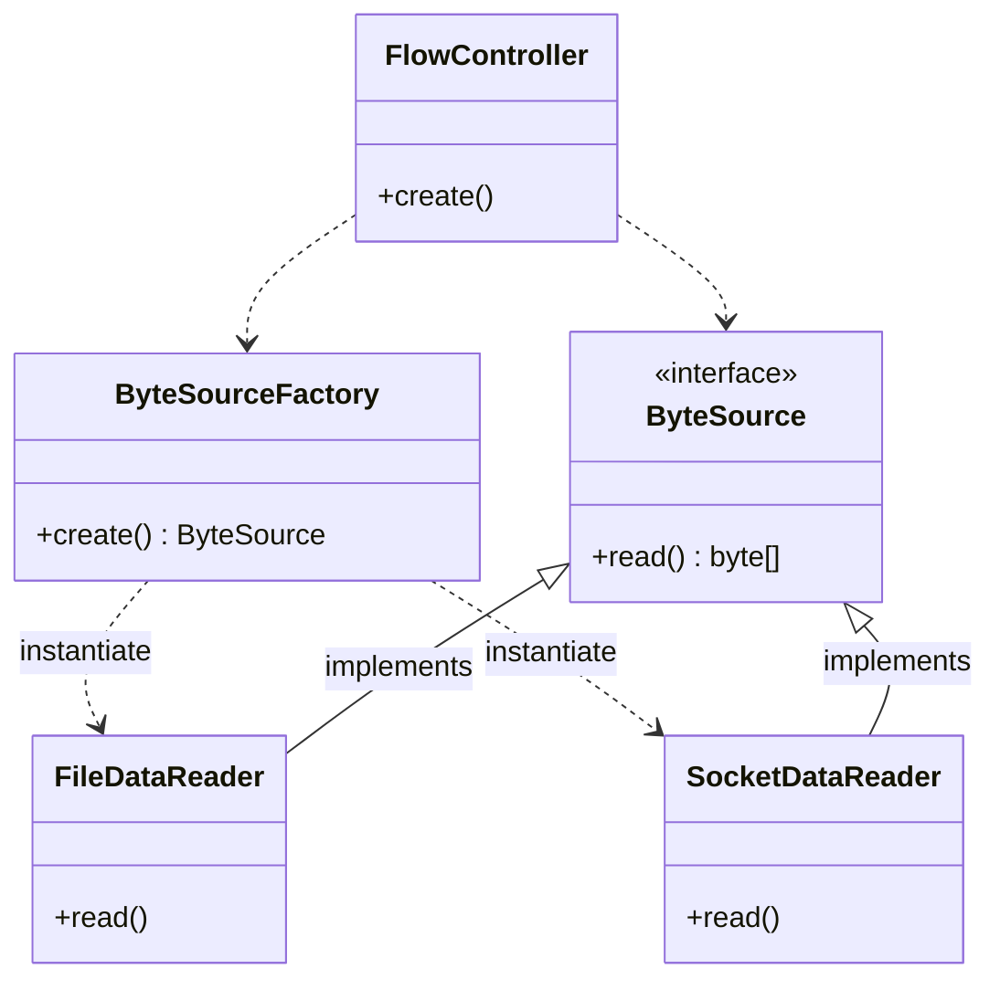

<!-- TOC -->
* [3.2 추상 타입을 이용한 구현 교체의 유연함](#32-추상-타입을-이용한-구현-교체의-유연함)
  * [ByteSource의 종류가 변경되더라도 FlowController가 바뀌지 않도록 하는 법](#bytesource의-종류가-변경되더라도-flowcontroller가-바뀌지-않도록-하는-법)
  * [객체를 생성 과정을 추상화](#객체를-생성-과정을-추상화)
  * [추상화 과정을 통해 얻은 유연함](#추상화-과정을-통해-얻은-유연함)
  * [책임의 크기가 작아질수록 변경에 대한 유연함을 가질 수 있다](#책임의-크기가-작아질수록-변경에-대한-유연함을-가질-수-있다)
    * [추상화를 통한 책임 분리](#추상화를-통한-책임-분리)
<!-- TOC -->

# 3.2 추상 타입을 이용한 구현 교체의 유연함

> **_추상화는 변경의 유연함을 증가시켜준다._**

```java
public class FlowController {

    private boolean useFile;

    public FlowController(boolean useFile) {
        this.useFile = useFile;
    }

    public void process() {
        ByteSource source = null;

        // 이 부분을 처리하지 않으면 FlowController는 여전히 사용할 ByteSource의 콘크리트 클래스가 변경될 때마다 함께 변경된다.
        if (useFile) {
            source = new FileDataReader();
        } else {
            source = new SocketDataReader();
        }

        final byte[] data = source.read();

        final Encryptor encryptor = new Encryptor();
        final byte[] encryptedData = encryptor.encrypt(data);

        final FileDataWriter writer = new FileDataWriter();
        writer.write(encryptedData);
    }

}
```

## ByteSource의 종류가 변경되더라도 FlowController가 바뀌지 않도록 하는 법

1. ByteSource 타입의 객체를 생성하는 기능을 별도 객체로 분리 후, 그 객체를 사용해서 ByteSource객체 생성
2. 생성자(또는 다른 메서드를)통해 사용할 ByteSource를 주입 받는다.

## 객체를 생성 과정을 추상화

```java
public class ByteSourceFactory {

    private static final ByteSourceFactory INSTANCE = new ByteSourceFactory();

    public static ByteSourceFactory getInstance() {
        return INSTANCE;
    }

    // 객체 생성 기능을 위한 오퍼레이션 정의
    public ByteSource create() {
        if (useFile()) {
            return new FileDataReader();
        }
        return new SocketDataReader();
    }

    private boolean useFile() {
        final String useFileValue = System.getProperty("useFile");
        return Boolean.parseBoolean(useFileValue);
    }

}

public class FlowController {
    
    // ...
    
    public void process() {
        final ByteSource source = ByteSourceFactory.getInstance().create();

        final byte[] data = source.read();

        final Encryptor encryptor = new Encryptor();
        final byte[] encryptedData = encryptor.encrypt(data);

        final FileDataWriter writer = new FileDataWriter();
        writer.write(encryptedData);
    }

}
```

- ByteSourceFactory 클래스의 create() 메서드는 ByteSource 타입의 객체를 생성하는 기능을 제공
  - 👉 ByteSourceFactory 클래스는 ByteSource 타입의 객체를 생성하는 과정을 추상화 했다고 볼 수 있다.

<br>

## 추상화 과정을 통해 얻은 유연함

1. ByteSource의 종류가 변경되면, ByteSourceFactory만 변경될 뿐, FlowController 클래스는 변경되지 않음. (바이트 데이터를 읽어오는 과정을 추상화)
2. FlowController의 제어 흐름을 변경할 때, ByteSource의 객체 생성 부분은 영향을 주지 않으면서 FlowController만 변경하면 된다.

<br>

## 책임의 크기가 작아질수록 변경에 대한 유연함을 가질 수 있다

```java
public void process() {
    // 데이터 읽기 객체 직접 생성
    final FileDataReader reader = new FileDataReader(); 

    // 흐름 제어 1: 읽기
    final byte[] data = reader.read();

    // 흐름 제어 2: 암호화
    final Encryptor encryptor = new Encryptor();
    final byte[] encryptedData = encryptor.encrypt(data);

    // 흐름 제어 3: 쓰기
    final FileDataWriter writer = new FileDataWriter();
    writer.write(encryptedData);
}
```

- 위 코드에는 두 가지 책임을 동시에 갖고 있다.
  1. 데이터를 읽어 오는 객체를 생성하는 책임
  2. 흐름을 제어하는 책임
- 따라서 **객체 생성 방식에 변화가 있거나, 제어 흐름에 변화가 있을 때 모두 FlowController를 수정해줄 수 밖에없는 것이다..!** (그 책임을 이 객체가 가지고 있으니까!)

<br>

### 추상화를 통한 책임 분리

```java
public void process() {
    final ByteSource source = ByteSourceFactory.getInstance().create();

    final byte[] data = source.read();

    final Encryptor encryptor = new Encryptor();
    final byte[] encryptedData = encryptor.encrypt(data);

    final FileDataWriter writer = new FileDataWriter();
    writer.write(encryptedData);
}
```

- 두 번의 추상화를 통해 FlowController에서 책임을 분리해낼 수 있었음.
  1. 바이트 데이터를 읽기: ByteSource 인터페이스를 도출
  2. ByteSource 객체를 생성하기: ByteSourceFactory 도출
- 추상화는 공통된 개념을 도출해서 추상 타입을 정의해 주기도 하지만, **책임이 많은 객체로부터 책임을 분리하는 시발점이 되기도 함.**

