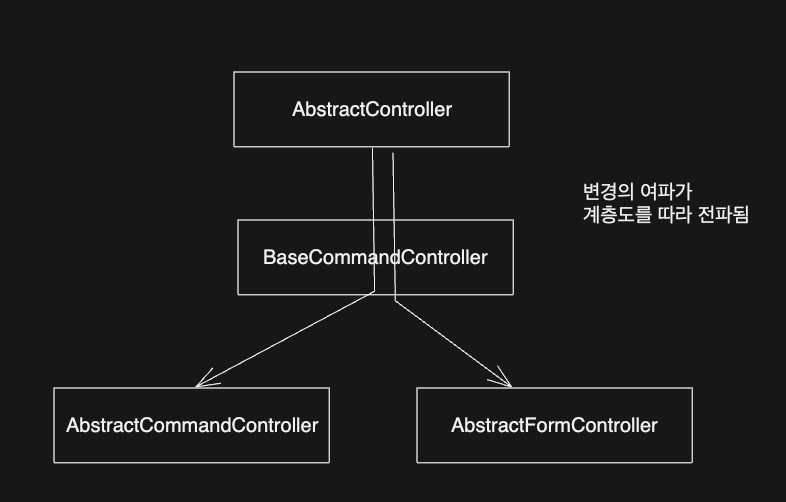
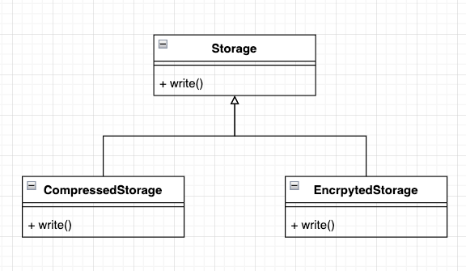
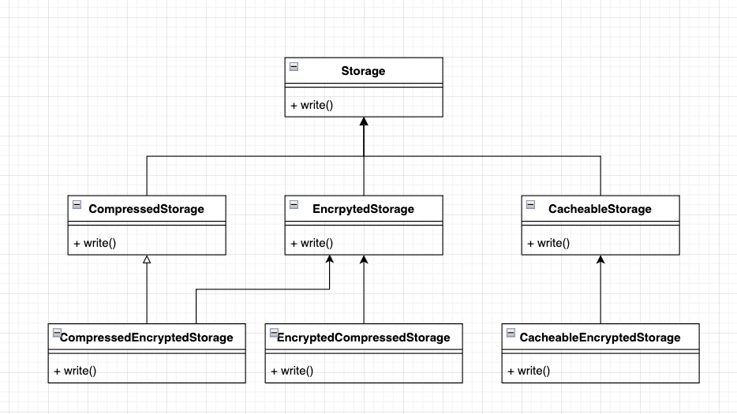
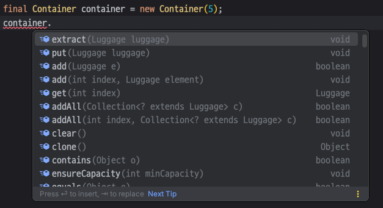
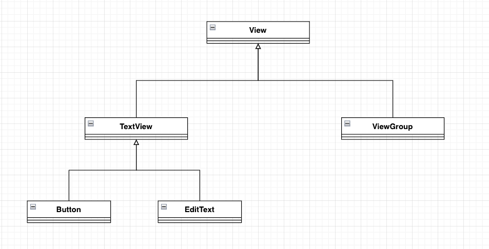

<!-- TOC -->
* [4.1 상속과 재사용](#41-상속과-재사용)
  * [4.1.1 상속을 통한 재사용의 단점 1: 상위 클래스 변경의 어려움](#411-상속을-통한-재사용의-단점-1-상위-클래스-변경의-어려움)
  * [4.1.2 상속을 통한 재사용의 단점 2: 클래스의 불필요한 증가](#412-상속을-통한-재사용의-단점-2-클래스의-불필요한-증가)
  * [4.1.2 상속을 통한 재사용의 단점 3: 상속의 오용](#412-상속을-통한-재사용의-단점-3-상속의-오용)
    * [상속을 이용하여 기능을 구현한 예제](#상속을-이용하여-기능을-구현한-예제)
    * [다른 개발자의 오용](#다른-개발자의-오용)
    * [문제의 원인: IS-A를 지키지 않은 상속](#문제의-원인-is-a를-지키지-않은-상속)
* [4.2 조립을 이용한 재사용](#42-조립을-이용한-재사용)
  * [4.2.2 그럼 상속은 언제 사용해야하나?](#422-그럼-상속은-언제-사용해야하나)
    * [재사용이 아닌 기능의 확장](#재사용이-아닌-기능의-확장)
<!-- TOC -->

# 4.1 상속과 재사용

## 4.1.1 상속을 통한 재사용의 단점 1: 상위 클래스 변경의 어려움



_(계층도가 커질수록 상위 클래스의 변경의 어려워짐)_

- 어떤 클래스를 상속 받는다는 것은 그 클래스에 의존한다는 뜻.
  - 따라서 의존하는 클래스가 변경되면 영향을 받을 수 있음.
- 상속 계층을 따라 상위 클래스의 변경이 하위 클래스에 영향을 줌.
  - 최악의 경우 상위 클래스의 변화가 모든 하위 클래스에 영향을 줄 수 있다.

<br>

## 4.1.2 상속을 통한 재사용의 단점 2: 클래스의 불필요한 증가



- Storage는 파일 보관소를 구현한 클래스.
- 제품 출시 이후 보관소의 용량을 아낄 수 있는 요구사항이 들어왔다고 하자.
  - CompressedStorage: Storage 클래스를 상속 받아 압축 기능 추가.
- 보안이 문제가 되서 암호화 해달라는 요구사항이 들어옴
  - EncryptedStorage: 파일을 암호화해서 저장.
- 위 같은 상황에서 암호화를 먼저하고 압축해야하는 저장소가 필요하다면?




- **필요한 기능의 조합이 증가할수록, 상속을 통한 기능 재사용을 하면 클래스의 개수가 함께 증가하게 된다.**

<br>


## 4.1.2 상속을 통한 재사용의 단점 3: 상속의 오용

### 상속을 이용하여 기능을 구현한 예제

- 한 개발자가 다음의 요구사항을 받았다고 하자.
  - 수화물을 넣는다.
  - 수화물을 뺀다.
  - 수화물을 넣을 수 있는지 확인한다.
- 이 개발자는 ArrayList를 상속해서 기능을 구현받았다고 한다.

```java
public class Container extends ArrayList<Luggage> {

    private int maxSize;
    private int currentSize;

    public Container(int maxSize) {
        this.maxSize = maxSize;
    }

    public void put(Luggage luggage) throws NotEnougthSpaceException {
        if (!canContain(luggage)) {
            throw new NotEnougthSpaceException();
        }
        super.add(luggage);
        currentSize += luggage.size();
    }

    public void extract(Luggage luggage) {
        super.remove(luggage);
        this.currentSize -= luggage.size();
    }

    private boolean canContain(Luggage luggage) {
        return currentSize + luggage.size() <= maxSize;
    }

}
```

### 다른 개발자의 오용



- 다른 개발자들은 이를 오용할 수 있다.
  - Container에 정의된 메서드 외에도 다른 메서드가 IDE에 노출될 수 있다.

```java
final Luggage size3Lug = new Luggage(3);
final Luggage size2Lug = new Luggage(2);
final Luggage size1Lug = new Luggage(1);

final Container container = new Container(5);
if (container.canContain(size3Lug)) {
    container.put(size3Lug); // 정상 사용
}

if (container.canContain(size2Lug)) {
    container.add(size2Lug); // 비정상 사용. Container 사이즈 여분 2에서 줄어들지 않는다.
}
```

- 잘못은 Container 클래스의 사용법을 제대로 지키지 않은 개발자한테 있는 것은 맞음.
- 그런데 더 큰 잘못은 **오용의 여지를 준 Container 클래스 작성자에게 있다.**

<br>

### 문제의 원인: IS-A를 지키지 않은 상속

- 위 같은 문제가 발생하는 이유는 Container는 사실 ArrayList가 아니기 때문임.
- **상속은 IS-A 관계가 성립할 때에만 사용해야함.**
- Container는 수화물을 보관하는 책임을 갖는 반면에, ArrayList는 목록을 관리하는 책임을 갖음.
- 같은 종류가 아닌 클래스의 구현을 재사용하기 위해 상속을 받게 되는 경우

<br>

# 4.2 조립을 이용한 재사용

## 4.2.2 그럼 상속은 언제 사용해야하나?

### 재사용이 아닌 기능의 확장



- **상속을 사용할 때는 재사용이라는 관점이 아닌 기능의 확장이라는 관점에서 상속을 적용해야한다.**
- 또, 명확한 IS-A 관계가 성립해야한다. 
  - (Button은 TextView이다.)
