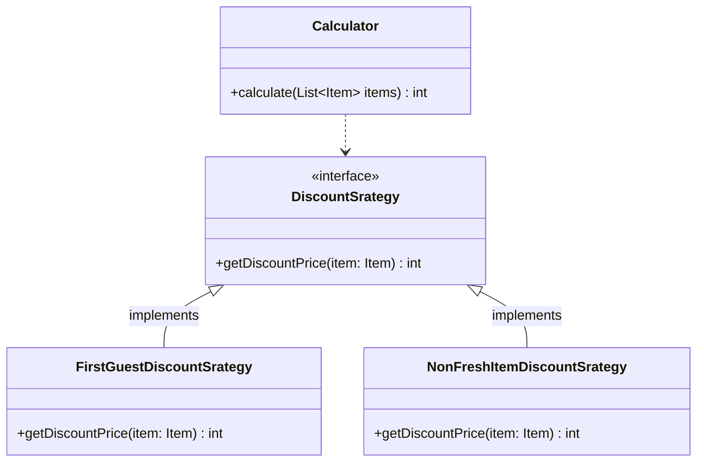

# 전략 패턴

## 무엇이 문제인가

```java
/**
 * 가격 계산에 모듈에 할인 정책 구현이 포함된 코드
 */
public class Calculator {

    /**
     * 서로 다른 계산 정책들이 한 코드에 섞여 있어, 정책이 추가될 수록 코드 분석을 어렵게 만든다.
     * 가격 정책 (할인 정책) 이 추가 될 때마다, 메서드를 수정하는 것이 어려워짐.
     */
    public int calculate(boolean isFirstGuest, List<Item> items) {
        int sum = 0;

        for (Item item : items) {

            if (isFirstGuest) {
                sum += (int) (item.getPrice() * 0.9); // 첫 손님 10% 할인
            } else if (!item.isFresh()) { // 덜 신선한 것 20% 할인
                sum += (int) (item.getPrice() * 0.8);
            } else  {
                sum += item.getPrice();
            }
        }

        return sum;
    }

}
```

## 전략 패턴


- 전략(Strategy): 가격 할인 알고리즘(계산 방법)을 추상화하는 DiscountStrategy를 전략이라고함.
- 콘텍스트(Context): 가격 계산 기능 자체의 책임을 갖고 있는 Calculator를 콘텍스트라고함.
- 콘텍스트에서 알고리즘(전략)을 별도로 분리하는 설계 방법이 전략 패턴임.

## 전략 의존성 주입

- 콘텍스트는 사용할 전략을 직접 선택하지 않는다.
- 콘텍스트의 클라이언트가 콘텍스트에 사용할 전략을 전달한다.
- DI를 통해서, 콘텍스트가 사용할 전략을 클라이언트가 주입해준다. 

## 전략 패턴을 사용한 코드

```java
public class CalculatorUsingStrategy {

    private final DiscountStrategy discountStrategy;

    public CalculatorUsingStrategy(DiscountStrategy discountStrategy) {
        this.discountStrategy = discountStrategy;
    }

    public int calculate(List<Item> items) {
        int sum = 0;

        for (Item item : items) {
            sum += discountStrategy.getDiscountPrice(item);
        }

        return sum;
    }

}

public class FirstGuestDiscountStrategy implements DiscountStrategy {

    @Override
    public int getDiscountPrice(Item item) {
        return (int) (item.getPrice() * 0.9);
    }

}
```


