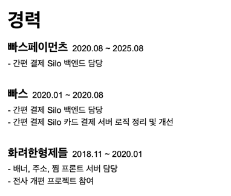
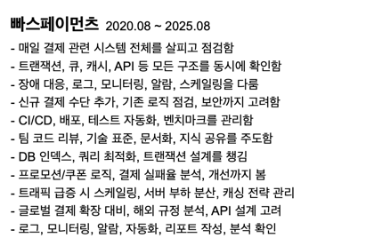
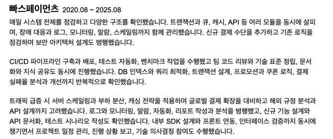
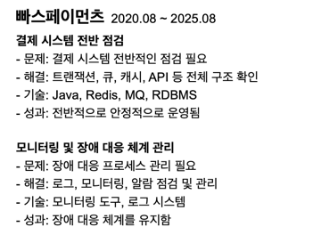
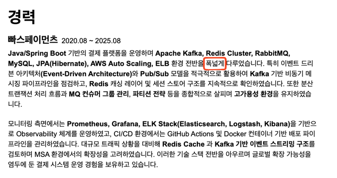

<!-- TOC -->
* [1. 누구나 다 아는 템플릿 쓰지 마세요](#1-누구나-다-아는-템플릿-쓰지-마세요)
* [2. 너무 많이 축약하지 마세요](#2-너무-많이-축약하지-마세요)
* [3. 너무 많이 넣지 마세요](#3-너무-많이-넣지-마세요)
* [4. 패턴에 갇혀서 작성하지 마세요](#4-패턴에-갇혀서-작성하지-마세요)
<!-- TOC -->

# 1. 누구나 다 아는 템플릿 쓰지 마세요

1. 똑같이 찍어내진 템플릿으로 지원받고, 이것으로 면접 본 지원자들의 결과가 안 좋게되면 인터뷰어도 이것을 학습함. 그래서 똑같은 템플릿으로 지원하는 사람들은 점점 더 불리해질 수 밖에 없음.
   1. 같은 템플릿에 노이로제를 느끼는 인터뷰어도 존재 가능.
2. CV 스타일로 직접 워드나 문서로 작성하는 것을 추천.
3. 최종 결과물이 최종적으로 PDF로 제출되는 것을 기억하라.
4. 템플릿에 집착하지 말고 내용과 나를 잘 나타내는 것에 집중. 

# 2. 너무 많이 축약하지 마세요

- 이력서는 지원자와 면접관이 소통할 수 있는 유일한 공통 분모.
- 너무 축약하면 보는 사람들이 이해하기 어려움. 즉 매력이 없어보임. (회사에서 뭘했는지 본인만 알고 있음.)
- 축약하는 지원자들 심리: 너무 장황하게 늘어놓은 것 같아서, 프로페셔널하지 않게 보이는 것 같아서 축약을 많이했음.

# 3. 너무 많이 넣지 마세요

- 검토자 입장에서, 지원자가 뭘 했다는 건지 알기 어려움. 그래서 이 사람이 뭘했다는 건지?
- 진짜 혼자 다했다는 건지? 팀규모는 어땠는지? 
- 재직기간이 짧으면 그 기간안에 이걸 혼자 다했다? 의심스러움.
- 뭘 개선했다는 건지? 왜 개선했다는 건지? 

- 장황하게 풀어써도 뭘 어필하고자 하는지 알기 어려움. 이력서 안에서 논문을 쓰지 말 것. 
- **_간결함 속에서 나를 어떻게 어필할 것인지가 포인트_**
- 👉 **_내 장점이 뭔지 고민해보고 뭘 어필할건지 많이 고민해봐야함._** 

# 4. 패턴에 갇혀서 작성하지 마세요

- 이력서 멘토링 같은 것을 듣다보면, 문제/해결/기술/성과 이런 것들을 일목요연하게 정리하라. 이런식으로 얘기를 많이 해줌.
  - 그러다보면 패턴 자체에 갇히게 되는 경우가 있음.
- Why? 가 빠져있는 경우가 있음. 
- **_어떤 문제가 있어서 이런 걸 만든건지, 아니면 일이 없어서 그냥 한 건지. 이런 배경이 빠져있는 경우가 있음._**
- 패턴 자체가 나쁘다기 보다, 자기 경력/경험을 패턴에 맞춰서 억지로 끼워맞출 필요는 없다는 얘기.

# 5. 과대 포장하지 마세요

- Redis 도입 안 하고 기존 레거시로 있었는데 활용만 한 거를 Redis 도입했다고 과대 포장하는 경우가 있음.
- 너무 많이 어필되어있으면 논리적으로 이렇게를 다 했다는게 말이 될까 의심하게됨.
- 한 줄기를 갖고, 그 메인스트림에 대해서 쓰는 것은 좋음.
  - 어떤 문제가 있어서 어떤 고민을 했고, 그 상황에서 Redis를 썼고, ...
  - Kafka가 도입이 되어있었는데 어떤 문제가 있어서 추가적으로 어떤 작업을 했고, ...
- 전반적인 거 다했다고 했는데, 기술에 대해 딥하게 알고 있는 면접관이 들어와서 검증할 때 허위 이력서처럼 느껴지면 오히려 마이너스.
- **_서류를 통과하는 것도 중요하지만, 결국 합격하는 것이 목표._**
  - 집중해서 답을 잘 할 수 있는 부분 위주로 어필하는 것이 좋음. 
  - 이력서를 보고, 면접관이 질문을 생각해서 올텐데 기대랑 좀 안 맞게 되는 경우가 되면 실망하게됨. (이력서가 과장되었구나)