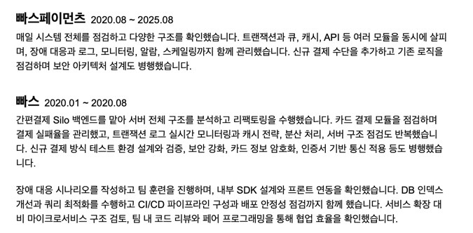
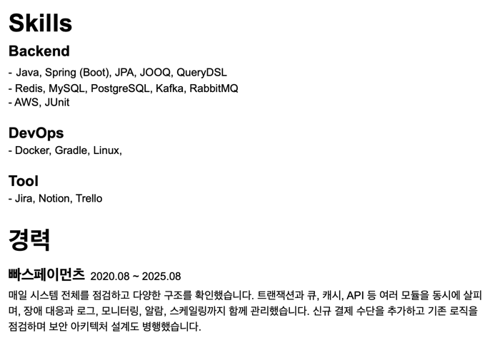
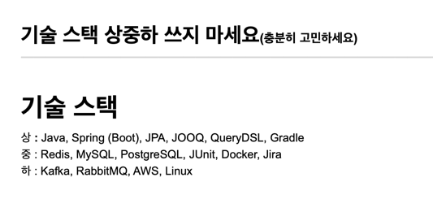
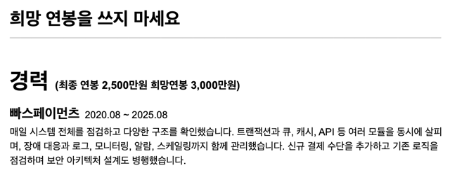
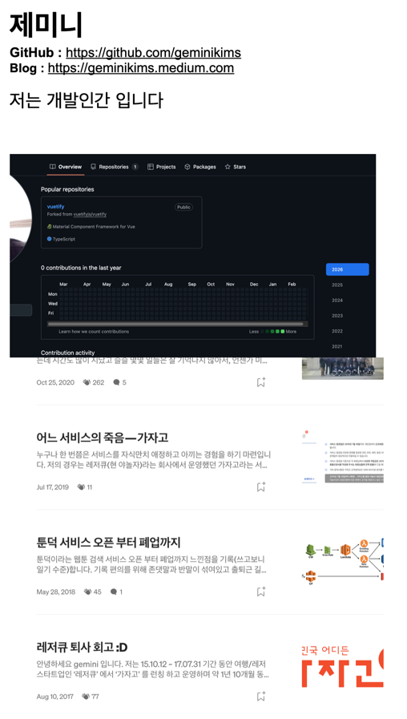

<!-- TOC -->
* [1. 누구나 다 아는 템플릿 쓰지 마세요](#1-누구나-다-아는-템플릿-쓰지-마세요)
* [2. 너무 많이 축약하지 마세요](#2-너무-많이-축약하지-마세요)
* [3. 너무 많이 넣지 마세요](#3-너무-많이-넣지-마세요)
* [4. 패턴에 갇혀서 작성하지 마세요](#4-패턴에-갇혀서-작성하지-마세요)
* [5. 과대 포장하지 마세요](#5-과대-포장하지-마세요)
* [6. 과거 이력을 정리하세요](#6-과거-이력을-정리하세요)
* [7. 기술 스택 충분히 고민하세요](#7-기술-스택-충분히-고민하세요)
<!-- TOC -->

# 1. 누구나 다 아는 템플릿 쓰지 마세요

1. 똑같이 찍어내진 템플릿으로 지원받고, 이것으로 면접 본 지원자들의 결과가 안 좋게되면 인터뷰어도 이것을 학습함. 그래서 똑같은 템플릿으로 지원하는 사람들은 점점 더 불리해질 수 밖에 없음.
   1. 같은 템플릿에 노이로제를 느끼는 인터뷰어도 존재 가능.
2. CV 스타일로 직접 워드나 문서로 작성하는 것을 추천.
3. 최종 결과물이 최종적으로 PDF로 제출되는 것을 기억하라.
4. 템플릿에 집착하지 말고 내용과 나를 잘 나타내는 것에 집중. 

# 2. 너무 많이 축약하지 마세요

- 이력서는 지원자와 면접관이 소통할 수 있는 유일한 공통 분모.
- 너무 축약하면 보는 사람들이 이해하기 어려움. 즉 매력이 없어보임. (회사에서 뭘했는지 본인만 알고 있음.)
- 축약하는 지원자들 심리: 너무 장황하게 늘어놓은 것 같아서, 프로페셔널하지 않게 보이는 것 같아서 축약을 많이했음.

# 3. 너무 많이 넣지 마세요

- 검토자 입장에서, 지원자가 뭘 했다는 건지 알기 어려움. 그래서 이 사람이 뭘했다는 건지?
- 진짜 혼자 다했다는 건지? 팀규모는 어땠는지? 
- 재직기간이 짧으면 그 기간안에 이걸 혼자 다했다? 의심스러움.
- 뭘 개선했다는 건지? 왜 개선했다는 건지? 

- 장황하게 풀어써도 뭘 어필하고자 하는지 알기 어려움. 이력서 안에서 논문을 쓰지 말 것. 
- **_간결함 속에서 나를 어떻게 어필할 것인지가 포인트_**
- 👉 **_내 장점이 뭔지 고민해보고 뭘 어필할건지 많이 고민해봐야함._** 

# 4. 패턴에 갇혀서 작성하지 마세요

- 이력서 멘토링 같은 것을 듣다보면, 문제/해결/기술/성과 이런 것들을 일목요연하게 정리하라. 이런식으로 얘기를 많이 해줌.
  - 그러다보면 패턴 자체에 갇히게 되는 경우가 있음.
- Why? 가 빠져있는 경우가 있음. 
- **_어떤 문제가 있어서 이런 걸 만든건지, 아니면 일이 없어서 그냥 한 건지. 이런 배경이 빠져있는 경우가 있음._**
- 패턴 자체가 나쁘다기 보다, 자기 경력/경험을 패턴에 맞춰서 억지로 끼워맞출 필요는 없다는 얘기.

# 5. 과대 포장하지 마세요

- Redis 도입 안 하고 기존 레거시로 있었는데 활용만 한 거를 Redis 도입했다고 과대 포장하는 경우가 있음.
- 너무 많이 어필되어있으면 논리적으로 이렇게를 다 했다는게 말이 될까 의심하게됨.
- 한 줄기를 갖고, 그 메인스트림에 대해서 쓰는 것은 좋음.
  - 어떤 문제가 있어서 어떤 고민을 했고, 그 상황에서 Redis를 썼고, ...
  - Kafka가 도입이 되어있었는데 어떤 문제가 있어서 추가적으로 어떤 작업을 했고, ...
- 전반적인 거 다했다고 했는데, 기술에 대해 딥하게 알고 있는 면접관이 들어와서 검증할 때 허위 이력서처럼 느껴지면 오히려 마이너스.
- **_서류를 통과하는 것도 중요하지만, 결국 합격하는 것이 목표._**
  - 집중해서 답을 잘 할 수 있는 부분 위주로 어필하는 것이 좋음. 
  - 이력서를 보고, 면접관이 질문을 생각해서 올텐데 기대랑 좀 안 맞게 되는 경우가 되면 실망하게됨. (이력서가 과장되었구나)

# 6. 과거 이력을 정리하세요

> 최근 이력이 가장 중요.

- **면접관들은 최근 이력을 가장 중요하게 생각함.**
- 면접 때 과거 이력을 물어본다면 안 좋은 시그널.
  - 위에서 물어볼게 없었거나 매력을 못 느껴서 질문할 게 없었다는 뜻이기 때문.
- 과거 이력은 검토자건 면접관이건 크게 관심은 없음.
- 그렇기 때문에, 과거 이력을 적절하게 정리하라.
  - 시간이 조금 지난 회사나 프로젝트는 삭제하거나 짧게 줄이기.
- 내가 지금 구직을 열심히 하고 있다면, 최근에 뭔가 어필할 수 있는 것들을 만들어 놓는게 중요. (최근 이력이 관심사이기 때문)

# 7. 기술 스택 충분히 고민하세요

> 나 역시 기술스택을 직접 적는 것보다, 문제 배경 이나 경력 푸는 쪽에서 쓰는 것이 나을듯. (단순 기술 질문보다는 이력에 대해 질문 받기 위함)

- 기술 스택은 양날의 검이 될 수 있음.
- 기술 스택이 경력보다 먼저 위치하면, 검토자 입장에서 '기술 스택적으로 뭔가 어필하고 싶은건가?'라고 느껴질 수 있음.
- 스택 줄줄이 나열할 경우, 검토자 입장에서 이 분이 정말 다 해본건가라는 의구심이 들 수 있음.
  - 또는 기술 스택 많아서 우리팀에 오셔서 할 게 많겠구나 라고 하고 기술 면접으로 들어갔는데, 까놓고 보니 거짓이라는 걸 알면 더 크게 실망.
- **내가 기술적으로 매력이 있고, 기술스택적으로 어필할래 라는게 아니라면 경력 부분에서 자연스럽게 녹여내는 것이 좋음.** 
  - 또는 아예 바닥으로 내려서 심플하게만 적는다든가.
  - 예: 경력 부분에서 무슨 문제 때문에 캐싱 레이어가 필요했고, Redis를 사용했다.
- 기술 스택을 꼭 적어야할까?
  - 재민님은 본인 이력서에 기술 스택 영역을 쓰지 않음.
  - 기술적으로 어필할게 없다면, 아예 기술 스택 영역을 쓰지 마라. 

# 8. 기술스택 상중하 쓰지 마세요.

- 기술 스택을 상중하로 나눠서 적는 경우가 있는데, 검토자 입장에서 '이걸 왜 나눠놨지?'라는 의문이 들 수 있음.
- Redis를 중으로 적어놨는데, 면접관이 Redis 고수일 수도 있음.
- 심지어 이력에 관련 기술이 녹아져있지도 않는 경우가 있음.

# 9. 희망연봉을 쓰지 마세요.

- 연봉은 기밀사항. 해고 사유가 될 수도 있음.

# 10. 관리 안 된 깃허브, 블로그 적지 마세요.

- 블로그 들어갔는데 옛날 글만 있음 
  - 👉 *"외부 링크 들어갔는데 별 게 없네"*가 된다. '김이 새버린다.'
- 불안감 때문에 적는 경우가 있는데, 어필할만한게 없으면 아예 안 적어도 됨.
- 밀린 방학 숙제하듯이 한참 블로그 안 쓰다가 갑자기 최근에 몰아서 쓰는 경우도 있는데 사실 검토자 입장에서는 그런게 보인다.
- 경력자의 깃허브 잔디심기는 기본적으로 안 좋게 보는 편 (우리 회사 와서도 1일 1커밋할까? 일을 안 하는 건 아닐까?)
- **_채용 때문에 한 건지, 진짜 꾸준히 한 건지 이걸 스스로 판단해서 작성하면 좋겠음._**
- **_최근 글 작성해서 관련 기술 관련해서 질문했는데 답변 못하면 마이너스임. (AI 돌려서 썼나?)_**
- 알고 적어야 함. 그냥 그럴듯하게 보인다라는 걸로 최종 좋은 결과까지 합격까지 갈 수 없다는 점을 인지.

## 좋은 블로그 예시

- 글이 한 달에 하나만 있어도 된다. 그러나 '꾸준히' 쓰는 것이 더 중요하다.

## 좋은 깃허브 예시

1. 커밋이 드문드문 있더라도, (단순 문서가 아닌) 오픈소스 기여라든지, 업무랑 관련성 있다든지. 
2. 커밋이 드문드문 있는데, 자신만의 개인 프로젝트를 꾸준히 하신 분들 