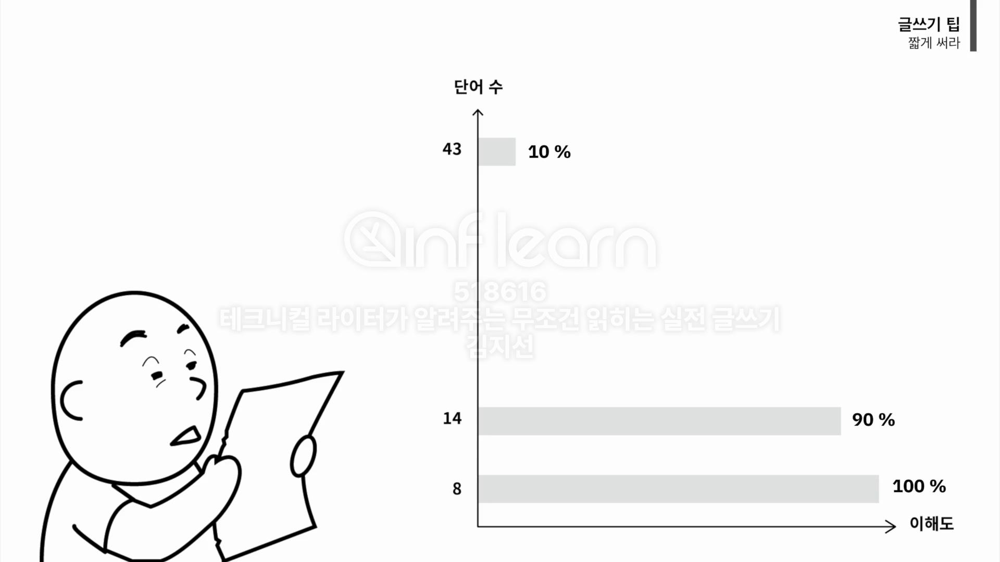
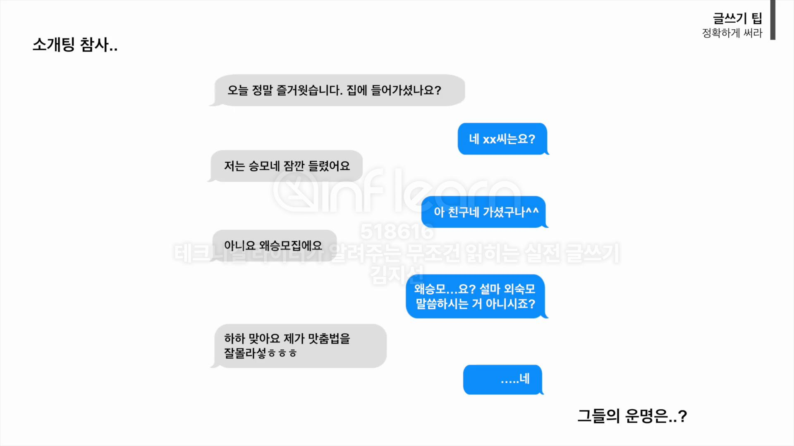
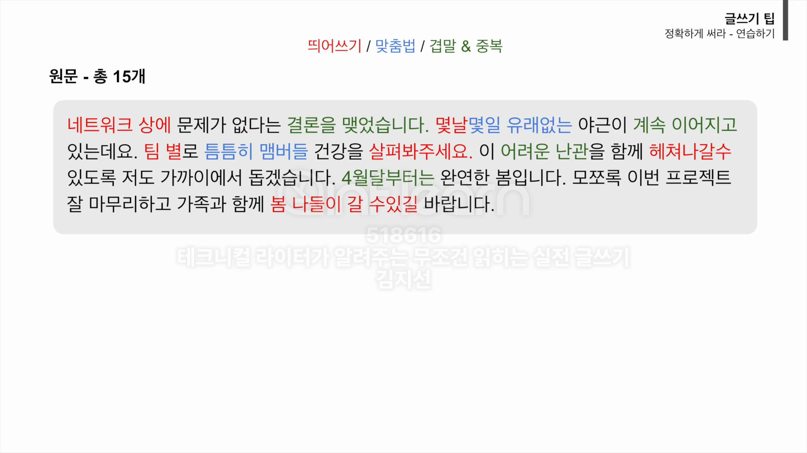

<!-- TOC -->
* [Part 1. 글쓰기 팁](#part-1-글쓰기-팁)
  * [01  "짧게 써라" - 독자의 머릿속에 100% 꽂히는 기술](#01-짧게-써라---독자의-머릿속에-100-꽂히는-기술)
    * [짧은 문장을 쓰는 기술 2가지(단문 쓰기, 불필요한 내용 삭제)](#짧은-문장을-쓰는-기술-2가지단문-쓰기-불필요한-내용-삭제)
    * [실습: 짧게 쓰기 연습하기](#실습-짧게-쓰기-연습하기)
    * [일단 글을 쓰고나서 체크할 것](#일단-글을-쓰고나서-체크할-것)
  * [02 "정확하게 써라" - 글의 품격을 결정하는 1%의 디테일](#02-정확하게-써라---글의-품격을-결정하는-1의-디테일)
    * [[정확하게 써라]](#정확하게-써라-)
    * [실습: 정확하게 쓰기 연습하기](#실습-정확하게-쓰기-연습하기)
  * [03 첫 문장으로 승리하는 법 - 결론부터 꽂는 두괄식 글쓰기](#03-첫-문장으로-승리하는-법---결론부터-꽂는-두괄식-글쓰기)
  * [04 선비 병 탈출하기 - 말하듯이 쓴다](#04-선비-병-탈출하기---말하듯이-쓴다-)
* [Part 2. 숨이 긴 글쓰기](#part-2-숨이-긴-글쓰기)
  * [05 글의 뼈대 세우기 - 길을 잃지 않는 글쓰기의 기술](#05-글의-뼈대-세우기---길을-잃지-않는-글쓰기의-기술)
  * [06 끔찍한 초안 만들기 - 완벽주의 버리기](#06-끔찍한-초안-만들기---완벽주의-버리기)
  * [07 원석을 보석으로 - 초고를 명품으로 바꾸는 3가지 처방](#07-원석을-보석으로---초고를-명품으로-바꾸는-3가지-처방)
<!-- TOC -->

# Part 1. 글쓰기 팁

## 01  "짧게 써라" - 독자의 머릿속에 100% 꽂히는 기술

_(by. American Press Institute)_

- 단어가 적을수록, 문장이 짧을수록 이해도가 높아짐.
  - 8단어 이하일 경우 이해도가 100%, 43단어일 경우 이해도가 10%.
- 하나의 긴 문장보다, 짧은 문자 여러개로 쪼개는 것이 좋음.
  - 독자뿐만 아니라, 글쓴이 자신도 길을 잃지 않음.

### 짧은 문장을 쓰는 기술 2가지(단문 쓰기, 불필요한 내용 삭제)

1. **단문으로 써라**
   1. _하나의 주어, 하나의 서술어_
   2. 접속사를 줄이고, 마침표를 찍어라.
   3. 하나의 문장에는 하나의 메시지만
2. **불필요한 내용은 삭제해라 - 미사여구 덜어내기**
   1. _핵심 내용을 이해하는 데 문제가 없다면 과감히 삭제_
   2. 수식어는 과감히 삭제해라. (군더더기를 빼면 글의 핵심이 드러남)

> 💡 _**쓰고, 자르고, 삭제하는 연습을 반복하라**_

**단문으로 쓰기 예시**

> 글의 생명은 화려함이 아니고 정확하게 전달되는 것이다.
> 
> 👉 글의 생명은 화려함이 아니다. 정확하게 전달되는 것이다.

- 글의 생명은 화려함이 아니다. (글의 생명은) 정확하게 전달되는 것이다.
  - 연달아 나오는 문장은 인간의 뇌가 내용을 연속적으로 이해하므로 여기서는 주어 생략해도 무방함.

**불필요한 내용 삭제 예시**

> 그 상황을 딱 마주할 친구의 표정이 마냥 궁금해지기만 한다.
> 
> 👉 그 상황을 마주할 친구의 표정이 궁금해지기만 하다.
> 
> 👉 그 상황을 마주할 친구의 표정이 궁금하다.

### 실습: 짧게 쓰기 연습하기

> (원문)
> 
> 한 문장에 40자를 넘기지 않는 것은 매우 중요한데 문장을 길게 쓰면 쓸수록 점점 문장은 꼬이고 불필요한 말들이 계속해서 들어간다. 글을 짧게 쓰는 훈련을 해야 하는 데 글을 무작정 술술 쓴다고 글쓰기 실력은 늘지 않기에 방법을 알고 그에 따라서 쓰면 우리가 원하는 깔끔한 글을 쓸 수 있다.

**단문으로 쓰기 연습**

> 👉 한 문장에 40자를 넘기지 않는 것은 매우 중요하다. 문장을 길게 쓰면 쓸수록 점점 문장은 꼬인다. 불필요한 말들이 계속해서 들어간다. 글을 짧게 쓰는 훈련을 해야 한다. 글을 무작정 술술 쓴다고 글쓰기 실력은 늘지 않는다. 방법을 알고 그에 따라서 쓰면 우리가 원하는 깔끔한 글을 쓸 수 있다.

**불필요한 내용 삭제 연습**

> 👉 한 문장에 40자를 넘기지 않는 것은 중요하다. 문장을 길게 쓰면 문장은 꼬인다. 불필요한 말들이 들어간다. 글을 짧게 쓰는 훈련을 해야 한다. 글을 무작정 쓴다고 글쓰기 실력은 늘지 않는다. 방법을 알고 쓰면 깔끔한 글을 쓸 수 있다.

- 최종 다듬기 결과 97자. 원문 118자.

### 일단 글을 쓰고나서 체크할 것

단문 쓰기를 위한 체크리스트

1. 한 문장에 주어와 서술어가 하나씩만 있는가?
2. 불필요한 내용이 있는가?

## 02 "정확하게 써라" - 글의 품격을 결정하는 1%의 디테일

- 맞춤법 틀리는 순간 글의 내용은 눈에 들어오지 않음.

### 정확하게 써라

1. 중복, 겹말 사용하지 말기
2. 맞춤법, 띄어쓰기 올바르게 쓰기

---

**중복, 겹말 사용하지 말기** 예시

> - 무슨 일이 있어도 그 말만은 절대로 하면 안 된다.
> - 행복해지려면 우선 먼저 건강부터 신경 써.
> - 이 기간 동안에는 쥐 죽은 듯이 살아야 해.
> - 의료진들 수십여 명이 대기하고 있다.
> - 2시 이후부터 가능합니다.

👉

> - 그 말만은 절대로 하면 안 된다.
> - 무슨 일이 있어도 그 말만은 하면 안 된다.
> 
> 
> - 행복해지려면 우선 건강부터 신경 써.
> - 행복해지려면 먼저 건강부터 신경 써.
> 
> 
> - 이 기간에는 쥐 죽은 듯이 살아야 해.
> 
> 
> - 의료진 수십 명이 대기하고 있다.
> 
> 
> - 2시부터 or 2시쯤부터 가능합니다.

---

**맞춤법, 띄어쓰기 올바르게 쓰기** 예시

> - 필요시 틈틈히 연락할께요.
> - 역활을 지정하세요.
> - 너한테도 없는게 나라고 있겠니?
> - 최소값과 최대값을 입력하세요.
> - 말을 삼가하세요.

👉 

> - 필요시 틈틈이 연락할게요.
> - 역할을 지정하세요.
> - 너한테도 없는 게 나라고 있겠니? (것이의 준말)
> - 최솟값과 최댓값을 입력하세요.
> - 말을 삼가세요.

### 실습: 정확하게 쓰기 연습하기

> (원문)
> 
> 네트워크 상에 문제가 없다는 결론을 맺었습니다. 몇날몇일 유래없는 야근이 계속 이어지고 있는데요. 팀 별로 틈틈히 맴버들 건강을 살펴봐주세요. 이 어려운 난관을 함께 헤쳐나갈수 있도록 저도 가까이에서 돕겠습니다. 4월달부터는 완연한 봄입니다. 모쪼록 이번 프로젝트 잘 마무리하고 가족과 함께 봄 나들이 갈 수있길 바랍니다.

(오류 총 15개)

👉
 
> 네트워크상에 문제가 없다는 결론을 냈습니다. 몇 날 며칠 유례없는 야근이 이어지고 있는데요. 팀별로 틈틈이 멤버들 건강을 살펴봐 주세요. 이 난관을 함께 헤쳐나갈 수 있도록 저도 가까이에서 돕겠습니다. 4월부터는 완연한 봄입니다. 모쪼록 이번 프로젝트 잘 마무리하고 가족과 함께 봄나들이 갈 수 있길 바랍니다.

- 네트워크 상에 > 네트워크상에
    - 통신상, 인터넷상처럼 '상'을 붙여씀.
- 결론을 맺었습니다 > 결론을 냈습니다
    - '결론'과 '맺었다'는 의미 중복
- 몇날 > 몇 날
- 몇일 > 며칠
- 유래없는 > 유례없는
- 계속 이어지고 > 이어지고
- 팀 별로 > 팀별로
- 틈틈히 > 틈틈이
- 맴버들 > 멤버
- 살펴봐주세요 > 살펴봐 주세요
- 어려운 난관을 > 난관을
- 헤쳐나갈수 > 헤쳐나갈 수
- 4월달부터 > 4월부터
- 봄 나들이 > 봄나들이
    - 합성어로 붙여씀.
    - 가을 나들이는 '가을 나들이'가 맞음.
- 갈 수있길 > 갈 수 있길

### 맞춤법 검사기 추천

> 공지글 또는 업무 비즈니스 메일을 쓸 때는 반드시 보내기 전에 맞춤법 검사 진행.

1. 네이버 맞춤법 검사기
2. 다음 맞춤법 검사기
3. 바른 한글(구 부산대 한국어 맞춤법. 자주 사용)

## 03 첫 문장으로 승리하는 법 - 결론부터 꽂는 두괄식 글쓰기

## 04 선비 병 탈출하기 - 말하듯이 쓴다 

# Part 2. 숨이 긴 글쓰기

## 05 글의 뼈대 세우기 - 길을 잃지 않는 글쓰기의 기술

## 06 끔찍한 초안 만들기 - 완벽주의 버리기

## 07 원석을 보석으로 - 초고를 명품으로 바꾸는 3가지 처방