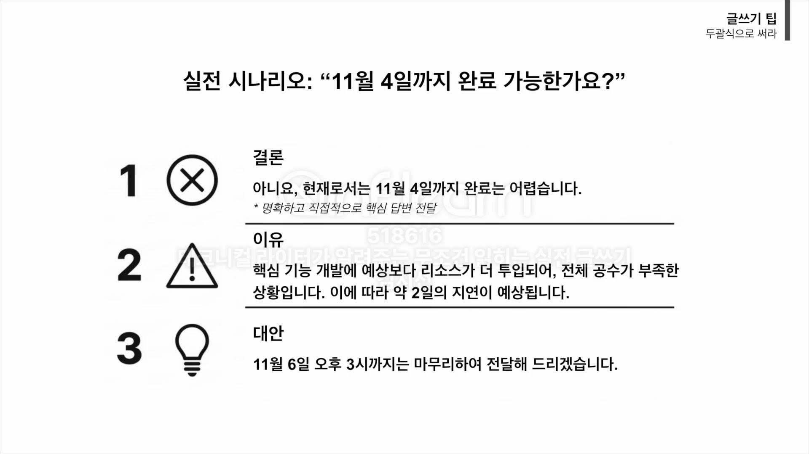
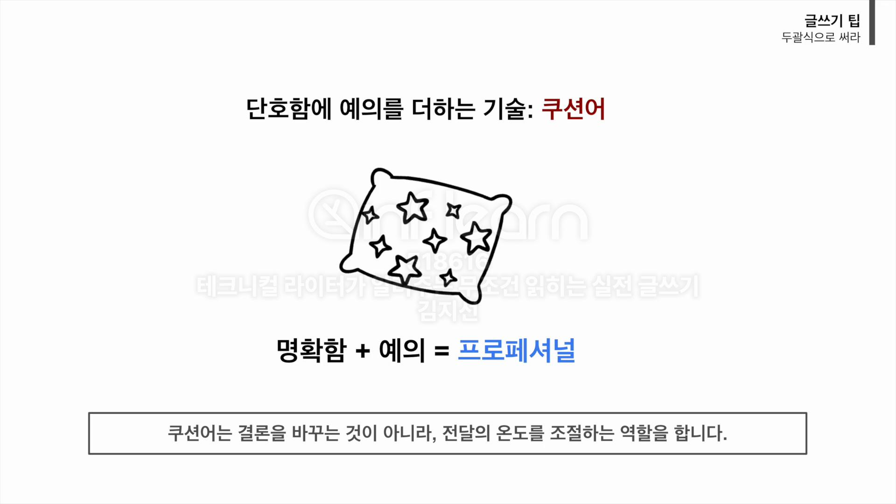
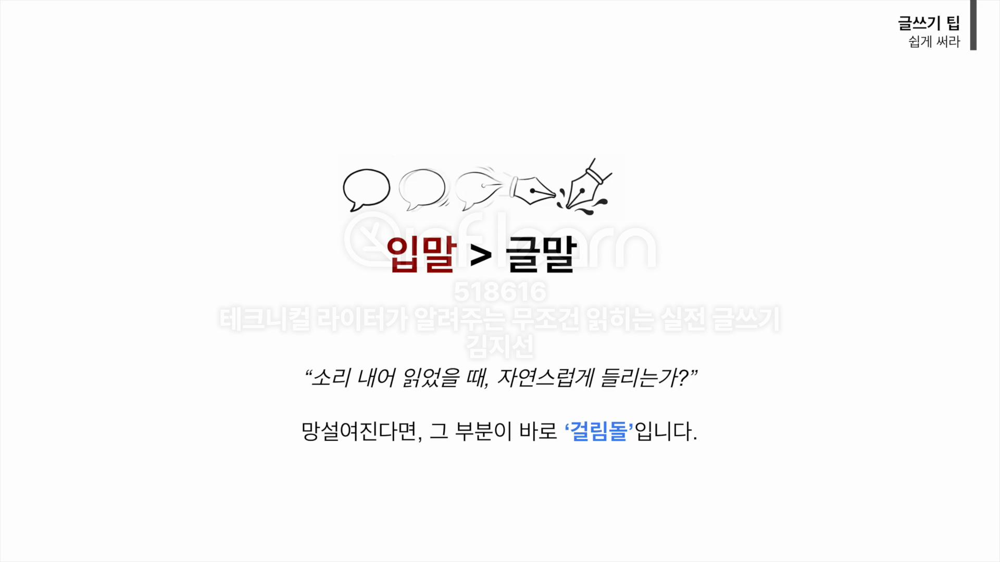
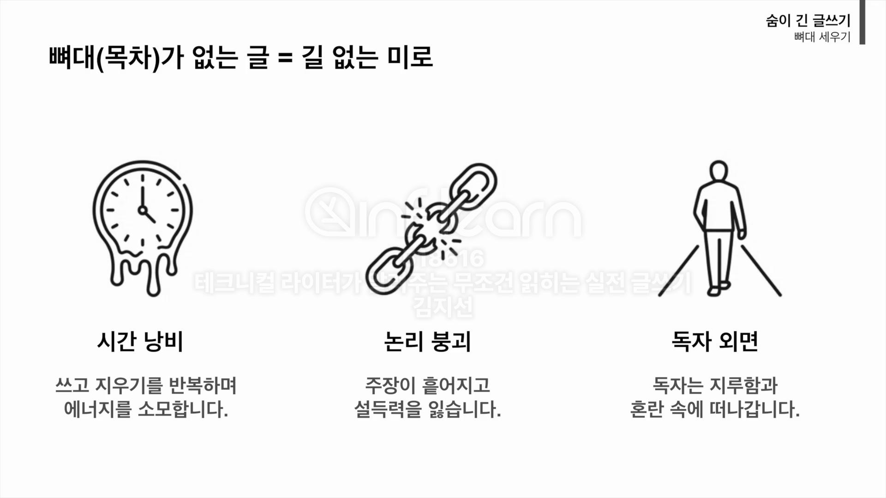
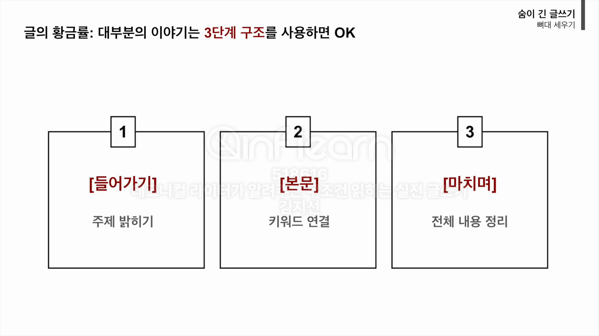
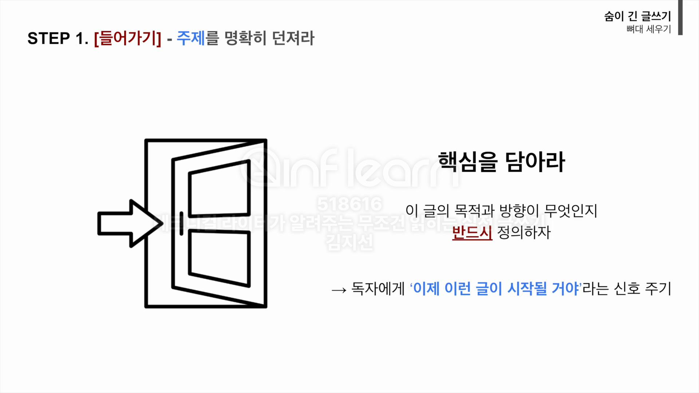
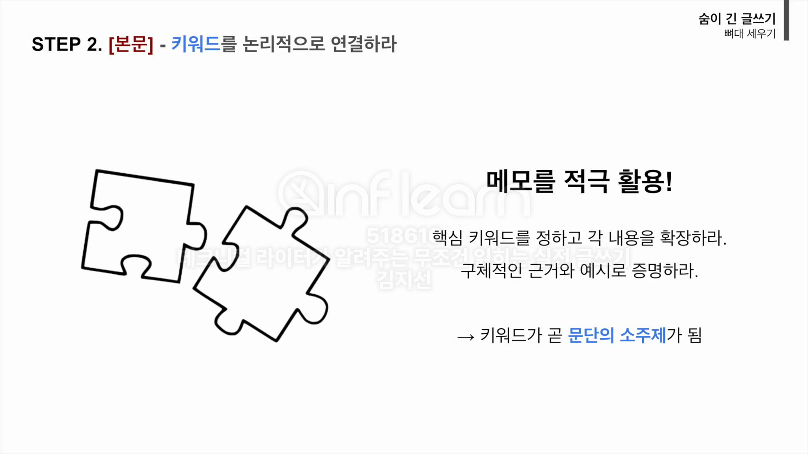
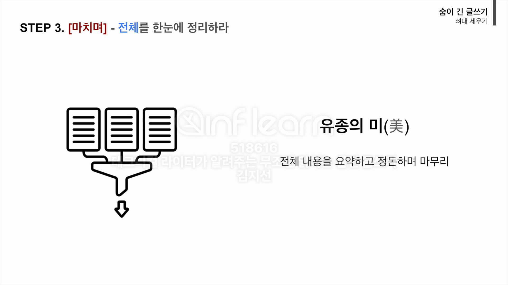

<!-- TOC -->
* [Part 1. 글쓰기 팁](#part-1-글쓰기-팁)
  * [01  "짧게 써라" - 독자의 머릿속에 100% 꽂히는 기술](#01-짧게-써라---독자의-머릿속에-100-꽂히는-기술)
    * [짧은 문장을 쓰는 기술 2가지(단문 쓰기, 불필요한 내용 삭제)](#짧은-문장을-쓰는-기술-2가지단문-쓰기-불필요한-내용-삭제)
    * [실습: 짧게 쓰기 연습하기](#실습-짧게-쓰기-연습하기)
    * [일단 글을 쓰고나서 체크할 것](#일단-글을-쓰고나서-체크할-것)
  * [02 "정확하게 써라" - 글의 품격을 결정하는 1%의 디테일](#02-정확하게-써라---글의-품격을-결정하는-1의-디테일)
    * [정확하게 써라](#정확하게-써라)
    * [실습: 정확하게 쓰기 연습하기](#실습-정확하게-쓰기-연습하기)
    * [맞춤법 검사기 추천](#맞춤법-검사기-추천)
  * [03 "두괄식으로 써라" (feat. 단호함에 예의를 더하는 쿠션어)](#03-두괄식으로-써라-feat-단호함에-예의를-더하는-쿠션어)
    * [두괄식 작성 방법](#두괄식-작성-방법)
    * [두괄식 글쓰기 실전 시나리오](#두괄식-글쓰기-실전-시나리오)
    * [단호함에 예의를 더하는 기술: 쿠션어](#단호함에-예의를-더하는-기술-쿠션어)
    * [두괄식 글쓰기를 위한 체크리스트](#두괄식-글쓰기를-위한-체크리스트)
  * [04 "쉽게 써라" (선비 병 탈출하기 - 말하듯이 쓴다)](#04-쉽게-써라-선비-병-탈출하기---말하듯이-쓴다-)
    * [글을 쉽게 쓰는 방법 HOW TO](#글을-쉽게-쓰는-방법-how-to)
    * [구어체로 써라](#구어체로-써라)
    * [우리말로 써라](#우리말로-써라)
    * [쉬운 글을 위한 체크리스트](#쉬운-글을-위한-체크리스트)
* [Part 2. 숨이 긴 글쓰기](#part-2-숨이-긴-글쓰기)
  * [05 글의 뼈대 세우기 - 길을 잃지 않는 글쓰기의 기술](#05-글의-뼈대-세우기---길을-잃지-않는-글쓰기의-기술)
    * [글의 뼈대 세우기 방법](#글의-뼈대-세우기-방법)
    * [STEP1. [들어가기] - 주제를 명확히 던져라](#step1-들어가기---주제를-명확히-던져라)
    * [STEP2. [본문] - 키워드를 논리적으로 연결하라](#step2-본문---키워드를-논리적으로-연결하라)
    * [STEP3. [마치며] - 전체를 한눈에 정리하라](#step3-마치며---전체를-한눈에-정리하라)
    * [뼈대 세우기 예시: 혼란에서 명확함으로](#뼈대-세우기-예시-혼란에서-명확함으로-)
    * [글의 뼈대 세우기를 위한 체크리스트](#글의-뼈대-세우기를-위한-체크리스트)
  * [06 끔찍한 초안 만들기 - 완벽주의 버리기](#06-끔찍한-초안-만들기---완벽주의-버리기)
  * [07 원석을 보석으로 - 초고를 명품으로 바꾸는 3가지 처방](#07-원석을-보석으로---초고를-명품으로-바꾸는-3가지-처방)
<!-- TOC -->

# Part 1. 글쓰기 팁

1. 짧게 쓰기
2. 정확하게 쓰기
3. 두괄식으로 쓰기
4. 쉽게 쓰기

## 01  "짧게 써라" - 독자의 머릿속에 100% 꽂히는 기술

_(by. American Press Institute)_

- 단어가 적을수록, 문장이 짧을수록 이해도가 높아짐.
  - 8단어 이하일 경우 이해도가 100%, 43단어일 경우 이해도가 10%.
- 하나의 긴 문장보다, 짧은 문자 여러개로 쪼개는 것이 좋음.
  - 독자뿐만 아니라, 글쓴이 자신도 길을 잃지 않음.

### 짧은 문장을 쓰는 기술 2가지(단문 쓰기, 불필요한 내용 삭제)

1. **단문으로 써라**
   1. _하나의 주어, 하나의 서술어_
   2. 접속사를 줄이고, 마침표를 찍어라.
   3. 하나의 문장에는 하나의 메시지만
2. **불필요한 내용은 삭제해라 - 미사여구 덜어내기**
   1. _핵심 내용을 이해하는 데 문제가 없다면 과감히 삭제_
   2. 수식어는 과감히 삭제해라. (군더더기를 빼면 글의 핵심이 드러남)

> 💡 _**쓰고, 자르고, 삭제하는 연습을 반복하라**_

**단문으로 쓰기 예시**

> 글의 생명은 화려함이 아니고 정확하게 전달되는 것이다.
> 
> 👉 글의 생명은 화려함이 아니다. 정확하게 전달되는 것이다.

- 글의 생명은 화려함이 아니다. (글의 생명은) 정확하게 전달되는 것이다.
  - 연달아 나오는 문장은 인간의 뇌가 내용을 연속적으로 이해하므로 여기서는 주어 생략해도 무방함.

**불필요한 내용 삭제 예시**

> 그 상황을 딱 마주할 친구의 표정이 마냥 궁금해지기만 한다.
> 
> 👉 그 상황을 마주할 친구의 표정이 궁금해지기만 하다.
> 
> 👉 그 상황을 마주할 친구의 표정이 궁금하다.

### 실습: 짧게 쓰기 연습하기

> (원문)
> 
> 한 문장에 40자를 넘기지 않는 것은 매우 중요한데 문장을 길게 쓰면 쓸수록 점점 문장은 꼬이고 불필요한 말들이 계속해서 들어간다. 글을 짧게 쓰는 훈련을 해야 하는 데 글을 무작정 술술 쓴다고 글쓰기 실력은 늘지 않기에 방법을 알고 그에 따라서 쓰면 우리가 원하는 깔끔한 글을 쓸 수 있다.

**단문으로 쓰기 연습**

> 👉 한 문장에 40자를 넘기지 않는 것은 매우 중요하다. 문장을 길게 쓰면 쓸수록 점점 문장은 꼬인다. 불필요한 말들이 계속해서 들어간다. 글을 짧게 쓰는 훈련을 해야 한다. 글을 무작정 술술 쓴다고 글쓰기 실력은 늘지 않는다. 방법을 알고 그에 따라서 쓰면 우리가 원하는 깔끔한 글을 쓸 수 있다.

**불필요한 내용 삭제 연습**

> 👉 한 문장에 40자를 넘기지 않는 것은 중요하다. 문장을 길게 쓰면 문장은 꼬인다. 불필요한 말들이 들어간다. 글을 짧게 쓰는 훈련을 해야 한다. 글을 무작정 쓴다고 글쓰기 실력은 늘지 않는다. 방법을 알고 쓰면 깔끔한 글을 쓸 수 있다.

- 최종 다듬기 결과 97자. 원문 118자.

### 일단 글을 쓰고나서 체크할 것

단문 쓰기를 위한 체크리스트

1. 한 문장에 주어와 서술어가 하나씩만 있는가?
2. 불필요한 내용이 있는가?

## 02 "정확하게 써라" - 글의 품격을 결정하는 1%의 디테일

- 맞춤법 틀리는 순간 글의 내용은 눈에 들어오지 않음.

### 정확하게 써라

1. 중복, 겹말 사용하지 말기
2. 맞춤법, 띄어쓰기 올바르게 쓰기

---

**중복, 겹말 사용하지 말기** 예시

> - 무슨 일이 있어도 그 말만은 절대로 하면 안 된다.
> - 행복해지려면 우선 먼저 건강부터 신경 써.
> - 이 기간 동안에는 쥐 죽은 듯이 살아야 해.
> - 의료진들 수십여 명이 대기하고 있다.
> - 2시 이후부터 가능합니다.

👉

> - 그 말만은 절대로 하면 안 된다.
> - 무슨 일이 있어도 그 말만은 하면 안 된다.
> 
> 
> - 행복해지려면 우선 건강부터 신경 써.
> - 행복해지려면 먼저 건강부터 신경 써.
> 
> 
> - 이 기간에는 쥐 죽은 듯이 살아야 해.
> 
> 
> - 의료진 수십 명이 대기하고 있다.
> 
> 
> - 2시부터 or 2시쯤부터 가능합니다.

---

**맞춤법, 띄어쓰기 올바르게 쓰기** 예시

> - 필요시 틈틈히 연락할께요.
> - 역활을 지정하세요.
> - 너한테도 없는게 나라고 있겠니?
> - 최소값과 최대값을 입력하세요.
> - 말을 삼가하세요.

👉 

> - 필요시 틈틈이 연락할게요.
> - 역할을 지정하세요.
> - 너한테도 없는 게 나라고 있겠니? (것이의 준말)
> - 최솟값과 최댓값을 입력하세요.
> - 말을 삼가세요.

### 실습: 정확하게 쓰기 연습하기

> (원문)
> 
> 네트워크 상에 문제가 없다는 결론을 맺었습니다. 몇날몇일 유래없는 야근이 계속 이어지고 있는데요. 팀 별로 틈틈히 맴버들 건강을 살펴봐주세요. 이 어려운 난관을 함께 헤쳐나갈수 있도록 저도 가까이에서 돕겠습니다. 4월달부터는 완연한 봄입니다. 모쪼록 이번 프로젝트 잘 마무리하고 가족과 함께 봄 나들이 갈 수있길 바랍니다.

(오류 총 15개)

👉
 
> 네트워크상에 문제가 없다는 결론을 냈습니다. 몇 날 며칠 유례없는 야근이 이어지고 있는데요. 팀별로 틈틈이 멤버들 건강을 살펴봐 주세요. 이 난관을 함께 헤쳐나갈 수 있도록 저도 가까이에서 돕겠습니다. 4월부터는 완연한 봄입니다. 모쪼록 이번 프로젝트 잘 마무리하고 가족과 함께 봄나들이 갈 수 있길 바랍니다.

- 네트워크 상에 > 네트워크상에
    - 통신상, 인터넷상처럼 '상'을 붙여씀.
- 결론을 맺었습니다 > 결론을 냈습니다
    - '결론'과 '맺었다'는 의미 중복
- 몇날 > 몇 날
- 몇일 > 며칠
- 유래없는 > 유례없는
- 계속 이어지고 > 이어지고
- 팀 별로 > 팀별로
- 틈틈히 > 틈틈이
- 맴버들 > 멤버
- 살펴봐주세요 > 살펴봐 주세요
- 어려운 난관을 > 난관을
- 헤쳐나갈수 > 헤쳐나갈 수
- 4월달부터 > 4월부터
- 봄 나들이 > 봄나들이
    - 합성어로 붙여씀.
    - 가을 나들이는 '가을 나들이'가 맞음.
- 갈 수있길 > 갈 수 있길

### 맞춤법 검사기 추천

> 공지글 또는 업무 비즈니스 메일을 쓸 때는 반드시 보내기 전에 맞춤법 검사 진행.

1. 네이버 맞춤법 검사기
2. 다음 맞춤법 검사기
3. 바른 한글(구 부산대 한국어 맞춤법. 자주 사용)

## 03 "두괄식으로 써라" (feat. 단호함에 예의를 더하는 쿠션어)

- 두괄식은 기사, 자기소개서, 비즈니스 메일 등에 사용
- 결론 - 이유 - 근거 구조.
- 결론부터 들으니, 집중력이 올라감
- 빠르게 핵심을 파악할 수 있음.

### 두괄식 작성 방법

- '결론 > 이유/근거 > (대안)'의 순서로 정보를 구조화

---

**미괄식 글쓰기 예시**

> "팀장님, 가을입니다. 가을은 천고마비의 계절이죠. 서늘한 바람이 불어오기 시작하니 생각나는 음식이 있습니다. 집 나간 며느리도 돌아오게 한다는 말이 있을 정도로 이 계절에 맛있는 전어인데요. (중략) 제가 지난 주말에 시장을 다녀왔는데요. 마침 전어가 신선해 보여서 먹어 보니 맛있었습니다. **_그래서 이번 회식에는 전어 어떠신가요._**"

팀장은 메일에 치여 김대리의 메시지를 놓치고 말았다..

---

**두괄식 글쓰기 예시**

- 결론: 팀장님, 이번 달 회식은 전어 먹으러 가시죠!
- 이유 1: 지금이 제철이라 살이 오르고 맛있습니다.
- 이유 2: 주말에 직접 먹어보니 신선함이 남달랐습니다.

### 두괄식 글쓰기 실전 시나리오

- 실전 시나리오: _"11월 4일까지 완료 가능한가요?"_
- 위처럼 질문 받았을 때 평소에 어떻게 대답해 왔는가?

> 미괄식 답변 예:
> 
> 지금 저희 리소스도 없고요. 연휴도 겹쳐서요.
> 저희도 최대한 빠르게 해드리고 싶은데 여의치가 않네요. 
> 시간을 조금 더 주세요. 

> 두괄식 답변 예:
> 
> 👉
> 
> (결론) 아니요. 11월 4일까지 완료는 어렵습니다.
> 
> (이유) 핵심 기능 개발에 예상보다 리소스가 더 투입되어, 전체 공수가 부족한 상황입니다. 이에 따라 약 2일의 지연이 예상됩니다.
> 
> (대안) 11월 6일 오후 3시까지는 마무리하여 전달해 드리겠습니다.

- 일단 네/아니요로 대답할 수 있는 물음에 대해서는 무조건 대답부터해야함.

### 단호함에 예의를 더하는 기술: 쿠션어

- 두괄식은 인간미가 없다는 단점 존재. (단호함, 차가) 
  - 이 때 쿠션어 사용하여 글의 온도를 올릴 수 있음.
- 글을 말랑하게 하는 유용한 쿠션어
  - 그 이유를 구체적으로 말씀드리자면 / 부연 설명을 해드리면 
  - 아쉽게도 / 안타깝지만 / 유감스럽게도
  - 이러한 결정을 한 배경에는
  - ~한 점을 고려해 주시기 바랍니다.
  - 혹시 괜찮으시다면 / 가능하시다면
- **_두괄식이 좋지만, 읽는 사람을 차갑게 대하는 글은 좋은 글이 아님._**

### 두괄식 글쓰기를 위한 체크리스트

1. 핵심 메시지를 첫 문장에 담았는가?
2. '결론 -> 이유 -> 대안'의 구조를 따르는가?
3. 상대가 궁금해할 만한 질무에 미리 답하고 있는가?
4. 필요할 때 '쿠션어'를 적절히 사용하였는가?

## 04 "쉽게 써라" (선비 병 탈출하기 - 말하듯이 쓴다) 

- 글을 어렵게 쓰면 안 된다. 어렵게 글을 쓰는 습관에서 벗어나야한다.

### 글을 쉽게 쓰는 방법 HOW TO

1. 구어체로 쓴다.
   1. 문어체가 아닌 말하듯이 쓴다.
2. 가급적 우리말로 쓴다.
   1. 한자어를 줄이고 우리말로.

### 구어체로 써라

- 내가 쓴 글이 문어체인지, 구어체인지 알 수 있는 가장 쉬운 방법은 '소리 내어 읽어보는 것'.

> (문어체 예시)
> 
> 술을 많이 마시니 세상은 어지러이 돌아가고 뭔가 울컥하고 치밀어 올랐다. 
> 
> 통하여 or 말하였다
> 
> 미안함과 고마운 마음이 교차한다.

> (구어체 예시)
> 
> 술을 많이 마셔 어지럽고 토할 것 같았다. (있어 보이는 문장 쓰지 말기)
> 
> 통해 or 말했다. (늘어지는 표현 쓰지 말기)
> 
> 미안하기도 하고 고맙기도 했다.

- 쉽게 쓰기 원칙에서는 절대로 '있어 보이는 글'은 쓰지 말아야한다.

### 우리말로 써라

| 한자 사용       | 우리말 사용       |
|:------------|:-------------|
| 미사용 시에는     | 사용하지 않을 때는   |
| 일체의 것을 향유했다 | 모든 것을 누렸다    |
| 심적 고통이 있다.  | 마음이 아프다      |
| 그는 개인 파산했다  | 그는 빈털터리가 되었다 |
| 입금, 송금      | 채우기, 보내기     |

### 쉬운 글을 위한 체크리스트

1. 쉽고 부드러운 입말로 썼는가?
2. 어렵고 상투적인 한자어는 없는가?
3. 소리 내 검토했는가? 

# Part 2. 숨이 긴 글쓰기

## 05 글의 뼈대 세우기 - 길을 잃지 않는 글쓰기의 기술

- 글을 잃은 글쓰기의 문제점 
  - 시간 낭비 
    - 쓰고 지우기를 반복하며 에너지를 소모.
  - 논리 붕괴
    - 주장이 흩어지고 설득력을 잃음.
  - 독자 외면 
    - 독자는 지루함과 혼란 속에 떠나감.
- 글의 뼈대를 세우면 길을 잃지 않고 글을 쓸 수 있음.

### 글의 뼈대 세우기 방법

- 들어가기
  - 주제 밝히기
- 본문
  - 키워드 연결
- 마치며
  - 전체 내용 정리

### STEP1. [들어가기] - 주제를 명확히 던져라

- 이 글의 목적과 방향이 무엇인지 반드시 정의
- 독자에게 '이제 이런 글이 시작될 거야'라는 신호 주기
- 한 문장 정도로 주제를 요약해두면 좋음.

### STEP2. [본문] - 키워드를 논리적으로 연결하라

- 내용을 본격적으로 쓰기 전 주제와 관련된 핵심 키워드를 적어두면 좋음.
- 문장 단위가 아닌 단어나 문구 정도만 간단하게 적어두면 됨.
- 각 키워드가 곧 문단의 소주제가 됨.

### STEP3. [마치며] - 전체를 한눈에 정리하라

- 전체적인 내용을 정돈하며 마무리해야함.
- 글을 쓸 때 외면하기 쉬운 부분. 
  - 마무리를 단단하게 마무리하지 않으면 글 전체가 맥이 없게 됨.

### 뼈대 세우기 예시: 혼란에서 명확함으로 

1. 뼈대 없이 뒤죽박죽인 글 (나쁜 예시)

> 책을 읽는 건 참 좋은 일이다. 어제 나는 서점에 갔는데 재미있는 소설책을 발견했다. 그런데 요즘 사람들은 스마트폰만 보고 책을 잘 안 읽는다. 책을 읽으면 어휘력이 좋아진다고 한다. 아무튼 책은 마음의 양식이다. 사실 책 읽기는 스트레스 해소에도 도움이 된다고 어디서 들었다. 하지만 책 읽는 건 지루할 때가 많다. 그래도 참아야 한다. 내가 아는 친구는 책을 많이 읽어서 말을 잘한다. 타인의 감정을 이해하는 데도 책이 좋다고 한다. 소설 속 주인공이 되어볼 수 있으니까 말이다. 그러니까 우리는 책을 읽어야 한다. 어휘력도 늘고 스트레스도 풀리니까. 스마트폰은 눈이 아픈데 책은 종이라서 좋다. 하루에 30분이라도 읽자. 독서는 정말 중요하다.

2. 뼈대를 잘 세운 글(좋은 예시)

> 1. 들어가기(서론): 책은 우리 삶을 풍요롭게 만드는 도구다.
> 2. 본문: 독서의 장점 3가지
>    1. 어휘력과 사고력을 키움
>    2. 공감 능력 향상
>    3. 스트레스 해소에 도움
> 3. 마치며(결론): 책 읽기를 통해 더 나은 사람이 될 수 있다.

> (실제 글쓰기 예시)
> 
> 구조: [들어가기: 독서의 필요성] $\rightarrow$ [본문: 독서의 장점 3가지] $\rightarrow$ [마치며: 요약 및 제안]
> 
> 1. 들어가기 (서론)
> 
> 현대인들은 스마트폰과 영상 매체에 익숙해져 활자를 멀리하고 있습니다. 하지만 독서는 단순한 취미가 아닙니다. 우리 삶의 질을 높이는 가장 확실한 방법입니다. 바쁜 일상에서도 책을 손에서 놓지 말아야 하는 이유를 세 가지로 나누어 살펴보겠습니다.
> 
> 
> 2. 본문
> 
> 첫째, 독서는 어휘력과 사고력을 길러줍니다. 다양한 문장을 접하면서 어휘가 자연스럽게 풍부해집니다. 저자의 깊은 생각을 따라가며 논리적으로 생각하는 힘도 강해집니다. 이는 말을 조리 있게 하고 글을 잘 쓰는 밑거름이 됩니다.
> 
> 둘째, 타인에 대한 공감 능력을 키워줍니다. 특히 소설 같은 문학 작품을 읽으면 주인공의 상황과 감정에 이입하게 됩니다. 나와 다른 삶을 간접 체험하면서 타인을 이해하는 폭이 넓어집니다.
>
> 셋째, 독서는 훌륭한 스트레스 해소법입니다. 연구 결과에 따르면, 조용한 곳에서의 독서는 심박수를 낮추고 근육 긴장을 풀어줍니다. 복잡한 현실에서 잠시 벗어나 책 속 세계에 몰입하는 것은 정신적 휴식을 제공합니다.
> 
> 3. 마치며 (결론)
>   
> 독서는 어휘력을 향상시키고, 공감 능력을 키우며, 마음의 안정을 줍니다. '마음의 양식'이라는 말처럼, 오늘부터 잠들기 전 30분씩 독서하는 습관을 들여보는 것은 어떨까요? 책 한 권이 당신의 내일을 더 풍요롭게 만들 것입니다.

### 글의 뼈대 세우기를 위한 체크리스트

1. '들어가기 -> 본문 -> 마치며'의 구조를 따르는가?
2. [들어가기]에서 주제/핵심을 밝혔는가?
3. [본문]에서 주제에 맞는 키워드를 나열했는가?
4. [마치며]에서 주제를 다시 언급했는가?

## 06 끔찍한 초안 만들기 - 완벽주의 버리기

## 07 원석을 보석으로 - 초고를 명품으로 바꾸는 3가지 처방