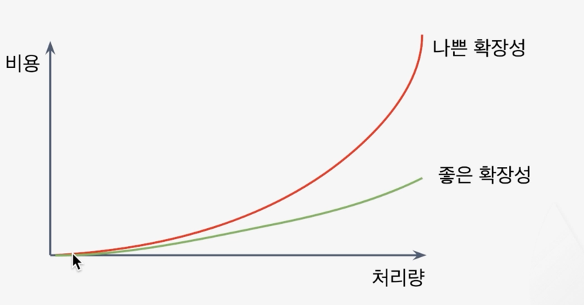
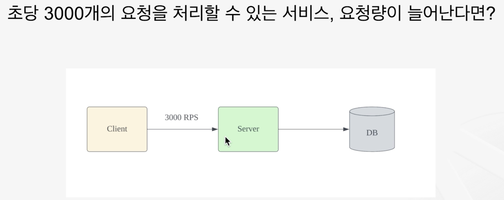
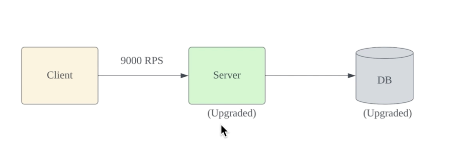
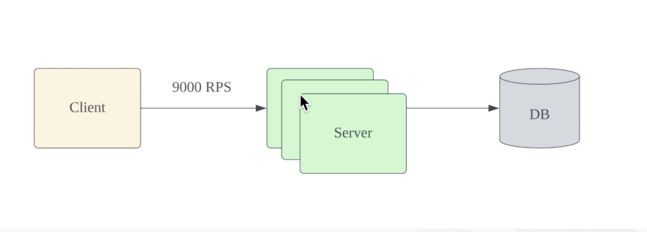
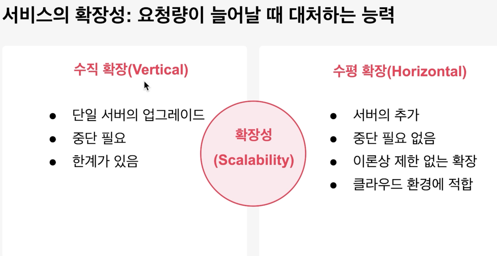
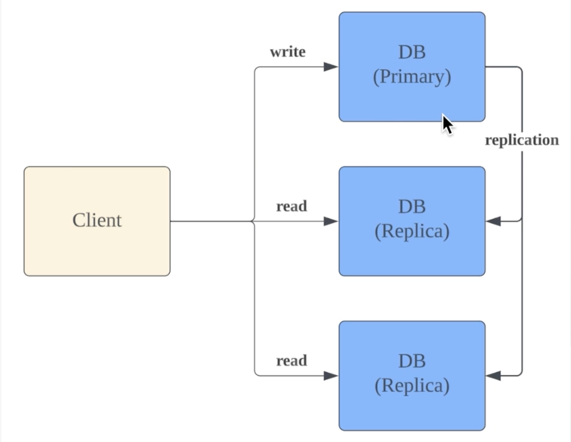
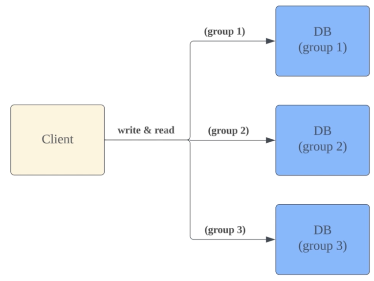
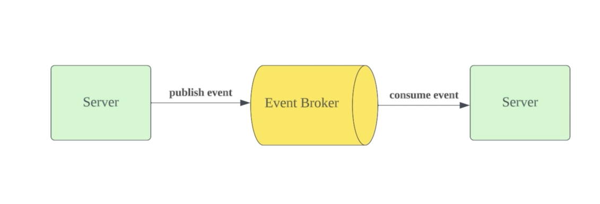

<!-- TOC -->
* [서비스의 확장성](#서비스의-확장성)
  * [서비스의 처리량](#서비스의-처리량)
  * [확장의 종류(수직 확장, 수평 확장)](#확장의-종류수직-확장-수평-확장)
    * [수직 확장(Vertical Scaling)](#수직-확장vertical-scaling)
    * [수평 확장(Horizontal Scaling)](#수평-확장horizontal-scaling)
  * [요약: 언제 무엇을 쓸까](#요약-언제-무엇을-쓸까)
* [확장성을 위한 복제와 분산](#확장성을-위한-복제와-분산)
  * [복제와 분산](#복제와-분산)
    * [복제](#복제)
    * [분산](#분산)
* [남은 문제들과 해결책](#남은-문제들과-해결책)
  * [분산으로 해결되지 않는 문제](#분산으로-해결되지-않는-문제)
  * [개선 방향: EDA](#개선-방향-eda)
    * [이벤트 기반 처리로 얻는 것들](#이벤트-기반-처리로-얻는-것들)
<!-- TOC -->

# 서비스의 확장성

- 확장성(Scalability)
  - 서비스가 더 많은 작업 부하를 수용하도록 대처할 수 있는 능력 
- 나쁜 확장성
  - 확장성이 나쁠 경우, 비용이 늘어나도 처리량은 그대로인 경우가 많음. 
  - 이것은 지속 가능하지도 않은 구조. 비용 상승이 너무 커서 처리량을 늘릴 수 없는 단계가 온다.
  - 여기서 비용은 단순 금전적인 비용 뿐만 아니라, 개발자의 관리 복잡도도 포함하는 개념임.
- 좋은 확장성
  - 처리량이 올라가도 비용 상승이 가파르지 않음.
  - 잘 설계된 시스템은 그림의 초록색 선을 따르게 된다.

## 서비스의 처리량

- 초당 3000개의 요청을 처리할 수 있는 서비스가 있다고 하자.
- 이 때 초당 4000개의 요청이 들어온다면??
  - 운이 좋으면 처리를 할 수 있을 것
  - 혹은 Timeout이 발생할 수도 있다.
  - 최악의 경우는 4000개의 요청이 들어감으로써 사이드 이펙트로 전체를 망가뜨리는 경우가 있을 수 있음.
    - 기존 잘 처리하던 3000개 처리도 지연되는 문제 발생 가능.

## 확장의 종류(수직 확장, 수평 확장)

### 수직 확장(Vertical Scaling)

- 개별 서버의 하드웨어 업그레이드로 성능 향상(CPU, RAM, Disk 등)
  - 당장은 처리량은 늘 수 있음.
- 확장시 일시적 중단 필요.
  - CPU나 RAM등은 재부팅을 해야하므로 일시적 중단 필요.
- 하드웨어 비용이 높고, 금방 한계에 도달.

### 수평 확장(Horizontal Scaling)

- 서버를 추가하여 처리 능력을 확장. (이론상 무제한 추가 가능)
- 장점
  - 일시적 중단 불필요. 리소스 추가와 제거가 유연함.
  - 하드웨어 비용 저렴
- 단점
  - **복잡성 증가**
    - 클라이언트 요청이 확장된 서버로 가게 해야하고, 없어진 서버로는 요청이 가지 않도록 해야한다.
  - 데이터 일관성 문제
    - DB가 여러 개일 때 생기는 문제
      - DB가 병목 지점일 때, DB를 여러 개로 늘릴 수 있음.
      - 데이터가 3군데에 나눠져서 들어가게 됨.
        - 여러 요청이 들어왔을 때 어느 DB에서 어떻게 처리하지? 
        - 동일한 데이터에 대한 수정 요청이 들어왔을 때 충돌 발생 가능. 

## 요약: 언제 무엇을 쓸까

- 수직 확장 
  - 관계형 데이터베이스 서버는 데이터 일관성 문제가 중요하기 때문에, 수직 확장을 쓰는 경우가 많다.
    - 데이터 일 관성을 지키는 것이 중요하기 때문에, 높은 비용을 지불하더라도 주로 수직 확장을 쓰는 경우를 쓴다.
- 수평 확장
  - 애플리케이션의 확장은 주로 수평 확장을 사용
  - NoSQL은 주로 수평 확장을 사용.
    - 그래서 NoSQL은 Join 불가능. 노드들이 나눠져 있기 때문. 

---

# 확장성을 위한 복제와 분산

> - 수평적 확장을 이용해서 확장성을 높이는게 추세이다.
> - 이번 강의에서 다룰 내용은 수평 확장

## 복제와 분산

수평 확장을 위한 방법으로 복제와 분산이 있음.

- 복제(Replication)
  - 데이터나 서비스의 복사본을 만들어서 처리.
  - 실시간으로 메인 DB의 변경이 일어날 때마다 복제 DB에 반영.
- 분산(Distribution)
  - 데이터나 서비스를 여러 곳에 나누어 처리.
  - 메인 DB 자체를 쪼개는 것.

👉 가용성과 성능 최적화를 위해 사용된다는 공통점.

### 복제

- `primary`와 `replica`가 존재.
  - `replica`는 읽기만 가능
  - 쓰기는 `primary`를 통해서 할 수 밖에 없음. (replica는 read-only이므로)
- 성능 분산 여부
  - 읽기 부하를 분산 가능.
  - 쓰기 부하는 분산 불가능.
    - 즉, 읽기 성능만 향상되는 것이고, 쓰기 성능이 향상되는 것은 아님.
- 복제 지연의 문제(데이터 일관성)
  - primary에 쓰고, 아주 짧은 시간 내에 다시 읽어왔을 때 발생하는 문제.
    - A 클라이언트가 쓰고, B 클라이언트가 읽었을 때 아직 복제가 완전히 이루어지지 않아서 쓰기 전의 데이터가 조회되는 문제 발생 가능. (dirty-read 느낌)
      - 👉 데이터 일관성 문제가 발생. but 최종적 일관성 수준을 따른다.
      - 최종적 일관성 (일관성 수준의 한 종류): 
        - 일시적으로는 불일치가 있을 수 있지만, 결국에는 모든 데이터는 동일하게 업데이트가 되기 때문에 최종적으로는 일관성이 맞춰진다.
- `replica`를 장애 복구용으로도 사용 가능.

### 분산

- 여러 노드가 범위를 나누어 데이터 처리
- node 별로 처리할 범위(group)를 지정
  - 예: 사용자 ID 기준
    - 1 ~ 1000: group1
    - 1001 ~ 2000: group2
    - 2001 ~ 3000: group3
- RDB의 파티셔닝(샤딩), Redis 클러스터 
- 읽기 & 쓰기 부하를 분산할 수 있어서 성능 향상에 용이
- 밸런싱과 routing이 중요하고, consistent hashing과 같은 기법이 사용됨.
  - 노드가 여러 개 있을 때 클라이언트 요청을 어디로 보내줄 지 관리. 노드의 개수가 바뀌었을 때에 대한 처리 등
  - 예를 들어 노드 3개가 있고, 하나가 추가 되면 새로 추가된 노드로 트래픽을 보내기 위해서 **전체 범위를 재조정해야함.**
- **RDB에서는 JOIN 연산이 불가능**
  - 노드간 연산이 불가능하므로, RDB에서는 수직 확장을 이용해서 primary의 성능을 높인 다음에 일부 read-traffic 만 분산하기 위해서 복제를 주로 사용.
  - NoSQL에서는 JOIN을 포기하고 아주 높은 성능을 보장.

---

# 남은 문제들과 해결책

## 분산으로 해결되지 않는 문제

- 분산 처리에 따라오는 복잡도와 동시성 문제
  - 데이터 일관성 문제
  - Routing의 처리
  - 노드 개수 변화에 따른 재조정(rebalancing)
  - 부분 장애
- 요청량이 급변할 때(spike traffic)의 확장 문제
- 처리량을 넘었을 때 발생할 수 있는 일시적인 오류

## 개선 방향: EDA

- Event-Driven 아키텍처
  - **이벤트(메시지) 기반**으로 **비동기 통신**을 이용해 상호작용하는 구조
  - 이벤트 발행 주체는 누구든지 될 수 있음.
### 이벤트 기반 처리로 얻는 것들

- **요청량 변화에 탄력적으로 대응 가능(비동기적 특성으로 인한 쉬운 확장)**
  - 요청량이 일시적으로 늘어도, 이벤트 브로커가 일시적으로 트래픽을 보관할 수 있음.
  - 이벤트를 컨슘하는 서버들은 자신의 속도에 맞게 소비를 하면서 처리를 이어간다.

- **관련 서비스의 일시적 오류에도 데이터 유실 없이 정상 작동**
  - 이벤트 기반의 비동기 통신이 아닌 경우, 일반적인 API의 Point-to-Point(점대점) 구조로 연결된 호출 구조의 경우, 
    - A 서비스가 B 서비스를 호출한다고 했을 때, B 서비스에 오류가 생기면 그동안 A 서비스에도 오류가 생김.
  - 이벤트 구조로 변경하게 되면?
    - B 서비스에 에러가 생기더라도 A 서비스는 이벤트 브로커로 필요한 이벤트를 발행 가능하다.
    - 이벤트 브로커는 해당 이벤트를 보관한다. B 서비스가 복구되었을 때, 쌓여있는 이벤트를 소비하면서 작업 진행 가능.

- **다른 서비스들과의 느슨한 결합(변경 영향도 최소화)**
  - 예를 들어 비이벤트 구조에서 A 서비스와 B 서비스가 연결되어 있을 때, B 서비스가 변경되었다면 A 서비스도 변경해야함. 이벤트 구조에서는 이런 경우가 줄어든다.
 
- **대용량 데이터의 실시간 처리(Batch 처리와 비교)**
  - Batch 처리: 일정 주기로 실행하면서, 아주 많은 데이터를 한꺼번에 실행하고 싶을 때 사용하는 방식.
  - Batch 처리와 비교해서 이벤트 구조의 경우, 스트림이라는 끊임없이 발행되는 이벤트를 기반으로 바로 처리가 가능. 
    - Batch 처리를 이벤트 기반 스트림으로 
      변경하는 것도 좋은 선택지가 된다.

