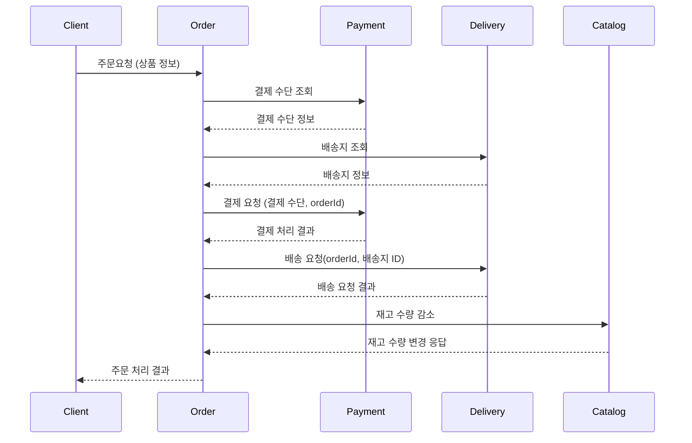

# 프로젝트 요구사항 분석 및 정리

- 요약: 온라인으로 상품을 등록하고 판매하는 e-commerce 시스템. 다량의 데이터와 높은 동시접속자 수 환경에서 안정적으로 요청을 처리할 수 있다.

## 요구사항 수집

### 판매자

- 판매자는 상품을 등록할 수 있다.
- 판매자는 상품의 설명, 수량 등 정보를 관리할 수 있다.

### 구매자

- 구매자는 상품을 구매할 수 있다.
- 구매자는 상품을 검색할 수 있다.
- 구매자는 결제수단을 등록하고 주문 시  사용할 수 있다.
- 구매자는 배송지를 등록하고 주문 시 사용할 수 있다.
- 구매자는 완료된 주문의 배송 상태를 조회할 수 있다.
- 구매자는 주문 내역 리스트를 볼 수 있다.
- 구매자는 회원으로 등록할 수 있다.
- 회원은 로그인을 할 수 있다.

> _"초반에는 모든 케이스를 커버할 수 없기 때문에, 큰 단위로 정해놓고 살을 붙여나가면서 커버하자."_ 

# 상위 수준 설계(주요 컴포넌트)

## 서비스

- Catalog
  - 역할: 상품 정보 관리
  - 기능
    - 상품 등록
    - 상품 수정
    - 상품 수량 관리
    - 상품 조회
    - 상품 검색
- Payment
    - 역할: 결제 처리와 관련된 작업
    - 기능:
        - 결제 수단 등록
        - 결제 수단 변경
        - 결제
        - 결제 결과 조회
- Order
    - 역할: 주문 처리를 수행하고 상태를 관리
    - 기능:
        - 상품 주문
        - 주문 상태 조회
        - 주문 내역 보기
        - 배송 상태 조회 <- 이 부분이 조금 애매하다. 실제로는 Delivery 서비스가 배송 상태 조회를 담당 하지만, Order쪽에서 가져다 쓰는 느낌으로 작업.
- Delivery
    - 역할: 주문 완료된 제품 배송, 상태 관리
    - 기능
        - 배송지 등록
        - 배송 처리
        - 배송 상태 조회
- Member
  - 역할: 회원 등록 관리와 인증
  - 기능
      - 회원 등록
      - 회원 정보 관리
      - 로그인

# 하위 수준 설계(각 컴포넌트 별 인터페이스)

- Catalog
    - 역할: 상품 정보 관리
    - 기능
        - 상품 등록: `POST /catalog/products`
        - 상품 수정: `PUT /catalog/products/{productId}`
        - 상품 수량 관리: `POST /catalog/change-inventory-count`
          - 복잡해질 수 있으므로 POST & Body를 사용하고, 네이밍을 직관적으로 가져간다.
        - 상품 조회: `GET /catalog/products/{productId}`
        - 상품 검색: `POST /catalog/search`
          - 특정 리소스를 지정하기 어렵기 때문에 id 사용 어려움
          - GET 을 사용하는 경우 쿼리 스트링이 계속 추가되므로 POST를 사용하는 것이 깔끔하게 관리된다. 
            - `GET /catalog/products/searchKeyword=?....`
          - 따라서 검색과 같은 경우에는 함수이름같이 네이밍을 하고, 복잡한 파라미터를 Body로 보낸다.
- Payment
    - 역할: 결제 처리와 관련된 작업
    - 기능:
        - 결제 수단 등록: `POST /payment/methods`
        - 결제 수단 변경: `POST /payment/methods/{methodId}`
        - 결제: `POST /payment/process-payment`
          - 복잡한 비즈니스 로직의 경우 네이밍을 명확하게.
          - 단순히 결제 데이터를 추가하는 것 그 이상이므로 `POST /payment/payments` 처럼 하기에는 무리가 있다.
          - 결제 과정 중 오류가 발생하는 등 결제의 트리거 느낌으로 짓는게 낫다고 생각.
        - 결제 결과 조회: `GET /payment/payments/{paymentId}`
- Order
    - 역할: 주문 처리를 수행하고 상태를 관리
    - 기능:
        - 상품 주문: `POST /order/process-order` 
        - 주문 상태 조회: `GET /order/orders/{orderId}`
        - 주문 내역 보기: `GET /order/orders`
        - 배송 상태 조회 <- 이 부분이 조금 애매하다. 실제로는 Delivery 서비스가 배송 상태 조회를 담당 하지만, Order쪽에서 가져다 쓰는 느낌으로 작업.
- Delivery
    - 역할: 주문 완료된 제품 배송, 상태 관리
    - 기능
        - 배송지 등록: `POST /delivery/addresses`
        - 배송 처리: `POST /delivery/process-delivery`
        - 배송 상태 조회 `GET /delivery/deliveries/{deliveryId}`
- Member
    - 역할: 회원 등록 관리와 인증
    - 기능
        - 회원 등록: `POST /member/registration`
        - 회원 정보 관리: `PUT /member/members/{userId}`
          - `{memberId}`를 쓸법하지만, `userId` 자체가 굉장히 커먼하기 때문에 `userId`를 사용했다. 
        - 로그인: `POST /member/login`
          - 로그인도 HTTP Method를 이용해서 나타내기는 무리가 있으므로 `login`이란 이름을 직접적으로 표현했다.

### 시퀀스 다이어그램

### 주의점

- 위 시퀀스대로 커머스를 실제로 운영한다면, 문제가 생길 수 있다.
- Order가 Catalog한테 재고 감소 요청을 보내서 마음대로 재고가 변경이되면, Catalog의 데이터 일관성에 문제가 생길 것.
- Catalog가 자기 나름대로 재고를 매우 안정적으로 관리하기 위한 시스템이 있어야한다.
  - 이 시스템에 영향을 주는 **Order는 간접적으로 재고 변경을 일으킬 수 있어야한다.**
    - 즉, API이름이 재고 수량 감소인 API가 직접적으로 있는 것이 아니라, 어떤 Order가 일어났다는 것을 알려주는 정도.  

# 아키텍처 고려사항을 설계에 적용하기
