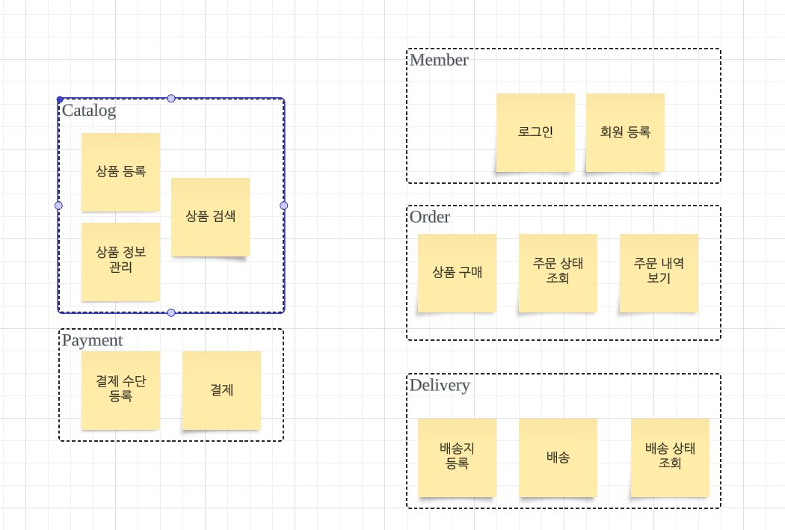
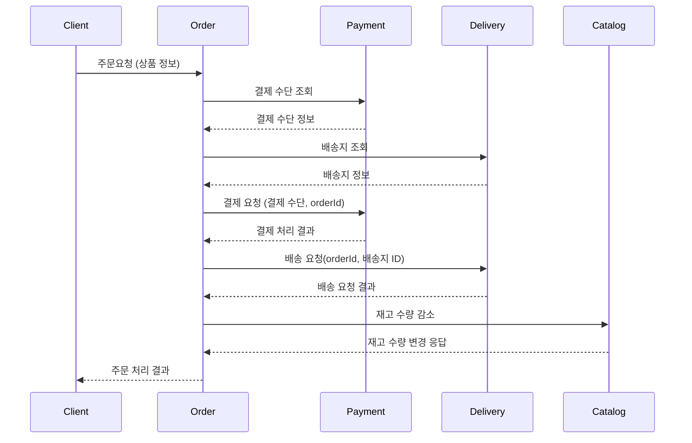

<!-- TOC -->
* [프로젝트 요구사항 분석 및 정리](#프로젝트-요구사항-분석-및-정리)
  * [요구사항 수집](#요구사항-수집)
    * [판매자](#판매자)
    * [구매자](#구매자)
* [상위 수준 설계(주요 컴포넌트)](#상위-수준-설계주요-컴포넌트)
  * [서비스](#서비스)
* [하위 수준 설계(각 컴포넌트 별 인터페이스)](#하위-수준-설계각-컴포넌트-별-인터페이스)
    * [시퀀스 다이어그램](#시퀀스-다이어그램)
    * [주의점](#주의점)
* [아키텍처 고려사항을 설계에 적용하기](#아키텍처-고려사항을-설계에-적용하기)
  * [요구성능 계산](#요구성능-계산)
    * [주요 목표: 100만명 동시 접속자 처리](#주요-목표-100만명-동시-접속자-처리)
  * [아키텍처 고려사항](#아키텍처-고려사항)
    * [대용량 트래픽 처리](#대용량-트래픽-처리)
    * [탄력성](#탄력성)
    * [안정성](#안정성)
  * [위 솔루션(EDA, 분산 처리 등)을 어디에 적용할 것인가?](#위-솔루션eda-분산-처리-등을-어디에-적용할-것인가)
    * [병목 지점 찾기](#병목-지점-찾기)
    * [EDA](#eda-)
<!-- TOC -->

# 프로젝트 요구사항 분석 및 정리

- 요약: 온라인으로 상품을 등록하고 판매하는 e-commerce 시스템. 다량의 데이터와 높은 동시접속자 수 환경에서 안정적으로 요청을 처리할 수 있다.

## 요구사항 수집

### 판매자

- 판매자는 상품을 등록할 수 있다.
- 판매자는 상품의 설명, 수량 등 정보를 관리할 수 있다.

### 구매자

- 구매자는 상품을 구매할 수 있다.
- 구매자는 상품을 검색할 수 있다.
- 구매자는 결제수단을 등록하고 주문 시  사용할 수 있다.
- 구매자는 배송지를 등록하고 주문 시 사용할 수 있다.
- 구매자는 완료된 주문의 배송 상태를 조회할 수 있다.
- 구매자는 주문 내역 리스트를 볼 수 있다.
- 구매자는 회원으로 등록할 수 있다.
- 회원은 로그인을 할 수 있다.

> _"초반에는 모든 케이스를 커버할 수 없기 때문에, 큰 단위로 정해놓고 살을 붙여나가면서 커버하자."_ 

# 상위 수준 설계(주요 컴포넌트)

## 서비스

- Catalog
  - 역할: 상품 정보 관리
  - 기능
    - 상품 등록
    - 상품 수정
    - 상품 수량 관리
    - 상품 조회
    - 상품 검색
- Payment
    - 역할: 결제 처리와 관련된 작업
    - 기능:
        - 결제 수단 등록
        - 결제 수단 변경
        - 결제
        - 결제 결과 조회
- Order
    - 역할: 주문 처리를 수행하고 상태를 관리
    - 기능:
        - 상품 주문
        - 주문 상태 조회
        - 주문 내역 보기
        - 배송 상태 조회 <- 이 부분이 조금 애매하다. 실제로는 Delivery 서비스가 배송 상태 조회를 담당 하지만, Order쪽에서 가져다 쓰는 느낌으로 작업.
- Delivery
    - 역할: 주문 완료된 제품 배송, 상태 관리
    - 기능
        - 배송지 등록
        - 배송 처리
        - 배송 상태 조회
- Member
  - 역할: 회원 등록 관리와 인증
  - 기능
      - 회원 등록
      - 회원 정보 관리
      - 로그인

# 하위 수준 설계(각 컴포넌트 별 인터페이스)

- Catalog
    - 역할: 상품 정보 관리
    - 기능
        - 상품 등록: `POST /catalog/products`
        - 상품 수정: `PUT /catalog/products/{productId}`
        - 상품 수량 관리: `POST /catalog/change-inventory-count`
          - 복잡해질 수 있으므로 POST & Body를 사용하고, 네이밍을 직관적으로 가져간다.
        - 상품 조회: `GET /catalog/products/{productId}`
        - 상품 검색: `POST /catalog/search`
          - 특정 리소스를 지정하기 어렵기 때문에 id 사용 어려움
          - GET 을 사용하는 경우 쿼리 스트링이 계속 추가되므로 POST를 사용하는 것이 깔끔하게 관리된다. 
            - `GET /catalog/products/searchKeyword=?....`
          - 따라서 검색과 같은 경우에는 함수이름같이 네이밍을 하고, 복잡한 파라미터를 Body로 보낸다.
- Payment
    - 역할: 결제 처리와 관련된 작업
    - 기능:
        - 결제 수단 등록: `POST /payment/methods`
        - 결제 수단 변경: `POST /payment/methods/{methodId}`
        - 결제: `POST /payment/process-payment`
          - 복잡한 비즈니스 로직의 경우 네이밍을 명확하게.
          - 단순히 결제 데이터를 추가하는 것 그 이상이므로 `POST /payment/payments` 처럼 하기에는 무리가 있다.
          - 결제 과정 중 오류가 발생하는 등 결제의 트리거 느낌으로 짓는게 낫다고 생각.
        - 결제 결과 조회: `GET /payment/payments/{paymentId}`
- Order
    - 역할: 주문 처리를 수행하고 상태를 관리
    - 기능:
        - 상품 주문: `POST /order/process-order` 
        - 주문 상태 조회: `GET /order/orders/{orderId}`
        - 주문 내역 보기: `GET /order/orders`
        - 배송 상태 조회 <- 이 부분이 조금 애매하다. 실제로는 Delivery 서비스가 배송 상태 조회를 담당 하지만, Order쪽에서 가져다 쓰는 느낌으로 작업.
- Delivery
    - 역할: 주문 완료된 제품 배송, 상태 관리
    - 기능
        - 배송지 등록: `POST /delivery/addresses`
        - 배송 처리: `POST /delivery/process-delivery`
        - 배송 상태 조회 `GET /delivery/deliveries/{deliveryId}`
- Member
    - 역할: 회원 등록 관리와 인증
    - 기능
        - 회원 등록: `POST /member/registration`
        - 회원 정보 관리: `PUT /member/members/{userId}`
          - `{memberId}`를 쓸법하지만, `userId` 자체가 굉장히 커먼하기 때문에 `userId`를 사용했다. 
        - 로그인: `POST /member/login`
          - 로그인도 HTTP Method를 이용해서 나타내기는 무리가 있으므로 `login`이란 이름을 직접적으로 표현했다.

### 시퀀스 다이어그램

### 주의점

- 위 시퀀스대로 커머스를 실제로 운영한다면, 문제가 생길 수 있다.
- Order가 Catalog한테 재고 감소 요청을 보내서 마음대로 재고가 변경이되면, Catalog의 데이터 일관성에 문제가 생길 것.
- Catalog가 자기 나름대로 재고를 매우 안정적으로 관리하기 위한 시스템이 있어야한다.
  - 이 시스템에 영향을 주는 **Order는 간접적으로 재고 변경을 일으킬 수 있어야한다.**
    - 즉, API이름이 재고 수량 감소인 API가 직접적으로 있는 것이 아니라, 어떤 Order가 일어났다는 것을 알려주는 정도.  

---

# 아키텍처 고려사항을 설계에 적용하기

## 요구성능 계산

### 주요 목표: 100만명 동시 접속자 처리

- 동시 접속자 수 100망명
- 100만명이 10분에 한 번씩 구매
- 분당 10만건 구매 처리
- 초당 1666건의 구매 처리
  - 결제, 배송 같은 경우는 외부 시스템을 이용하기 때문에 병목 구간이 있다.

## 아키텍처 고려사항

- 대용량 트래픽 처리: 동시에 많은 요청을 처리
- 탄력성: 급증하는 트래픽 처리
- 안정성: 트래픽 급증 또는 일부 장애 시 에러 최소화

### 대용량 트래픽 처리

- scale-out을 이용한 분산 처리
- 일부 데이터 NoSQL 사용
    - RDB 같은 경우 DB가 나뉘어져 있으므로 JOIN 연산이 불가능하므로.

### 탄력성

- scale-out을 이용해서 대응.
- EDA를 사용해서 보완.
- 순서대로 처리된다는 보장 가능. 실시간으로 처리 안 해도 되므로.

### 안정성

- EDA를 사용함으로써 장애 전파 최소화.
    - 일부 서비스의 장애가 생겼을 때, EDA를 사용해서 비동기 처리하면 EDA를 통해 메시지가 쌓이고, 복구 되었을 때 그 메시지를 처리하면 되므로.

## 위 솔루션(EDA, 분산 처리 등)을 어디에 적용할 것인가?

### 병목 지점 찾기

- 빈번한 상품 정보 변경 -> NoSQL 사용
- 주문 처리 시 결제, 배송 관련 외부 시스템 등의 사용 -> EDA 사용

### EDA 적용 가능한 부분

- 결제 처리(외부 연동을 통해야 하기 때문에 처리가 오래 걸릴 수 있음.)
  - 예를 들어 결제 완료 까지 했고 결제 완료 팝업까지 떴는데 몇 초 있다가 결제 실패했다고 뜨는 경우를 간혹 봤을 것이다. 
    - 일단 결제가 가능한 상태인지만 확인하고, 결제가 낮은 확률로 실패했을 때 유저한테 알려주는 방식으로 구현되어서 그런 것임.
- 배송 처리
  - 배송 요청 시 응답이 필요 없고 수행해야 하는 동작만 있어서 비동기 처리에 적합
- 검색어에 대한 캐시(색인) 업데이트(약간의 지연이 허용되기 때문에 비동기 처리 & 대량처리가 용이함)

## 설계 다이어그램

- 상품 검색
  - 유저가 Catalog를 직접 조회할 수도 있지만, 이름 같은 것으로 검색해야하는 경우 모든 Catalog를 전부 조회해야하므로 비효율적임
  - 따라서 검색에 특화된 Search 서비스를 따로 만들었다.
  - 동작 방식: 셀러가 상품 정보를 수정하면 상품 변경 이벤트를 발행하고, Search 서비스가 이것을 Consume 하여 Redis에 반영한다.
- Catalog 서비스
  - 빈번한 상품 업데이트를 확장성 있게 처리하기 위해서 Cassandra DB를 사용한다.
- Order
  - Order는 주문이 들어왔을 때 Payment 서비스에 결제 가능한 상태인지 확인하고 결제 요청을 할 것이다.
    - 결제 요청이 되면 결체 처리 요청 이벤트를 발행함으로써 이부분을 async하게 결제 처리를 하게 된다.
    - External Payment Adapter의 경우 외부 시스템과의 연동을 위한 게이트(어댑터 패턴)
      - 논리적으로 유의미한 구분. 실제 구현은 Payment 안에 있을 수도 있음.
    - 결제 처리 요청의 결과가 Payment로 들어오게 되면 결제 완료 이벤트를 발행.
      - 결제 완료 이벤트를 Order가 컨슘해서 처리를 하게 된다. 
        - 주문이 성공적으로 완료되었다.
        - 결제가 실패하였다.
  - 배송 요청
    - 결제 요청의 경우 Payment로 갔지만, 배송 요청의 경우 바로 이벤트를 발행했다.
      - 결제 요청의 경우 결제 가능한 상태인지 확인해야하기 때문에 Payment를 거쳐야했다.
    - 배송 요청은 배송지가 정상적으로 입력되었으면 배송 실패는 있을 수 없고 일단 배송 시작을 해야하기 때문에 요청 자체를 배송 요청 이벤트로 만들어버렸다.
- Delivery
  - 배송 요청 이벤트가 들어오면 외부 배송 모듈에 배송 요청.
    - 실제 배송 모듈은 Delivery 서비스에 포함될 수 있다.
  - 배송이 완료되면 배송 상태 변경 이벤트 발행하고 Delivery 가 컨슘해서 배송 상태를 변경한다.
    - 이렇게 되면 배송 상태를 즉시 조회하게 된다.
