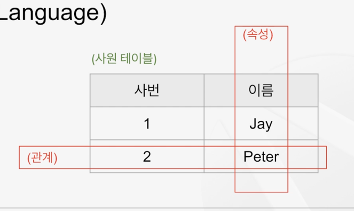
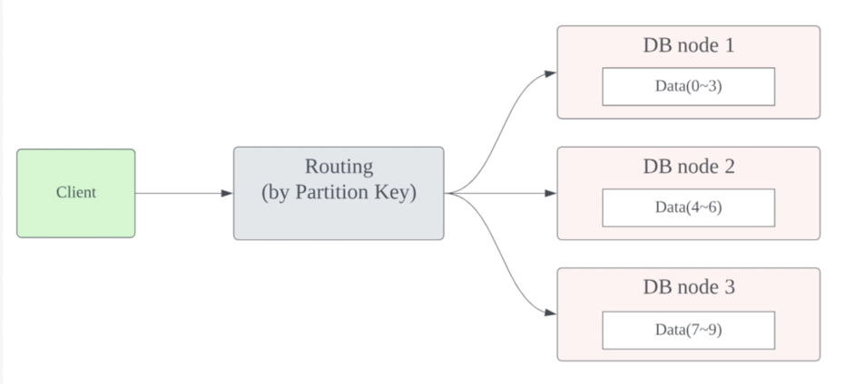

# 03. 관계형 DB와 NoSQL

- 관계형 모델을 기반으로 한 데이터베이스
- 관계와 속성으로 이루어진 집합 => 테이블
- 테이블간의 관계를 가지고 다양한 질의를 할 수 있음.
  - SQL(Structured Query Language)

## RDB

### 장점

- 데이터 무결성 유지에 용이(정규화를 통해 중복 제거)
- SQL을 사용해 다양한 형태의 질의 가능

### 단점

- 고정된 스키마 정의 필요
- JOIN이 존재하므로 데이터를 분산해서 처리하기 어려워짐
  - 여러 노드간 JOIN 불가능 (수평 확장에 한계)

## NoSQL

- `Not Only SQL` 또는 `No SQL`
- 관계형 DB와 달리 SQL을 사용하지 않는다는 의미
- 비 관계형 DB를 지칭함
  - 관계가 없으면 복잡한 질의가 불가능.

### NoSQL의 등장

- 다루는 데이터 사이즈가 급격히 증가
- 스토리지 비용이 낮아짐(데이터 중복이 허용됨)
- 분산 환경의 증가(Scale-Out)
- 👉 수평 확장이 가능한 고성능 DB구조의 필요

### NoSQL의 분산

- partition key를 이용해 데이터를 저장할 노드를 결정한다.
  - 어떤 노드에 가야 read할 수 있는지, write를 할 건지 알아낸다.
  - partition key는 해싱 주로 사용.

### NoSQL의 종류

- 전통적인 RDB의 테이블 형태를 벗어나 다양한 데이터 구조 존재.

# 04. Cassandra 둘러보기

