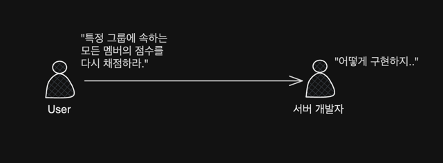

<!-- TOC -->
* [들어가며](#들어가며)
* [본문](#본문)
  * [요구사항](#요구사항-)
    * [요구사항 분석하기](#요구사항-분석하기)
<!-- TOC -->

# 들어가며

최근에 다건 업데이트가 필요한 비즈니스 로직을 구현하면서 성능 문제를 겪었습니다. 실제 소스를 공개하기가 어려워, 최대한 유사한 예제와 수도 코드로 준비해봤습니다.

# 본문

## 요구사항 


### 요구사항 분석하기

## 비동기를 사용할까?

## 서비스 구조 설명




### 연관관계 이해


## 어떻게 구현할까

### 

### 1. 서비스 A에서 반복문 돌려서 네트워크 2000번 태우기

<br>

### 2. 서비스 B에서 반복문 돌리기

<br>

### 3. 배치 업데이트

<br>

## 서비스 B에서 반복문을 돌리자.

### 반복문을 돌리면서 업데이트

### 첫 번째 최적화: 쿼리 개수 줄이기

### 두 번째 최적화: 프로젝션으로 조회


# 마치며

## 최적화 자체를 해야할지에 대한 고민

### 자주 호출되지는 않는 API

- 이 API는 

## 결국에는 트레이드 오프


```java

```

정확히는 2035건이긴 한데, 2000건 정도로 줄여서 말한다.