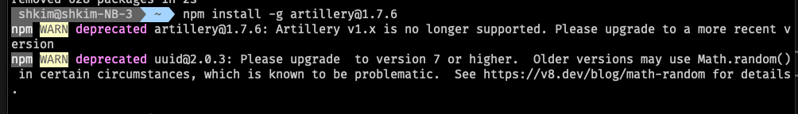
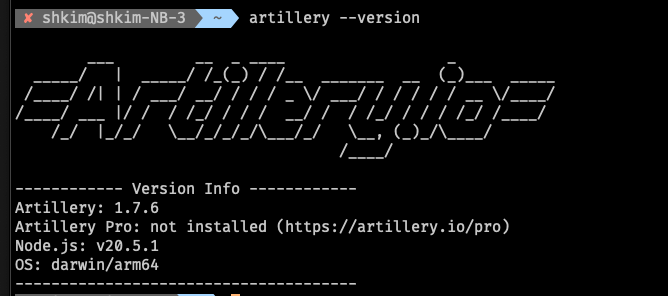
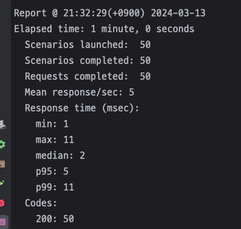
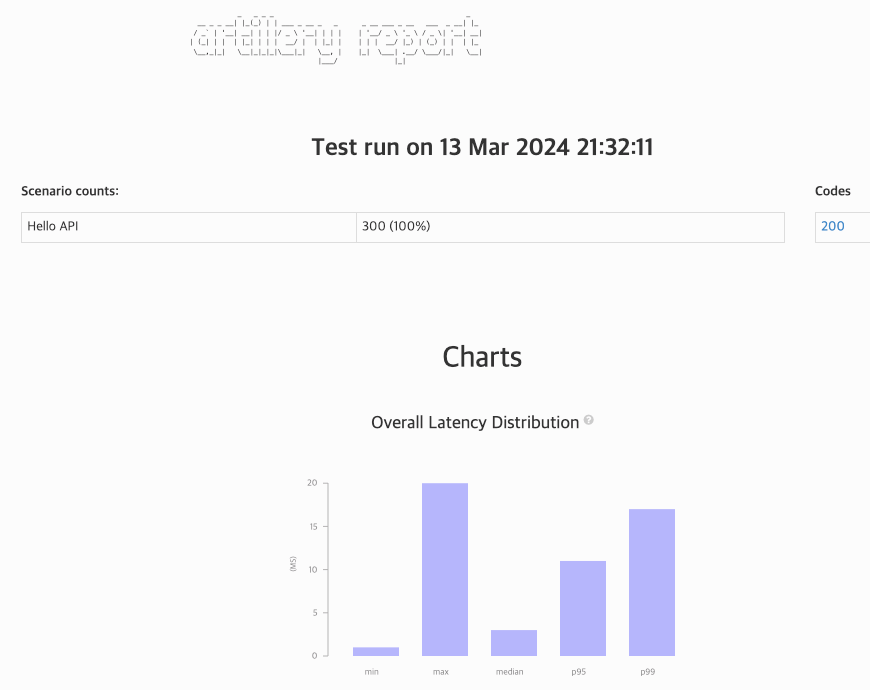

# 1. Artillery 소개

> https://www.artillery.io/

### Artillery 1.7.6

- 1버전이 있고 2버전이 있는데 2버전에서 퇴화된게 있어서 `1.7.6` 버전을 사용.

>  npm install -g artillery@1.7.6



> artillery --version



# 2. Artillery로 간단한 성능 테스트 진행해보기

```yaml
# test-config-DIY.yml
config:
  # target
  target: "http://localhost:8080"
  # define load phases
  phases:
    - duration: 60
      arrivalRate: 5 # 매 초마다 5명의 가상 유저를 만든다. 10초에는 50번씩 요청
scenarios:
  - name: Hello API
    flow:
      - get:
          url: "/hello"
```

- 실행 스크립트


Get Started

> https://www.artillery.io/docs/get-started/first-test

<br>

## 실행

### 실행 및 OUTPUT JSON으로 저장

> artillery run --output report.json test-config-DIY.yml



- `Codes: 200: 50` 
  - 매 초마다 5명의 사용자(`arrivalRate`)가 요청을 하고, 10초마다 로그를 보여주므로 50개의 요청에 대해 50개의 200 Response가 떨어졌음.

<br>

### 저장된 JSON을 HTML로 변환

> artillery report report.json --output report.html



<br>

# 3. 성능 테스트 결과 해석하기