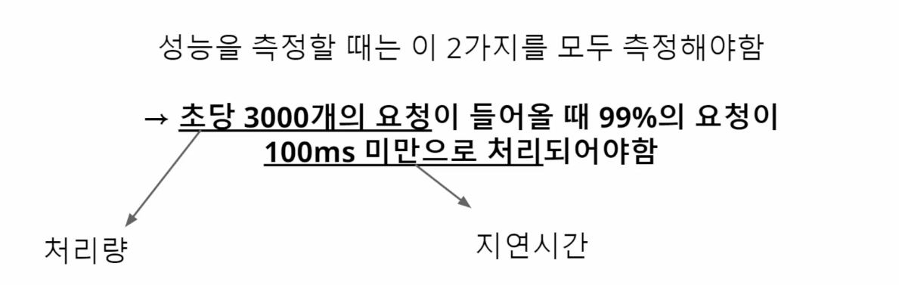
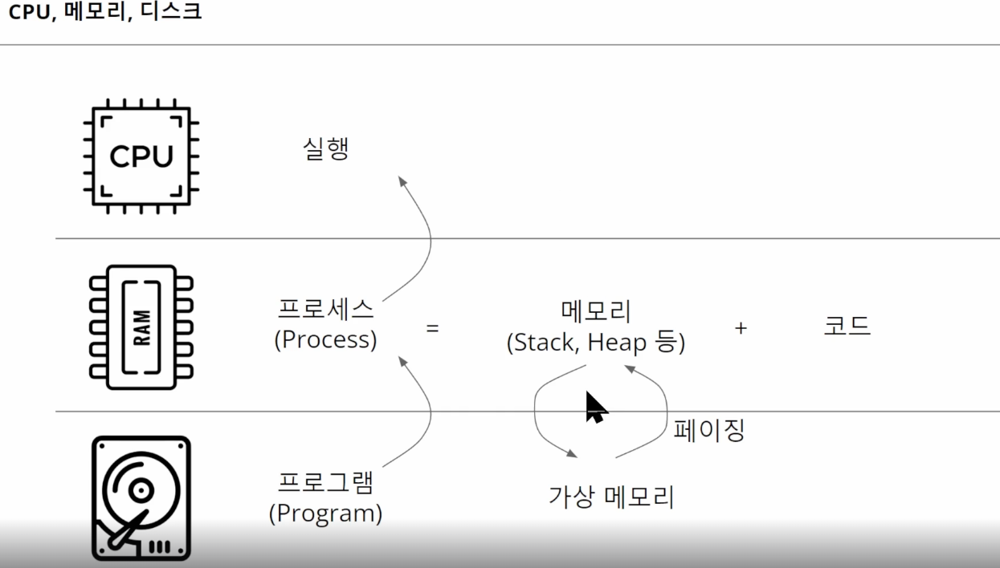
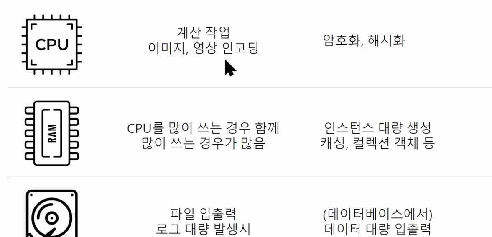

<!-- TOC -->
* [1. 지연시간(Latency)와 처리량(Throughput)](#1-지연시간latency와-처리량throughput)
  * [지연시간](#지연시간)
    * [지연 시간 기대 예시](#지연-시간-기대-예시)
  * [처리량](#처리량)
    * [대역폭과 처리량](#대역폭과-처리량)
  * [성능 테스트 시에는 지연시간과 처리량을 모두 살펴라](#성능-테스트-시에는-지연시간과-처리량을-모두-살펴라)
    * [단서 조항이 있는 이유](#단서-조항이-있는-이유)
    * [성능 테스트는 대부분의 사용자를 대상으로 목표를 잡는다.](#성능-테스트는-대부분의-사용자를-대상으로-목표를-잡는다)
  * [2. 운영체제와 서버 자원](#2-운영체제와-서버-자원)
<!-- TOC -->

# 1. 지연시간(Latency)와 처리량(Throughput)

## 지연시간

- 요청 한 건 한 건의 처리 시간.
  - 클라이언트가 요청을 보낸 후 응답을 받기까지 걸린 시간
- 주로 ms, s 단위
- 지연시간은 기능마다 달라진다.

### 지연 시간 기대 예시

- 인프런에서 강의 목록을 불러오는 경우
  - 1000ms 안쪽으로 불러오면 크게 불편한 없이
- 항공권 비교 검색 서비스에서 항공권을 검색하는 경우
  - 수초 ~ 수십초 예상
  - 수초가 걸려도 일반적으로 이해할 것. 

👉 목표로해야하는 지연시간 역시, 사용자들이 기대하는 지연시간에 맞춰줘야 한다.

 

## 처리량

- 일정 시간 동안 몇 건이나 처리할 수 있느냐를 의미
  - 단위 시간 동안 몇 건의 요청을 처리할 수 있는가?
- 주로 TPS(Transaction Per Second) 단위:
  - 여기서의 Transcation은 한 개의 HTTP 요청을 의미.

### 대역폭과 처리량

- 대역폭
  - 네트워크가 단위시간 동안 전송할 수 있는 최대한의 처리량을 의미
- 대역폭은 네트워크에서는 유의미하게 사용할 수 있지만, 백엔드 애플리케이션에서는 여러가지 요소들이 영향을 주므로 정확한 대역폭을 측정하기 어렵다.

 

## 성능 테스트 시에는 지연시간과 처리량을 모두 살펴라

- 예상되는 사용자가 몇 명이고, 이 사용자들이 발생시키는 API 요청이 몇 건일 때, 이 요청들을 사용자들이 불편함을 느끼지 않도록 처리하려면 어느 정도의 지연시간 미만으로 처리해야하는지 정하는 식이다.

### 단서 조항이 있는 이유

- 단서 조항: `99%의 요청`
- 단서 조항이 있는 이유?
  - 100%의 요청이 100ms 미만으로 처리되도록 만드는 것은 불가능에 가깝기 때문.
    - 왜? 성능 테스트에는 많은 변수가 있기 때문.

### 성능 테스트는 대부분의 사용자를 대상으로 목표를 잡는다.

- 95%, 99%와 같은 대부분의 유저가 불편함을 겪지 않도록 하는 것이 목표.

# 2. 운영체제와 서버 자원

## 운영체제

## CPU, 메모리, 디스크

## 작업마다 요구하는 자원이 다를 수 있다 

