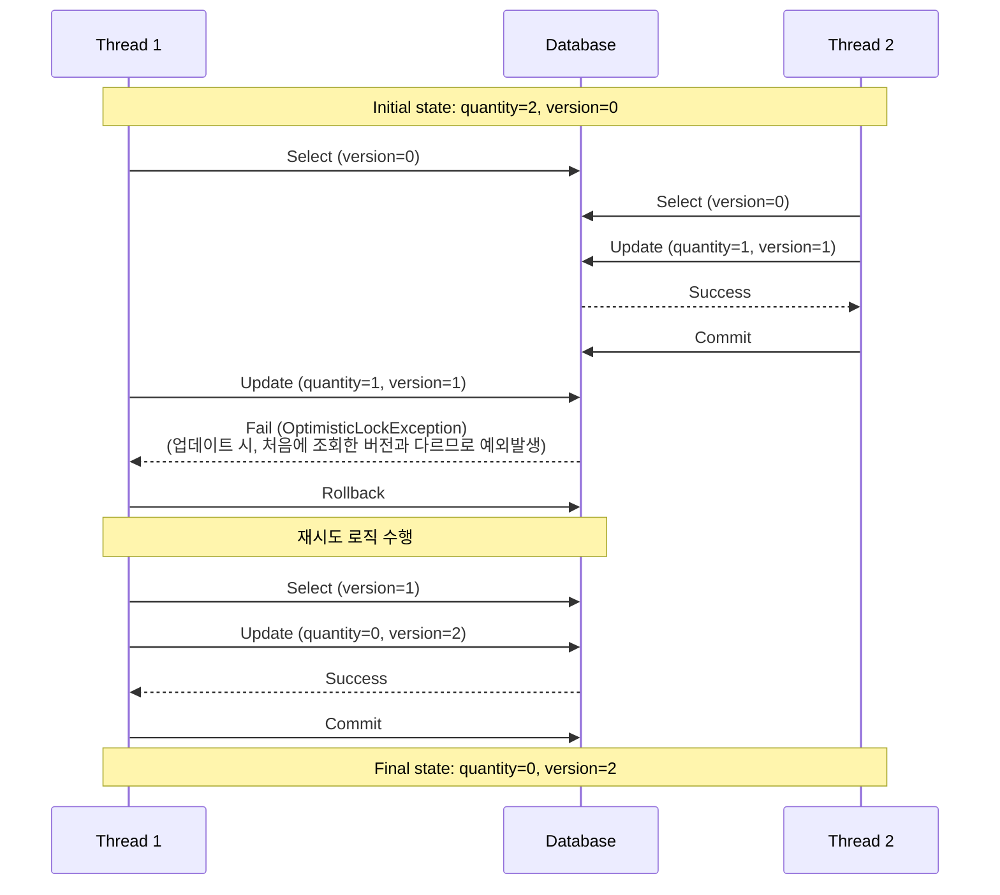
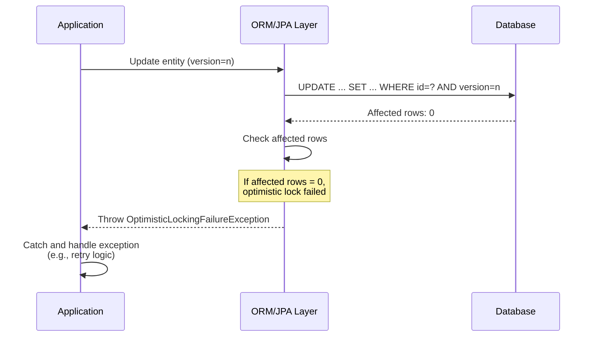

### 낙관적 락 프로덕션

```java
@Slf4j
@Service
@RequiredArgsConstructor
public class StockFacadeService {

    private final StockOptimisticService stockService;

    public void decreaseQuantity(final Long stockId, final long quantityToDecrease) throws InterruptedException {
        while (true) {
            try {
                stockService.decreaseQuantity(stockId, quantityToDecrease);
                break;
            } catch (ObjectOptimisticLockingFailureException e) {
                log.warn(e.getMessage());
                Thread.sleep(30);
            }
        }
    }
}
```

### 테스트 코드

```java
@Test
void decreaseQuantity() throws InterruptedException {
    // given
    final long stockQuantity = 2L;
    final StockOptimistic stock = new StockOptimistic(stockQuantity);
    stockRepository.save(stock);

    final int threadCount = (int) stockQuantity;
    final ExecutorService executorService = Executors.newFixedThreadPool(threadCount);
    final CountDownLatch countDownLatch = new CountDownLatch(threadCount);

    // when
    for (int i = 0; i < threadCount; i++) {
        executorService.submit(() -> {
            try {
                stockFacadeService.decreaseQuantity(stock.getId(), 1L);
            } catch (Exception e) {
                e.printStackTrace();
            } finally {
                countDownLatch.countDown();
            }
        });
    }

    countDownLatch.await(); // 모든 스레드의 작업이 끝날 때까지 대기

    // then
    final StockOptimistic findStock = stockRepository.findById(stock.getId()).orElseThrow();
    assertThat(findStock.getQuantity()).isEqualTo(0L);
}
```

```java
2024-08-25T12:56:05.800+09:00  INFO 75363 --- [           main] p6spy                                    : #1724558165800 | took 7ms | statement | connection 3| url jdbc:mysql://localhost:33066/concurrency_inventory
insert into stock_optimistic (quantity,version) values (?,?)
insert into stock_optimistic (quantity,version) values (2,0);
2024-08-25T12:56:05.836+09:00  INFO 75363 --- [           main] p6spy                                    : #1724558165836 | took 8ms | commit | connection 3| url jdbc:mysql://localhost:33066/concurrency_inventory

;
2024-08-25T12:56:05.889+09:00  INFO 75363 --- [pool-2-thread-1] p6spy                                    : #1724558165889 | took 6ms | statement | connection 5| url jdbc:mysql://localhost:33066/concurrency_inventory
select so1_0.stock_id,so1_0.quantity,so1_0.version from stock_optimistic so1_0 where so1_0.stock_id=?
select so1_0.stock_id,so1_0.quantity,so1_0.version from stock_optimistic so1_0 where so1_0.stock_id=1;
2024-08-25T12:56:05.889+09:00  INFO 75363 --- [pool-2-thread-2] p6spy                                    : #1724558165889 | took 6ms | statement | connection 4| url jdbc:mysql://localhost:33066/concurrency_inventory
select so1_0.stock_id,so1_0.quantity,so1_0.version from stock_optimistic so1_0 where so1_0.stock_id=?
select so1_0.stock_id,so1_0.quantity,so1_0.version from stock_optimistic so1_0 where so1_0.stock_id=1;
2024-08-25T12:56:05.898+09:00  INFO 75363 --- [pool-2-thread-2] p6spy                                    : #1724558165898 | took 2ms | commit | connection 4| url jdbc:mysql://localhost:33066/concurrency_inventory

;
2024-08-25T12:56:05.898+09:00  INFO 75363 --- [pool-2-thread-1] p6spy                                    : #1724558165898 | took 2ms | commit | connection 5| url jdbc:mysql://localhost:33066/concurrency_inventory

;
2024-08-25T12:56:05.916+09:00  INFO 75363 --- [pool-2-thread-2] p6spy                                    : #1724558165916 | took 4ms | statement | connection 6| url jdbc:mysql://localhost:33066/concurrency_inventory
select so1_0.stock_id,so1_0.quantity,so1_0.version from stock_optimistic so1_0 where so1_0.stock_id=?
select so1_0.stock_id,so1_0.quantity,so1_0.version from stock_optimistic so1_0 where so1_0.stock_id=1;
2024-08-25T12:56:05.916+09:00  INFO 75363 --- [pool-2-thread-1] p6spy                                    : #1724558165916 | took 4ms | statement | connection 7| url jdbc:mysql://localhost:33066/concurrency_inventory
select so1_0.stock_id,so1_0.quantity,so1_0.version from stock_optimistic so1_0 where so1_0.stock_id=?
select so1_0.stock_id,so1_0.quantity,so1_0.version from stock_optimistic so1_0 where so1_0.stock_id=1;
2024-08-25T12:56:05.945+09:00  INFO 75363 --- [pool-2-thread-2] p6spy                                    : #1724558165945 | took 4ms | statement | connection 6| url jdbc:mysql://localhost:33066/concurrency_inventory
update stock_optimistic set quantity=?,version=? where stock_id=? and version=?
update stock_optimistic set quantity=1,version=1 where stock_id=1 and version=0;
2024-08-25T12:56:05.953+09:00  INFO 75363 --- [pool-2-thread-2] p6spy                                    : #1724558165953 | took 6ms | commit | connection 6| url jdbc:mysql://localhost:33066/concurrency_inventory

;
2024-08-25T12:56:05.953+09:00  INFO 75363 --- [pool-2-thread-1] p6spy                                    : #1724558165953 | took 12ms | statement | connection 7| url jdbc:mysql://localhost:33066/concurrency_inventory
update stock_optimistic set quantity=?,version=? where stock_id=? and version=?
update stock_optimistic set quantity=1,version=1 where stock_id=1 and version=0;
2024-08-25T12:56:05.967+09:00  INFO 75363 --- [pool-2-thread-1] p6spy                                    : #1724558165967 | took 1ms | rollback | connection 7| url jdbc:mysql://localhost:33066/concurrency_inventory

;
2024-08-25T12:56:05.973+09:00  INFO 75363 --- [pool-2-thread-1] p6spy                                    : #1724558165973 | took 2ms | statement | connection 7| url jdbc:mysql://localhost:33066/concurrency_inventory
select so1_0.stock_id,so1_0.quantity,so1_0.version from stock_optimistic so1_0 where so1_0.stock_id=?
select so1_0.stock_id,so1_0.quantity,so1_0.version from stock_optimistic so1_0 where so1_0.stock_id=1;
2024-08-25T12:56:05.983+09:00  WARN 75363 --- [pool-2-thread-1] c.e.c.d.optimistic.StockFacadeService    : Row was updated or deleted by another transaction (or unsaved-value mapping was incorrect) : [com.example.concurrency.domain.optimistic.StockOptimistic#1]
2024-08-25T12:56:06.032+09:00  INFO 75363 --- [pool-2-thread-1] p6spy                                    : #1724558166032 | took 4ms | statement | connection 8| url jdbc:mysql://localhost:33066/concurrency_inventory
select so1_0.stock_id,so1_0.quantity,so1_0.version from stock_optimistic so1_0 where so1_0.stock_id=?
select so1_0.stock_id,so1_0.quantity,so1_0.version from stock_optimistic so1_0 where so1_0.stock_id=1;
2024-08-25T12:56:06.034+09:00  INFO 75363 --- [pool-2-thread-1] p6spy                                    : #1724558166034 | took 1ms | commit | connection 8| url jdbc:mysql://localhost:33066/concurrency_inventory

;
2024-08-25T12:56:06.040+09:00  INFO 75363 --- [pool-2-thread-1] p6spy                                    : #1724558166040 | took 2ms | statement | connection 9| url jdbc:mysql://localhost:33066/concurrency_inventory
select so1_0.stock_id,so1_0.quantity,so1_0.version from stock_optimistic so1_0 where so1_0.stock_id=?
select so1_0.stock_id,so1_0.quantity,so1_0.version from stock_optimistic so1_0 where so1_0.stock_id=1;
2024-08-25T12:56:06.044+09:00  INFO 75363 --- [pool-2-thread-1] p6spy                                    : #1724558166044 | took 3ms | statement | connection 9| url jdbc:mysql://localhost:33066/concurrency_inventory
update stock_optimistic set quantity=?,version=? where stock_id=? and version=?
update stock_optimistic set quantity=0,version=2 where stock_id=1 and version=1;
2024-08-25T12:56:06.053+09:00  INFO 75363 --- [pool-2-thread-1] p6spy                                    : #1724558166053 | took 8ms | commit | connection 9| url jdbc:mysql://localhost:33066/concurrency_inventory

;
2024-08-25T12:56:06.062+09:00  INFO 75363 --- [           main] p6spy                                    : #1724558166062 | took 1ms | statement | connection 10| url jdbc:mysql://localhost:33066/concurrency_inventory
select so1_0.stock_id,so1_0.quantity,so1_0.version from stock_optimistic so1_0 where so1_0.stock_id=?
select so1_0.stock_id,so1_0.quantity,so1_0.version from stock_optimistic so1_0 where so1_0.stock_id=1;
2024-08-25T12:56:06.065+09:00  INFO 75363 --- [           main] p6spy                                    : #1724558166065 | took 2ms | commit | connection 10| url jdbc:mysql://localhost:33066/concurrency_inventory

;

```

## 낙관적 락 시퀀스 다이어그램



## 어떻게 JPA는 이 예외가 ObjectOptimisticLockingFailureException인 걸 알 수 있을까?



- update 문을 실행하고, affected rows 에 따라 낙관적락 예외를 발생시킨다. 
