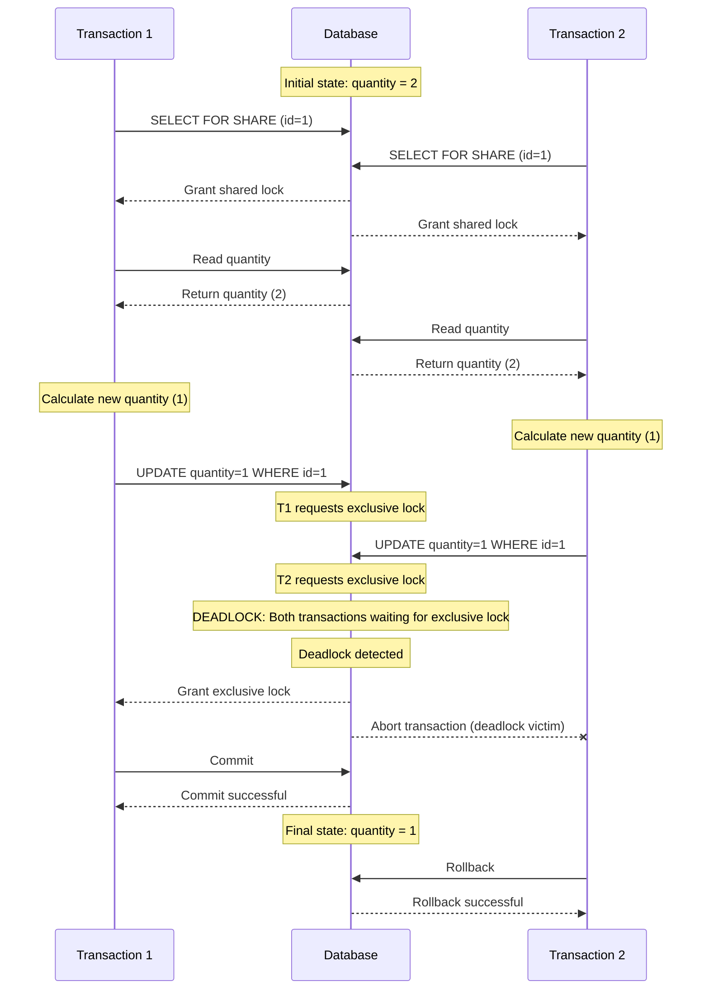

### PESSIMISTIC READ shared lock

```mermaid
sequenceDiagram
    participant T1 as Transaction 1
    participant DB as Database
    participant T2 as Transaction 2

    Note over DB: Initial state: quantity = 2

    T1->>DB: SELECT FOR SHARE (id=1)
    T2->>DB: SELECT FOR SHARE (id=1)
    DB-->>T1: Grant shared lock
    DB-->>T2: Grant shared lock

    T1->>DB: Read quantity
    DB-->>T1: Return quantity (2)
    T2->>DB: Read quantity
    DB-->>T2: Return quantity (2)

    Note over T1: Calculate new quantity (1)
    Note over T2: Calculate new quantity (1)

    T1->>DB: UPDATE quantity=1 WHERE id=1
    Note over DB: T1 requests exclusive lock
    T2->>DB: UPDATE quantity=1 WHERE id=1
    Note over DB: T2 requests exclusive lock

    Note over DB: DEADLOCK: Both transactions waiting for exclusive lock

    Note over DB: Deadlock detected
    DB-->>T1: Grant exclusive lock
    DB--xT2: Abort transaction (deadlock victim)

    T1->>DB: Commit
    DB-->>T1: Commit successful

    Note over DB: Final state: quantity = 1

    T2->>DB: Rollback
    DB-->>T2: Rollback successful
```
