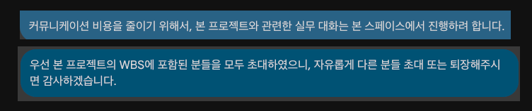

_(요약: 같은 프로젝트에 속한 실무자들을 한 채널에 모으니 업무 생산성이 '매우' 올라갔습니다.)_

 

# 들어가며

회사에서 업무용 메신저로 Google Chat을 사용하고 있습니다. 

커뮤니케이션 비용이 만만치 않았고, 

지난 8월 신입으로 입사이래 많은 불편함을 느꼈고, 이참에  

DM으로 업무하던 방식을

 

> Slack의 '채널' 개념은 Google Chat에서 '워크스페이스'에 해당됩니다. 본 포스팅에서는 '워크스페이스'가 대신 '채널'이라는 용어를 사용하도록 하겠습니다.  

 

# DM의 문제점

_(프로젝트 참여자 중 누군가는 항상 가운데에 위치하게 되는 구조)_

# 실무자들 한데 모으기

## 같이 일하는 실무자들에게 인지시키기

_(1대1 DM 예시)_

## 업무 대화는 공유되는 공간에서

_(실제 사례. 해당 방식이 익숙치 않을 수도 있으므로, 채널을 새로 팔 때면 항상 위와 같이 안내하고 있습니다.)_

### 장점: 제삼자가 먼저 반응할 수 있다

## 정말 생산성이 올라갔나요?

사실 이 생산성이라는게 정량화하기는 어렵고 정성적인 부분이 많아서, 딱잘라 말하기는 어렵습니다.
그럼 얼마나 생산적으로
이 시간을 벌면 개발자인 저는 코드를 '작성'할 시간을 벌 수 있습니다.
불필요한 커뮤니케이션 비용을 줄이고,  

# 전사적으로 적용시킬 수 있는 방법?

 

# 마치며

실무를 시작하면 하루 종일 신나게 코드만 짤 줄 알았습니다. 그런데 웬걸,  

신입이면 뭐 어떤가요. 비효율적인 부분이 있고, 생산적인 방법이 있다면 얼마든지 제안, 고쳐나가면 된다고 생각합니다.
