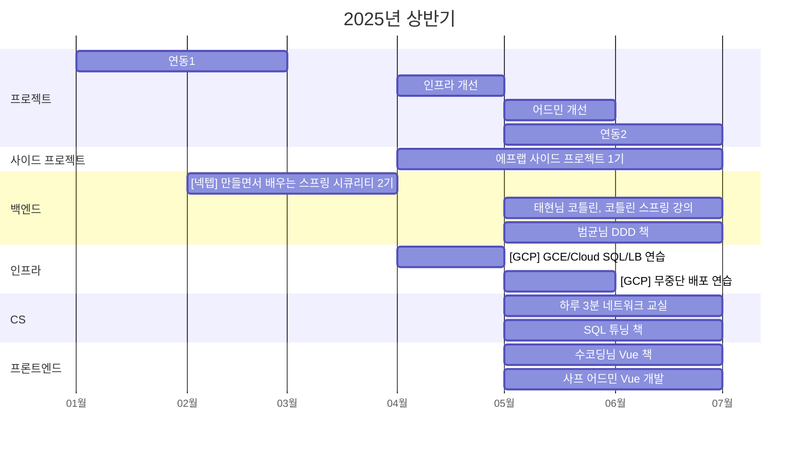
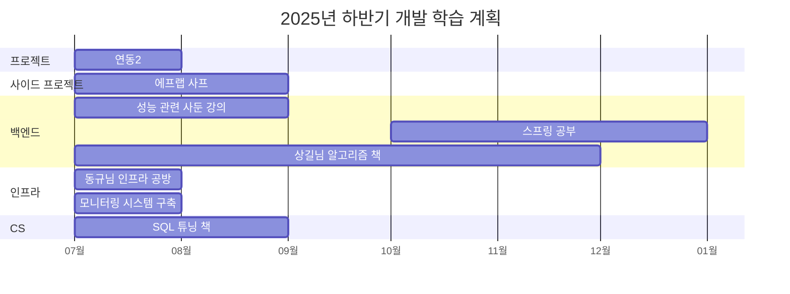

```mermaid
gantt
    title 2025년 상반기
    axisFormat %m월
    dateFormat YYYY-MM
    section 프로젝트
        연동1: 2025-01, 2M
        인프라 개선: 2025-04, 1M
        어드민 개선:  2025-05, 1M
        연동2:  2025-05, 2M
    section 사이드 프로젝트
        에프랩 사이드 프로젝트 1기 : 2025-04, 3M
    section 백엔드
        [넥텝] 만들면서 배우는 스프링 시큐리티 2기: 2025-02, 2M
        태현님 코틀린, 코틀린 스프링 강의 : 2025-05, 2M
        범균님 DDD 책 : 2025-05, 2M
    section 인프라
        [GCP] GCE/Cloud SQL/LB 연습: 2025-04, 1M
        [GCP] 무중단 배포 연습: 2025-05, 1M
    section CS
        하루 3분 네트워크 교실: 2025-05, 2M
        SQL 튜닝 책: 2025-05, 2M
    section 프론트엔드
        수코딩님 Vue 책: 2025-05, 2M
        사프 어드민 Vue 개발: 2025-05, 2M
```

```mermaid

gantt
    title 2025년 하반기 개발 학습 계획
    axisFormat %m월
    dateFormat YYYY-MM
    section 프로젝트
        연동2 : 2025-07, 1M
    section 사이드 프로젝트
        에프랩 사프  : 2025-07, 2M
%%        북마크 개인 플젝 : 2025-09, 2M 
    section 백엔드
%%        남희님 RabbitMQ : 2025-07, 1M
        성능 관련 사둔 강의: 2025-07, 2M
        스프링 공부 : 2025-10, 3M
        상길님 알고리즘 책: 2025-7, 5M
  section 인프라
        동규님 인프라 공방 : 2025-07, 1M
        모니터링 시스템 구축 : 2025-07, 1M
    section CS
        SQL 튜닝 책 : 2025-07, 2M
```

## 1분기

- [x] 넥스트 스텝 만들면서 배우는 스프링 시큐리티 2기 미션 완주 & 수료. 

## 2분기

- [x] 에프랩 사이드 프로젝트 1기 진행
- [ ] 범균님 DDD 책
- [ ] 태현님 코틀린 강의
  - [ ] 코틀린 기초
  - [ ] 코틀린 스프링 입문
- [ ] 하루 3분 네트워크 교실
