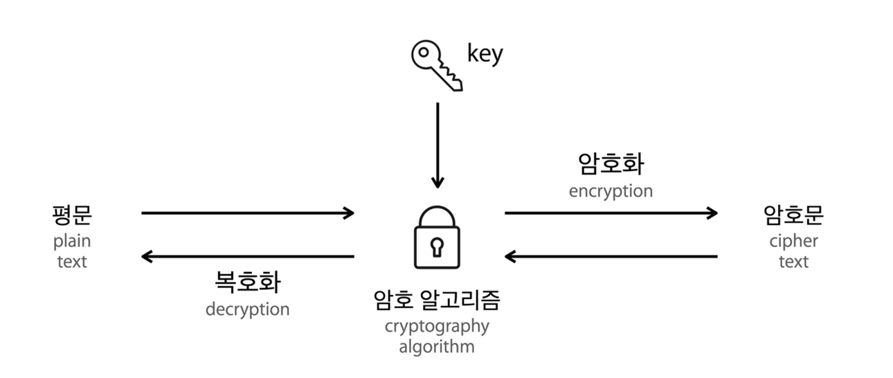
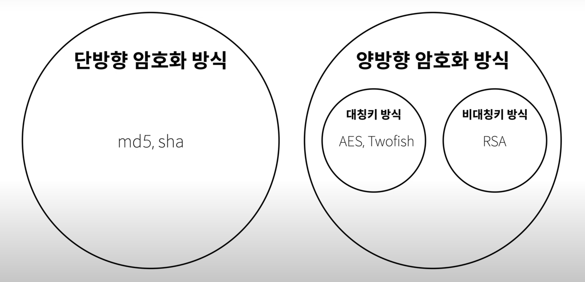
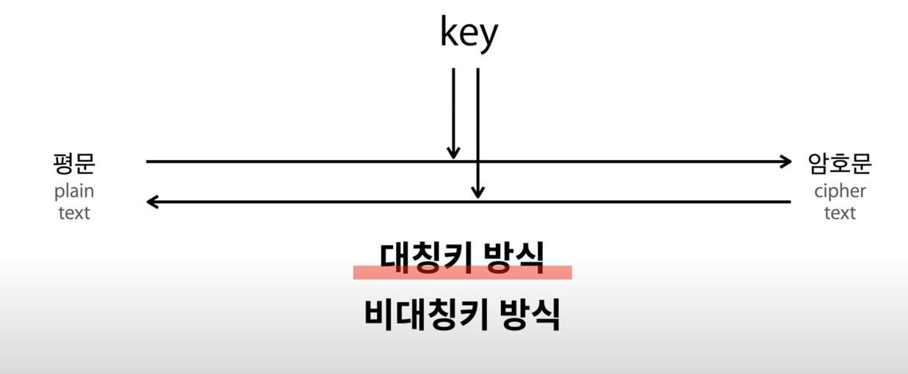
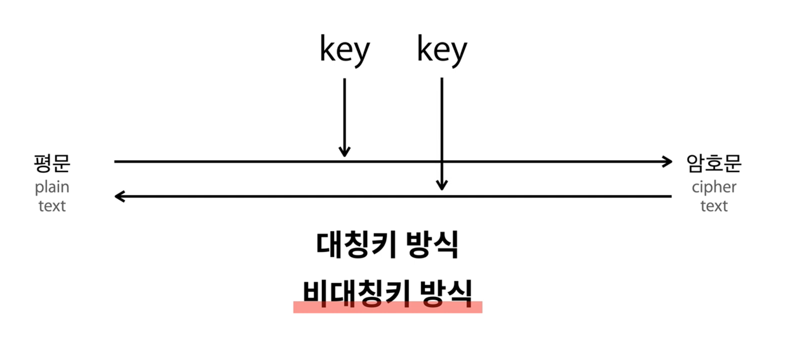

# 기밀을 지키기 위한 요소들

- 기밀성
  - 암호화된 내용이 무엇인지 알 수 없어야한다.
- 무결성
  - 내용이 조작되거나 훼손되었다면 암호는 의미가 없음.
  - 내용이 원본과 같다는 것을 확신할 수 있도록 해주는 특성
- 인증
  - 권한이 있는 사람만 정보에 접근 가능하다.

# 암호화, 복호화

- 현대의 암호는 암호화 알고리즘을 공개해서 검증을 받는다.
- 암호화 복호화할 때 비밀정보인 Key를 섞는다.

# 암호법의 종류

## 양방향, 단방향 암호화

###  양방향 암호화 방식

- 암호화/복호화를 모두할 수 있는 방식.
- 정보를 감추는 기밀성에 초점이 맞춰짐.
  
### 단방향 암호화 방식

- 암호화는 되지만 복호화는 되지 않음.
- 단방향 암호화 방식은 기밀성에 초점을 맞춘게 아니라 무결성에 초점을 맞춤.

## 양방향 암호화 - 대칭키/비대칭키

### 대칭키 방식

- 암/복호화 시 같은 키를 사용한다.

### 비대칭키 방식

- 두개의 키를 사용하여 암/복호화 진행.

