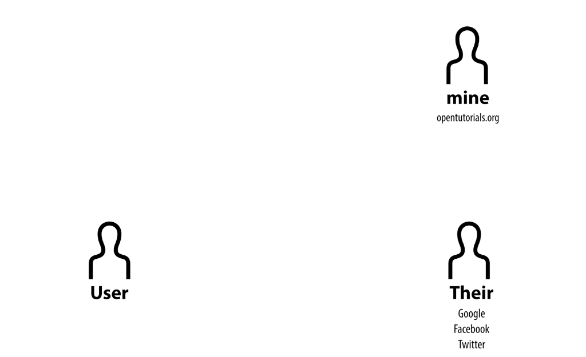
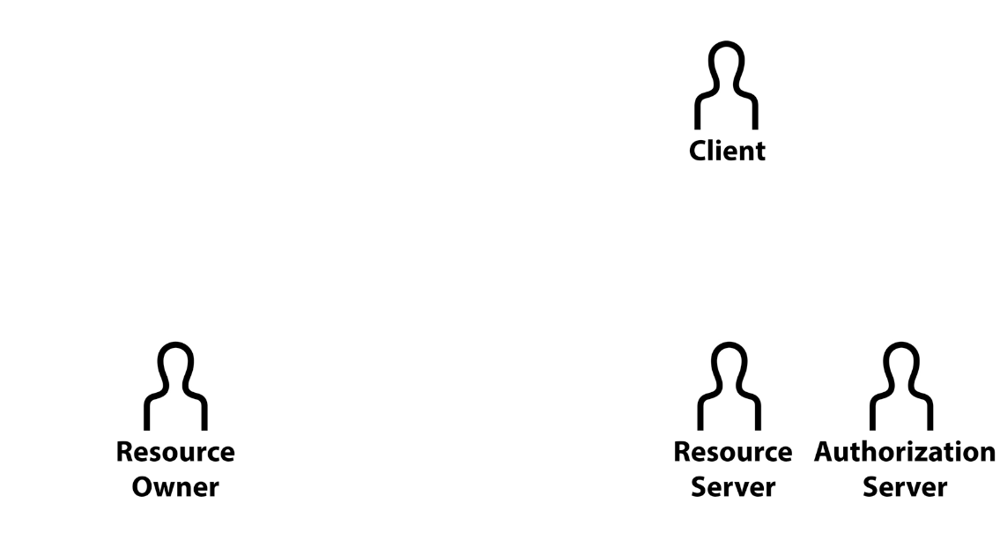

<!-- TOC -->
* [2. 역할](#2-역할)
  * [OAuth의 역할](#oauth의-역할)
    * [Authorization Server?](#authorization-server)
<!-- TOC -->

# 2. 역할

- mine: 내가 만든 서비스
- User: 내 서비스를 사용하는 사용자
- Their: 유저가 가입되어 있는 서비스

## OAuth의 역할

- Resource Server
  - 우리가 제어하고자 하는 자원을 갖고 있는 서버 (Their)
- Resource Owner 
  - 자원을 소유하는 사람. (User)
- Client
  - Resource Server에 접속해서 정보를 가져가는 클라이언트 (mine)

### Authorization Server?

- 공식문서에는 Resource Server외에도 Authorization Server가 있음.
- Resource Server는 데이터를 들고 있는 서버, Authorization Server는 인증과 관련된 처리를 하는 서버
- 이 강의에서는 편의를 위해 Resource Server 하나로 설명