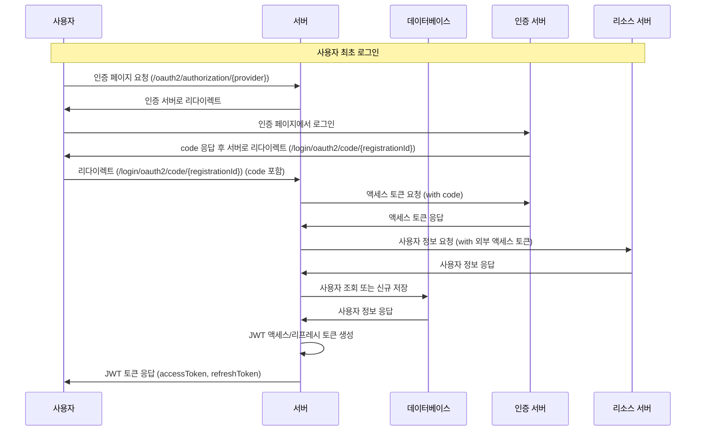
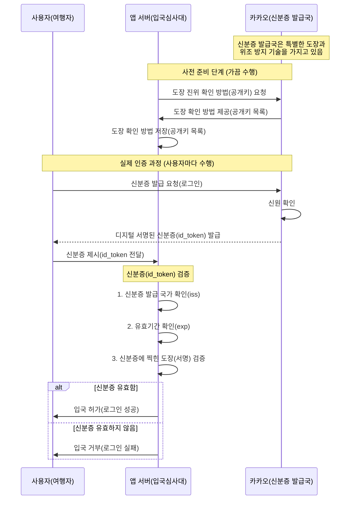

<!-- TOC -->
* [RFC 6749 OAuth2 Protocol Flow](#rfc-6749-oauth2-protocol-flow)
  * [OAuth2 인증 흐름](#oauth2-인증-흐름)
* [OIDC(OpenID Connect)](#oidcopenid-connect-)
  * [실생활 비유](#실생활-비유)
<!-- TOC -->

# RFC 6749 OAuth2 Protocol Flow

 > [RFC 6749 1.2 Protocol Flow](https://datatracker.ietf.org/doc/html/rfc6749#section-1.2)

```
     +--------+                               +---------------+
     |        |--(A)- Authorization Request ->|   Resource    |
     |        |                               |     Owner     |
     |        |<-(B)-- Authorization Grant ---|               |
     |        |                               +---------------+
     |        |
     |        |                               +---------------+
     |        |--(C)-- Authorization Grant -->| Authorization |
     | Client |                               |     Server    |
     |        |<-(D)----- Access Token -------|               |
     |        |                               +---------------+
     |        |
     |        |                               +---------------+
     |        |--(E)----- Access Token ------>|    Resource   |
     |        |                               |     Server    |
     |        |<-(F)--- Protected Resource ---|               |
     +--------+                               +---------------+

                     Figure 1: Abstract Protocol Flow
```

## OAuth2 인증 흐름



---

# OIDC(OpenID Connect) 

- OIDC(OpenID Connect)?
  - 사용자 인증을 위한 개방형 표준 프로토콜.
  - 간단히 말하자면, 사용자가 누구인지 확인하는 방법을 표준화한 것
- 정의:
  - OpenID Connect는 OAuth 2.0 프로토콜 위에 구축된 인증 레이어
  쉽게 말해, "이 사람이 누구인지" 확인할 수 있는 표준화된 방법
- 목적:
  - 사용자 인증(Authentication): "이 사람이 본인이 맞다"는 것을 증명
  - OAuth 2.0은 권한 부여(Authorization)에 중점을 두는 반면, OIDC는 인증에 중점을 둠
- 핵심 요소:
  - ID 토큰: JWT(JSON Web Token) 형식의 토큰으로, 사용자의 신원 정보 포함 
  - UserInfo 엔드포인트: 사용자에 대한 추가 정보를 얻을 수 있는 API

## 실생활 비유

- OIDC는 마치 여권이나 신분증과 같음. 
  - 신뢰할 수 있는 기관(예: 카카오)이 발급 
  - 신분증에는 본인 확인에 필요한 정보가 포함됨 
  - 제3자(내 서비스)가 신분증을 확인해 본인 여부를 판단




## 모바일 SDK를 이용한 OIDC 로그인 
