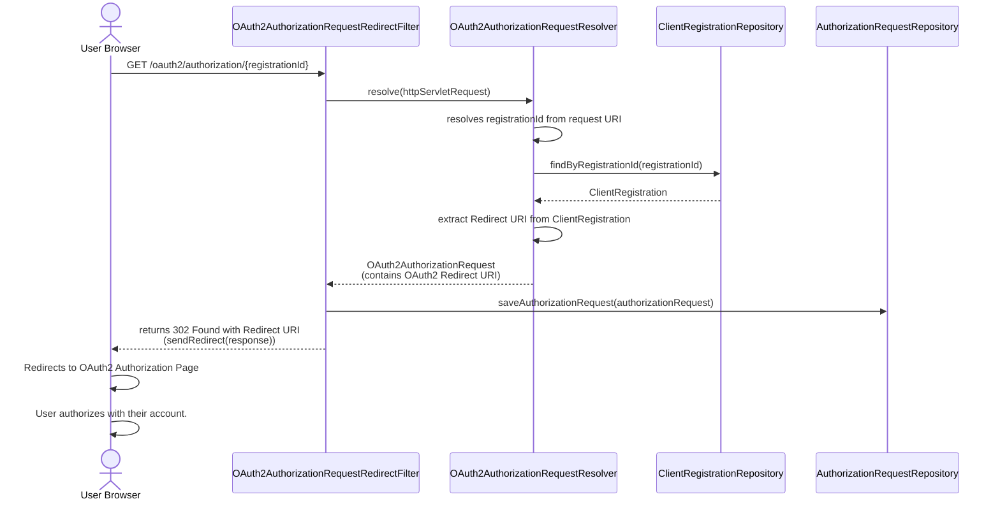
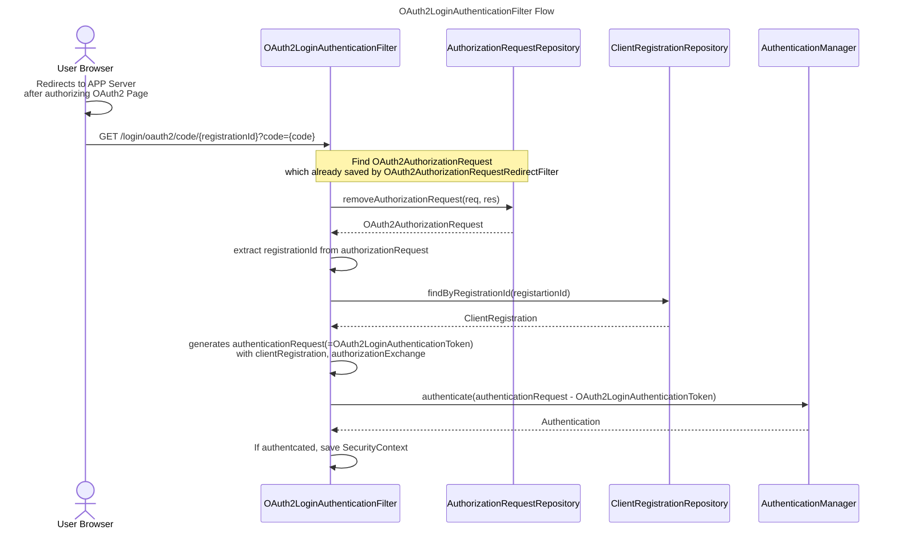
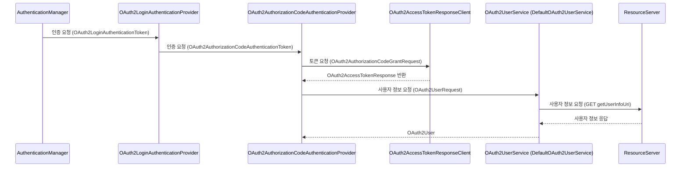
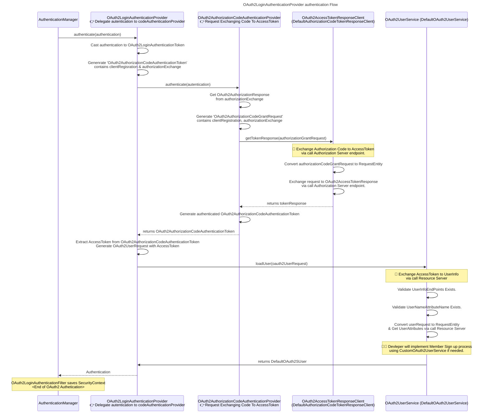

# 전체 플로우

> [RFC 6749 1.2 Protocol Flow](https://datatracker.ietf.org/doc/html/rfc6749#section-1.2)

```
     +--------+                               +---------------+
     |        |--(A)- Authorization Request ->|   Resource    |
     |        |                               |     Owner     |
     |        |<-(B)-- Authorization Grant ---|               |
     |        |                               +---------------+
     |        |
     |        |                               +---------------+
     |        |--(C)-- Authorization Grant -->| Authorization |
     | Client |                               |     Server    |
     |        |<-(D)----- Access Token -------|               |
     |        |                               +---------------+
     |        |
     |        |                               +---------------+
     |        |--(E)----- Access Token ------>|    Resource   |
     |        |                               |     Server    |
     |        |<-(F)--- Protected Resource ---|               |
     +--------+                               +---------------+

                     Figure 1: Abstract Protocol Flow
```


## OAuth2 로그인 페이지 리다이렉트

### OAuth2AuthorizationRequestRedirectFilter 



## Authorization Code 발급되고 나서 Access Token 발급 & 유저 정보 조회
 
### OAuth2LoginAuthenticationFilter



- 세션에 저장된 AuthorizationRequest를 찾은 후 AuthenticationManager로 인증 요청


### OAuth2LoginAuthenticationProvider 플로우





