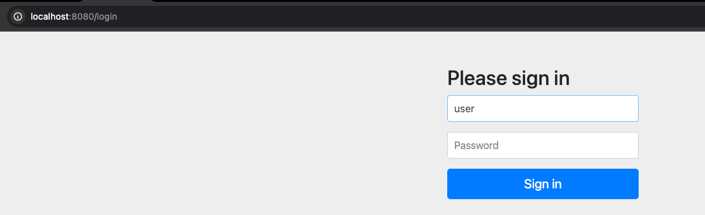
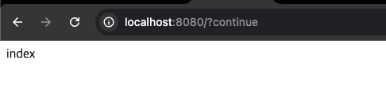
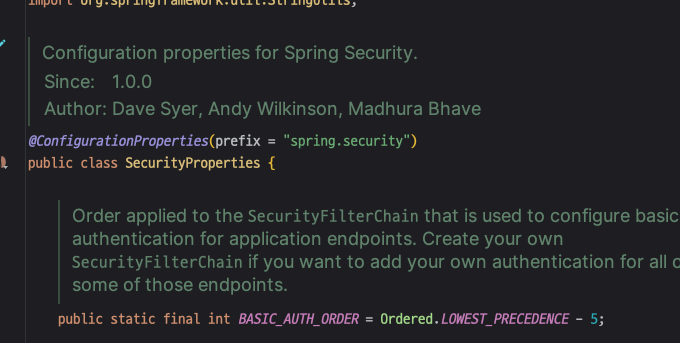
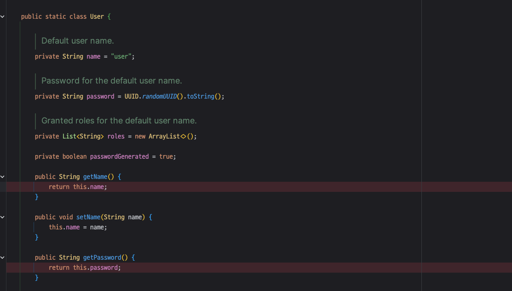
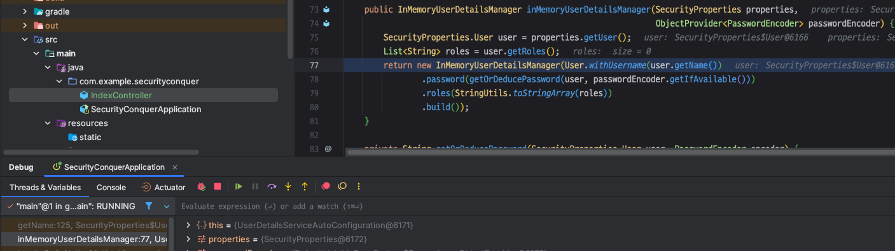
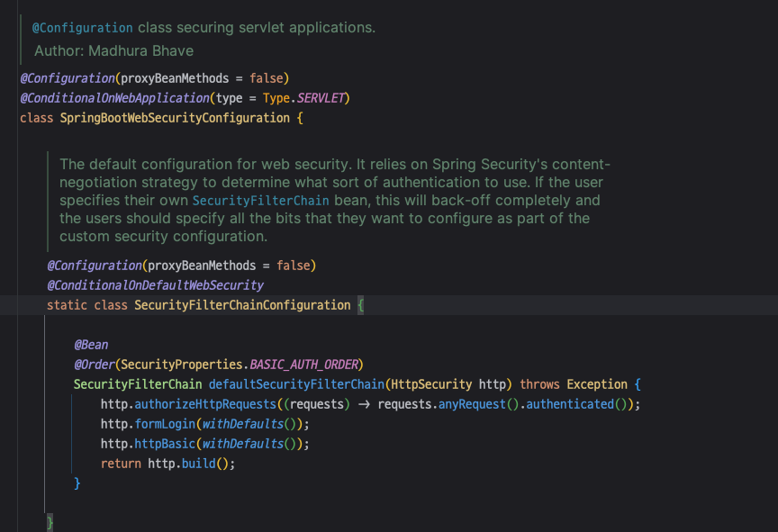
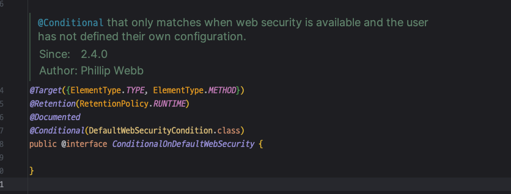
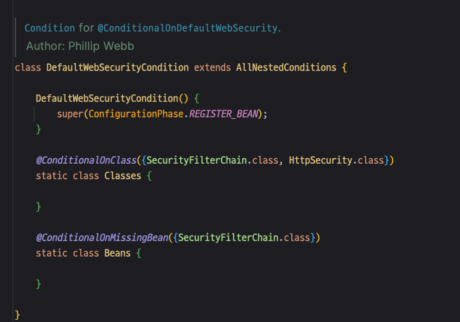

<!-- TOC -->
* [자동설정에 의한 기본 보안 작동](#자동설정에-의한-기본-보안-작동-)
  * [기본 유저 정보](#기본-유저-정보)
    * [그럼 어디서 기본 유저 정보를 초기화 하지?](#그럼-어디서-기본-유저-정보를-초기화-하지)
  * [기본 웹 처리](#기본-웹-처리)
* [SecurityBuilder / SecurityConfigurer](#securitybuilder--securityconfigurer)
  * [개념](#개념)
  * [소스 코드 분석](#소스-코드-분석)
* [WebSecurity / HttpSecurity](#websecurity--httpsecurity)
  * [HttpSecurity](#httpsecurity-)
  * [WebSecurity](#websecurity)
  * [실습](#실습)
    * [HttpSecurityConfiguration.httpSecurity()](#httpsecurityconfigurationhttpsecurity)
  * [웹 요청을 처리하는 주체](#웹-요청을-처리하는-주체)
* [DelegatingFilterProxy / FilterChainProxy](#delegatingfilterproxy--filterchainproxy)
  * [DelegatingFilterProxy](#delegatingfilterproxy)
  * [DelegatingFilterProxy 가 찾는 빈은 사실 FilterChainProxy 이다.](#delegatingfilterproxy-가-찾는-빈은-사실-filterchainproxy-이다)
* [사용자 정의 보안 설정하기](#사용자-정의-보안-설정하기)
<!-- TOC -->

# 자동설정에 의한 기본 보안 작동 

## 기본 유저 정보

- `localhost:8080` 입력 시 `localhost:8080/login`으로 리다이렉트 된다.

- 처음 컨테이너가 뜰 때 제공한 비밀번호로 로그인한 화면

### 그럼 어디서 기본 유저 정보를 초기화 하지?

- `SecurityProperties`가 그 역할을 수행하고 있음.

- `SecurityProperties.User` 클래스를 살펴보면 name과 password를 갖고 있음.
- 그런데 이 정보를 DB에 저장하진 않을 것이므로, 메모리에 저장될 것이고, 이 메모리에 초기화 해놓는 녀석이 따로 있을 것이다.
  - `getName()`과 `getPassword()`에 브레이크 포인트를 걸고 디버깅해보자. (스프링 컨테이너 재시작)

- `UserDetailsServiceAutoConfiguration.inMemoryUserDetailsManager`에서  `getName()`을 호출하고 있다.

## 기본 웹 처리

- `SpringBootWebSecurityConfiguration`에서 기본 웹 구문을 설정하기 위한 빈이 생성된다.
- 그런데 이 빈은 조건을 만족시킬 때만 생성이된다.

- `@ConditionalOnDefaultWebSecurity`에 따라 `SpringBootWebSecurityConfiguration.
  defaultSecurityFilterChain`이 실행될지 말지 결정된다.
- `@ConditionalOnDefaultWebSecurity`는 `DefaultWebSecurityCondition`의 조건에 의존한다.

- `@ConditionalOnClass({ SecurityFilterChain.class, HttpSecurity.class })`
  - SecurityFilterChain과 HttpSecurity가 클래스 패스에 있어야 참이 된다.
  - 스프링 시큐리티 의존성만 추가해줘도 이 부분은 만족한다.
- `@ConditionalOnMissingBean({ SecurityFilterChain.class })`
  - SecurityFilterChain 이 생성되어 있지 않을 때 참이다. (On Missing Bean이니까. 생성되어있다면 거짓.)
  - 그런데 우린 지금 SecurityFilterChain를 만든 적이 없다. 즉 SecurityFilterChain이 생성되어있지 않으므로 이 조건 역시 참이다.

---

# SecurityBuilder / SecurityConfigurer

- 스프링 시큐리티는 초기화 시에 인증/인가와 관련된 많은 작업을 한다. 
  - 객체 생성, 설정 등.
- 대부분의 초기화 작업은 SecurityBuilder / SecurityConfigurer 두 클래스에 의해 동작한다. 
- 따라서 SecurityBuilder / SecurityConfigurer 를 잘 이해하고 있으면 시큐리티 전반적인 이해도가 올라간다.

## 개념

- SecurityBuilder는 빌더 클래스로서 웹 보안을 담당하는 `빈 객체`와 `설정 클래스`들을 설정하는 역할
  - 대표적으로 WebSecurity, HttpSecurity 가 존재.
- `SecurityConfigurer`는 http 요청과 관련된 보안처리를 담당하는 필터를 생성 & 여러 초기화 설정에 관여.
- SecurityBuilder는 SecurityConfigurer를 참조하고 있으며, 인증/인가 초기화 작업은 SecurityConfigurer에 의해 진행됨.

- 자동 설정에 의해 HttpSecurity 빈 생성 
- SecurityConfigurer 가 Filter를 생성

## 소스 코드 분석

- SecurityBuilder: 객체를 생성하기 위한 인터페이스

# WebSecurity / HttpSecurity

## HttpSecurity 

- HttpSecurityConfiguration 에서 HttpSecurity 를 생성하고 초기화 진행.
- HttpSecurity는 보안에 필요한 각 설정 클래스와 필터를 생성하고 최종적으로 `SecurityFilterChain` 빈 생성
  - HttpSecurity 의 최종 목적은 빈을 생성하는 것.

- `build()` 이후 `SecurityFilterChain` 이 인증/인가에 필요한 필터들을 갖게된다.
- 디버깅 사진을 보면 구현체인 `DefaultSecurityFilterChain`이 확인된다.

- `matches(HttpServletRequest request)`
  - `SecurityFilterChain`은 여러 개가 생성될 수 있음.
  - `matches()` 는 이 필터 체인에 의해 처리해야한다는 것을 의미함.

## WebSecurity

- WebSecurityConfiguration 에서 WebSecurity 를 생성하고 초기화를 진행한다.
- WebSecurity 는 HttpSecurity 에서 생성한 SecurityFilterChain 빈을 SecurityBuilder 에 저장한다.
- WebSecurity 가 build() 를 실행하면 SecurityBuilder 에서 SecurityFilterChain 을 꺼내어 FilterChainProxy 
  생성자에게 전달한다.
- 즉 WebSecurity 는 HttpSecurity 보다 상위 개념이며, HttpSecurity가 생성한 빈인 SecurityFilterChain를 
  FilterChainProxy에 저장하는 역할
- 즉 이 모든 것은 FilterChainProxy가 SecurityFilterChain 을 갖게하기 위한 과정이었음. 

## 실습

### HttpSecurityConfiguration.httpSecurity()

- HttpSecurityConfiguration -> HttpSecurity 생성

## 웹 요청을 처리하는 주체
 
- SecurityFilterChain 자체가 웹 요청을 처리하는 것이 아니다.
- **웹 요청을 처리하는 주체는 WebSecurity가 만드는 FilterChainProxy 이다.**

# DelegatingFilterProxy / FilterChainProxy

## DelegatingFilterProxy

- DelegatingFilterProxy는 스프링에서 사용되는 특별한 서블릿 필터이다. 
  - 서블릿 컨테이너와 스프링 애플리케이션 컨텍스트간의 연결고리 역할을 하는 필터
- DelegatingFilterProxy는 서블릿 필터의 기능을 수행하는 동시에 스프링의 의존성 주입및 빈 관리 기능과 연동되도록 설계된 필터이다.
- 클라이언트로 부터 요청이 오면,  DelegatingFilterProxy는 `springSecurityFilterChain` 이름으로 생성 된 빈을 
  ApplicationContext 에서 찾아 요청을 위임한다. 
  - 즉, 실제 보안 처리를 하지는 않는다.

---

- 원래 Servlet Filter는 스프링 컨텍스트에서 제공하는 DI나 AOP기능을 사용할 수 없다.
- 스프링 시큐리티 역시 Servlet Filter 기반으로 설계되었으므로, 원래는 스프링 기능을 사용할 수 없는데,
  - DelegatingFilterProxy 가 
    `springSecurityFilterChain` 빈을 찾아 요청을 위임하므로 스프링에서 제공하는 기능인 DI 나 AOP를 사용할 수 있게 된다.  

## DelegatingFilterProxy 가 찾는 빈은 사실 FilterChainProxy 이다.

- DelegatingFilterProxy 가 요청을 springSecurityFilterChain 빈에게 위임하는데, 이 빈은 사실 `FilterChainProxy`이다.

### FilterChainProxy

- FilterChainProxy는 springSecurityFilterChain 라는 이름으로 생성되는 필터 빈이고, DelegatingFilterProxy 로부터 
  요청을 위임 받고 **보안 처리 역할을 한다.** (즉 **_실제 보안 처리는 DelegatingFilterProxy가 아닌 FilterChainProxy가 한다._**)
- 내부적으로 하나 이상의 `SecurityFilterChain` 객체들을 갖고 있으며, 요청 URL을 기준으로 SecurityFilterChain 을 선택하여 필터들을 
  호출한다. 
  - (복습) SecurityFilterChain 빈은 HttpSecurity에 의해 만들어지고,  WebSecurity가 이 SecurityFilterChain 을 FilterChainProxy에 저장하는 것을 기억하자.
- HttpSecurity를 통해 API 추가 시 `SecurityFilterChain` 목록에 관련 필터들이 추가된다. 
- 사용자의 요청을 필터 순서대로 호출함으로써 보안 기능을 동작시키고,
  - 필요 시 직접 필터를 만들어서 기존의 필터 전/후로 추가 가능하다. 

### FilterChainProxy가 갖는 필터 동작 방식

- 위 사진은 springSecurityFilterChain 빈을 찾아온 결과(=FilterChainProxy)
- FilterChainProxy는 0번 부터 15번까지 위에서 순서대로 필터를 호출하면서 요청을 처리하는데, 
  - 맨 마지막 인가 처리를 하는 필터(AuthorizationFilter)까지 예외나 오류가 발생하지 않으면 요청이 서블릿으로 넘어간다.
  - 요청이 서블릿으로 넘어가기 전 필터 체이닝 과정에서 에러가 나게 되면 서비스 로직으로는 요청이 가지 않게 된다.
- 즉 FilterChainProxy가 사용자 요청에 대한 모든 처리를 필터 기반으로 한다. 

## 실습 

- 애플리케이션 디버깅 모드로 기동 시작.

- SecurityFilterAutoConfiguration.securityFilterChainRegistration 에서 
  `DelegatingFilterProxyRegistrationBean` 빈을 생성한다.

- 이 때 DEFAULT_FILTER_NAME = "springSecurityFilterChain";

.... 

---

# 사용자 정의 보안 설정하기

