<!-- TOC -->
* [폼 인증 - formLogin()](#폼-인증---formlogin)
  * [폼 인증?](#폼-인증)
  * [formLogin()](#formlogin)
    * [실습](#실습)
    * [loginPage](#loginpage)
    * [usernameParameter, passwordParameter](#usernameparameter-passwordparameter)
    * [loginProcessingUrl](#loginprocessingurl)
    * [defaultSuccessUrl](#defaultsuccessurl)
    * [successHandler, failureHandler](#successhandler-failurehandler-)
  * [FormLoginConfigurer](#formloginconfigurer)
* [폼 인증 필터 - UsernamePasswordAuthenticationFilter](#폼-인증-필터---usernamepasswordauthenticationfilter)
  * [폼 인증 흐름도](#폼-인증-흐름도)
    * [인증에 성공한 경우](#인증에-성공한-경우)
    * [인증에 실패한 경우](#인증에-실패한-경우)
    * [인증 과정 중 예외가 발생하면 예외 처리는 어디서?](#인증-과정-중-예외가-발생하면-예외-처리는-어디서)
  * [실습](#실습-)
    * [인증 성공 과정](#인증-성공-과정)
    * [인증 실패 과정](#인증-실패-과정)
* [기본 인증 - httpBasic()](#기본-인증---httpbasic)
  * [httpBasic()](#httpbasic)
  * [기본 인증 필터 - BasicAuthenticationFilter](#기본-인증-필터---basicauthenticationfilter)
* [기억하기 인증 - rememberMe()](#기억하기-인증---rememberme)
  * [rememberMe()](#rememberme)
  * [기억하기 인증 필터 - RememberMeAuthenticationFilter](#기억하기-인증-필터---remembermeauthenticationfilter)
* [익명 인증 사용자 - anonymous](#익명-인증-사용자---anonymous)
* [로그아웃 - logout()](#로그아웃---logout)
* [요청 캐시 RequestCache / SavedRequest](#요청-캐시-requestcache--savedrequest-)
<!-- TOC -->

# 폼 인증 - formLogin()

## 폼 인증?


- 클라이언트가 `GET /user` API 로 요청을 보냈다고 하자.
- 그런데 이 API가 권한을 필요로 하는 API 였다고 하자.
- 그럼 시큐리티가 갖고 있는 필터 중 맨 마지막 필터인 AuthorizationFilter 권한 검사 필터가 있는데, 여기서 사용자가 권한이 있나 없나 검사하는데 여기서 
  권한이 없을 경우 접근 예외를 발생한다.
- 이 떄 예외 처리 필터(`ExceptionTranslationFilter`)가 이 예외를 받아서 처리하는데,
  - 이 예외를 처리하는 방법 중 하나가 **로그인 페이지로 리다이렉트** 로 처리하는 방식을 사용한다.
  - 그럼 유저는 다시 로그인 시도를 하게 된다.

## formLogin()

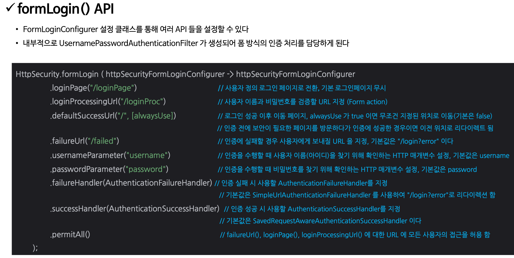

### 실습


- 위처럼 설정하고 루트 (`localhost:8080/`)로 이동해보자.

### loginPage


- 그럼 위와 같이 이동한다. 왜 그럴까?

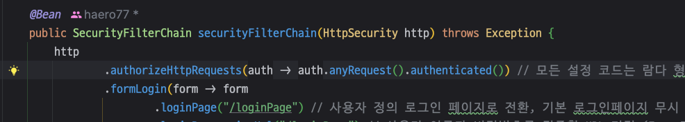

- 인가 쪽을 보면, 어떤 요청이든간에 모두 인증을 필요로 한다. (`auth.anyRequest().authenticated()`)
- 그런데 루트로 이동하면 인증을 하지 않았으므로 로그인 페이지로 이동하는데, 이 때 사용자 정의 로그인 페이지를 `/loginPage`로 정의해놓았으니 그리로 이동한 것이다. 
- `/loginPage`의 경우 **`permitAll()`을 설정했으므로 인증을 받지 못한 사용자라 하더라도 `/loginPage`에 접속 가능**하다.

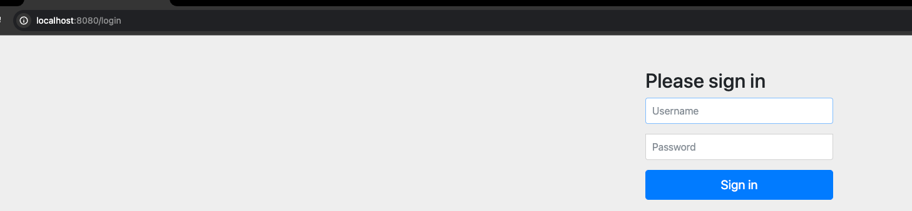

- `loginPage`를 주석 처리하고 다시 루트로 이동하면 위와 같이 기본 로그인 페이지로 이동하는 것을 볼 수 있다.

### usernameParameter, passwordParameter


- `usernameParameter`를 `userId`로 지정하고,
- `passwordParameter`는 `passwd`로 지정했다. 
- 이러고나서 개발자도구를 이용하여 시큐리티 기본 로그인 페이지 도구를 검사하자 

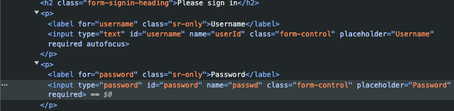

- 스프링에서는 HTML 태그의 `id`값이 아닌 `name`값을 이용하기 때문에 `name` 값이 각각 `userId`와 `passwd`로 변해있는 것을 확인할 수 있다.
  - 이것은 스프링 시큐리티가 자동으로 해준 것으로(우리가 설정을 직접 했으므로), 커스텀한 로그인 폼 페이지를 만든다면 이 name 부분을 설정한 값으로 맞춰줘야한다. 

### loginProcessingUrl


- form 태그의 action 값이 `loginProcessingUrl()` 설정한 경로로 변경되었다.

### defaultSuccessUrl

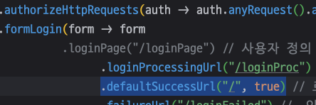

- 로그인 성공 이후 이동 페이지를 루트로 설정했다. 이 상태에서 로그인하면?

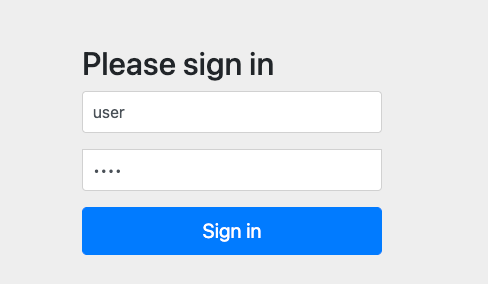

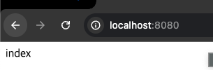

- 오호. 루트로 잘 이동한다.
- **_그럼 `alwaysUse` 값을 `false`로 주면 어떻게 될까?_**

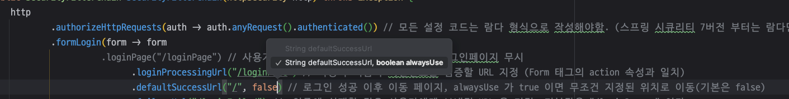

- `alwaysUse` 값을 `false`로 변경한 다음에, 앱을 재기동하고 `/home`으로 요청을 보내보자.

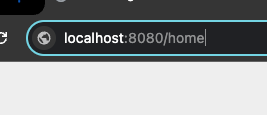


- `/home`으로 요청을 보냈지만, `/login`으로 리다이렉트 되었다. (스프링 기본 로그인 페이지로 리다이렉트 되었다.)


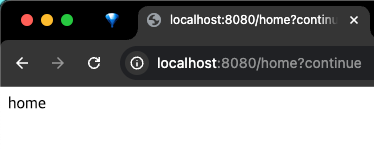

- 어라. 로그인에 성공하니, 이번에는 루트로 가는 것이 아니라 `/home`으로 이동한다. 
-  **_이것이 바로 `alwaysUse`값의 true/false 차이이다._**
  -  `alwaysUse`가 true 이면 어떤 경우든 상관 없이 defaultSuccessUrl 로 이동한다.
  -  `alwaysUse`가 false일 경우, 이전에 요청받은 주소로 리다이렉트 된다.
    -  즉, **_인증 전에 보안이 필요한 페이지를 방문하다가 인증에 성공한 경우이면 이전 위치로 리다이렉트 된다._** (=기본적인 스프링 시큐리티의 처리 방식)

     
### successHandler, failureHandler 

- successHandler, failureHandler 는 defaultSuccessUrl과 failureUrl보다 우선시 된다.

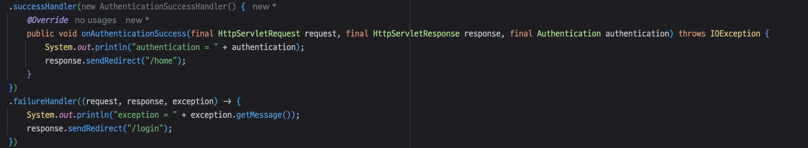

- 로그인 성공했을 때는 `/home`으로, 실패 했을 때는 `/login`으로 리다이렉트하도록 설정했다.


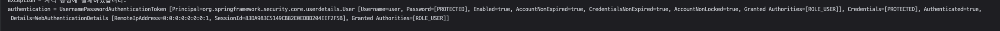

- 로그인에 성공했을 때 실제 `/home`으로 가는 것 확인 완료.


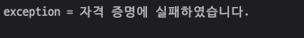

- 로그인에 실패했을 때 `/login`으로 리다이렉트 되는 것 확인 완료.

## FormLoginConfigurer

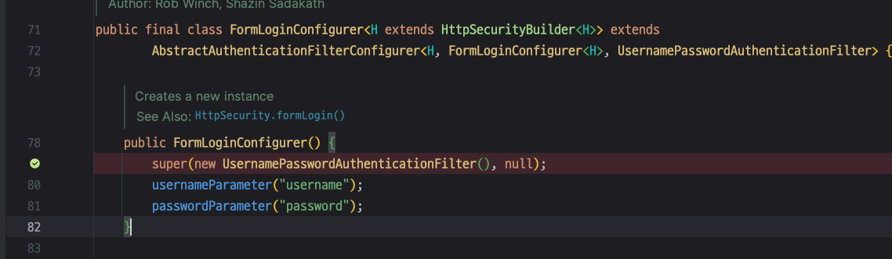

# 폼 인증 필터 - UsernamePasswordAuthenticationFilter

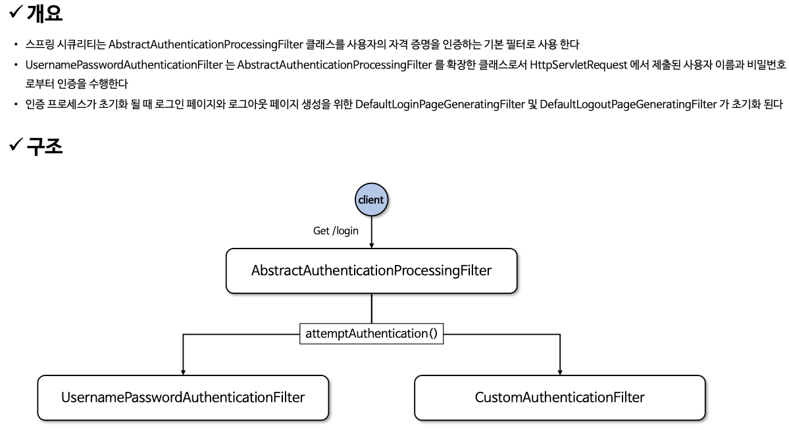

- 클라이언트로 부터 요청이 오면 `AbstractAuthenticationProcessingFilter`가 인증을 처리.
- `UsernamePasswordAuthenticationFilter`는 스프링 시큐리티가 구현해둔 인증 필터. 

## 폼 인증 흐름도

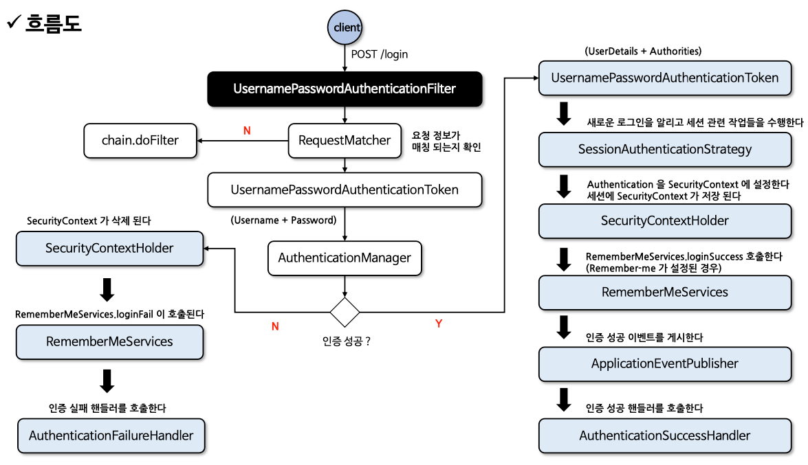

- **RequestMatcher**
  - Request Mapping 을 확인한다.
  - 기본적으로 `POST /login`으로 매핑되어있으므로 다른 URI, 예를 들면 `POST /login-process`의 경우는 매칭되지 않으므로 
    `RequestMatcher`는 `false`를 리턴한다.
- **AuthenticationManager**
  - username, password 기반으로 인증을 처리하는 매니저. 자세한 것은 후에 다룬다.

### 인증에 성공한 경우

- **UsernamePasswordAuthenticationToken**
  - username, password 외에 user 정보(UserDetails)와 권한 정보(Authorities)를 함께 저장.
- **SecurityContextHolder**
  - (1) `Authentication`을 `SecurityContext`에 설정
  - (2) 세션에 `SecurityContext`가 저장됨.
  - 위 두 작업을 하는 이유 -> **유저의 인증 상태 유지하기 위함.**
- **RememberMeServices**
  - 세션이 만료되어도 `기억하기` 기능을 통해 쉽게 로그인할 수 있음.

### 인증에 실패한 경우

- `SecurityContextHolder`를 삭제한다.
  - 누군가가 악의적으로 로그인 시도를 했을 수 있으니, 인증 정보 자체를 삭제한다.
- `RememberMeServices.loginFail` 호출
  - 기억하기도 같이 삭제.

### 인증 과정 중 예외가 발생하면 예외 처리는 어디서?

- 인증을 하다가 예외가 발생하면 전용 예외 필터에서 처리하는 것이 아니라, **인증 필터에서 예외처리를 한다.**
- 보통 `AuthenticationFailureHandler`에서 예외 처리한다.
  - 인증 성공 시에는 예외처리랄게 따로 없으므로 보통 `AuthenticationFailureHandler`에서 처리. 

## 실습 

### 인증 성공 과정

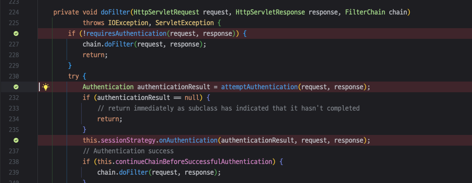

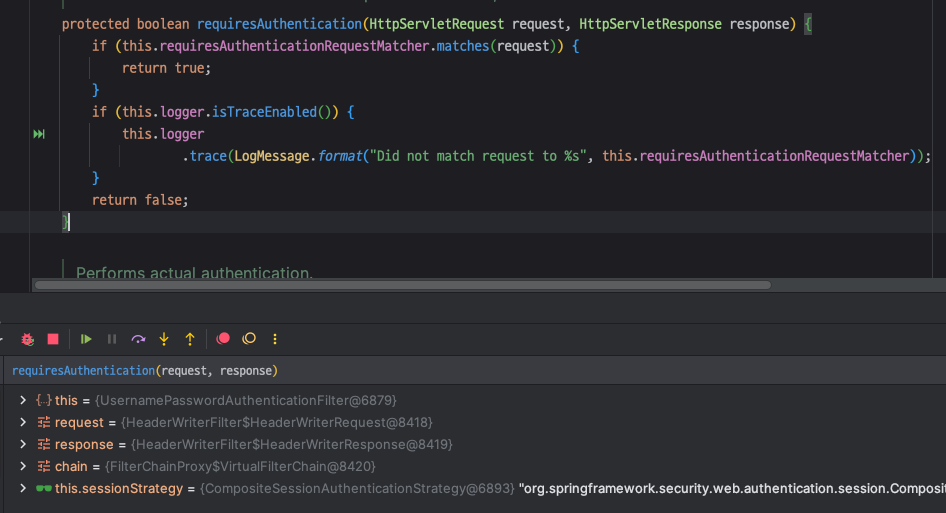

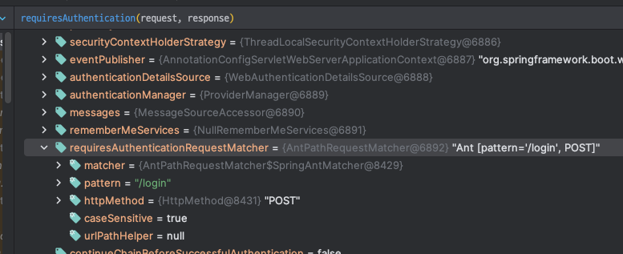

- `UsernamePasswordAuthenticationFilter.requiresAuthentication`
  - antPathRequestMatcher 의 패턴이 `/login`

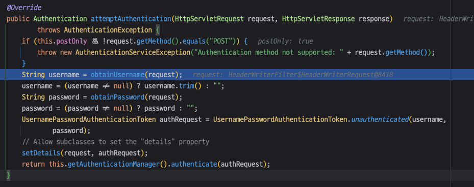

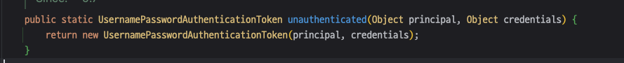

- `UsernamePasswordAuthenticationFilter.attemptAuthentication` 에서 
  `UsernamePasswordAuthenticationToken.unauthenticated` 호출 

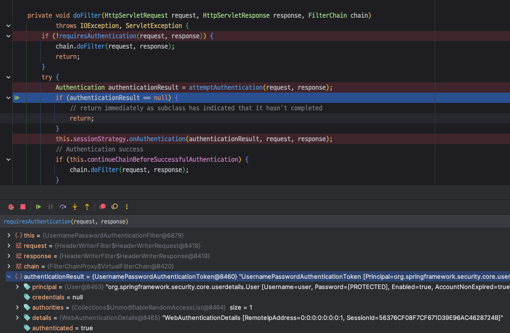

- `UsernamePasswordAuthenticationFilter.attemptAuthentication` 호출 결과 생긴 `Authentication`의 구현체는 
  `UsernamePasswordAuthenticationToken`이다

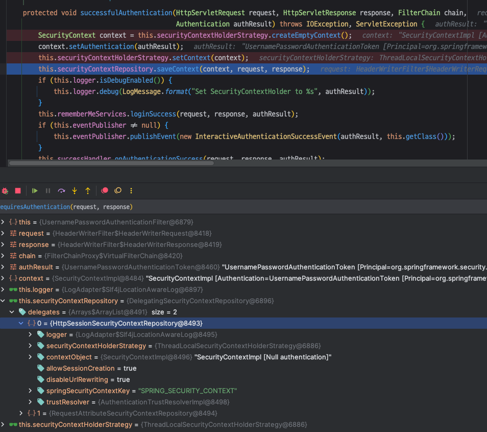

- this.securityContextRepository.saveContext(context, request, response);
  - 이 때 `securityContextRepository` 세션 storage이다. (`HttpSessionSecurityContextRepository`)

### 인증 실패 과정

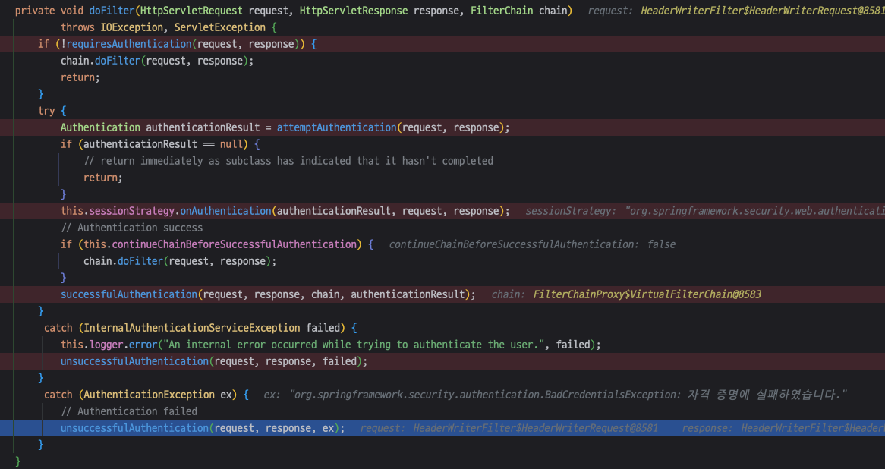

- `AuthenticationException` 캐치

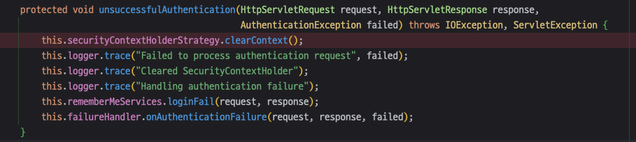

- `security context`를 초기화

# 기본 인증 - httpBasic()

## HTTP Basic 인증 방식

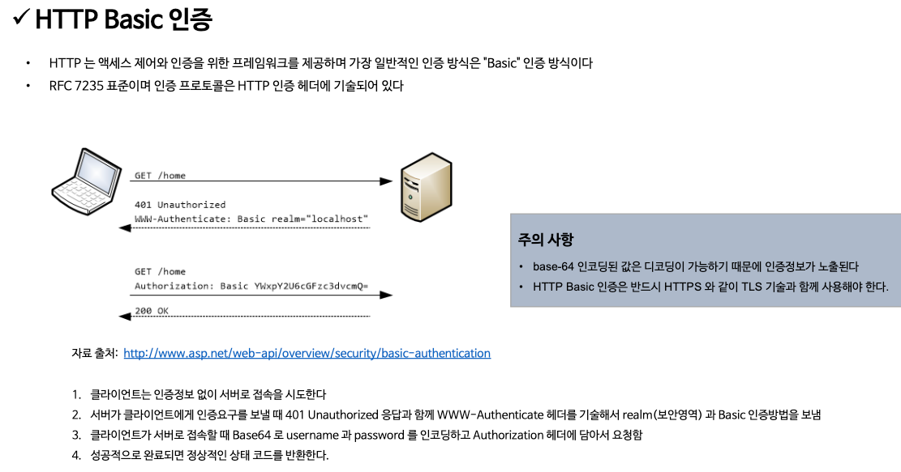

### 🚨 주의사항 - Base64로 인코딩한 값을 통신에 사용하면 안 된다 

- username, password를 Base64로 인코딩해서 서버에 전달한다고 했는데,
  - 이 때 Base64로 인코딩된 값은 **암호화된 값은 아니다.**
  - Base64로 디코딩할 수 있으므로, 암호가 노출될 수 있으며 **이 상태로 통신이 되면 안 된다.**
- 따라서 HTTP Basic 인증은 반드시 HTTPS와 같이 TLS 기술과 함께 사용해야한다.
- 요즘 웹에서는 HTTP Basic 인증은 거의 사용하지 않는다.

## 시큐리티의 HTTP Basic 인증

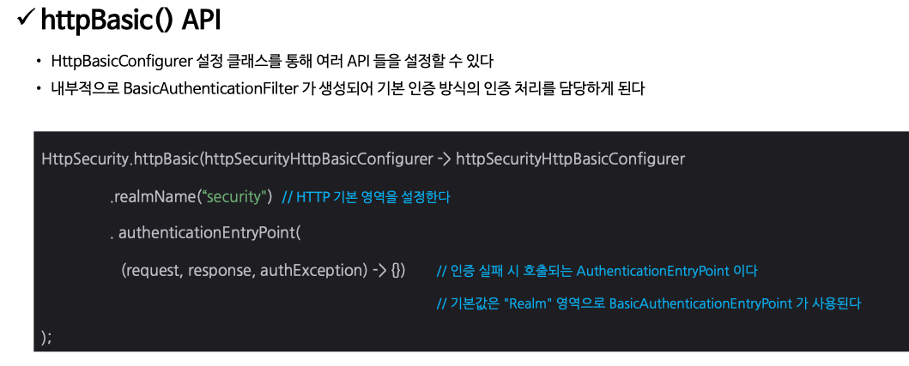

## 실습

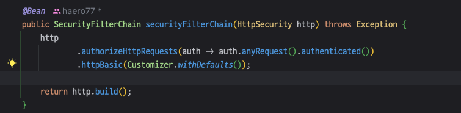

- 위 처럼 기본 `httpBasic`을 설정하고 루트로 접근해보자.

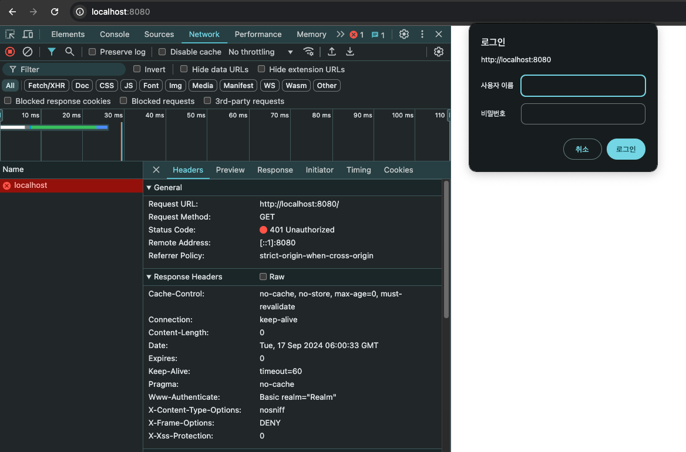

- 접근 권한이 없으므로 서버는 Response Header에 `WWW-Authenticate: Basic realm="Realm"` 응답을 내렸다. 

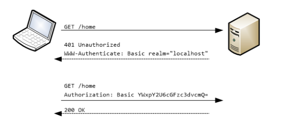

- 이후 클라이언트 브라우저에서는 Basic 인증 방식을 사용하기 위해 프롬프트 창을 띄웠다.
- 로그인에 성공한 결과를 확인해보자.


- 요청 헤더를 확인해보면 Base64로 인코딩된 `username:password`를 포함한 것을 확인 가능.

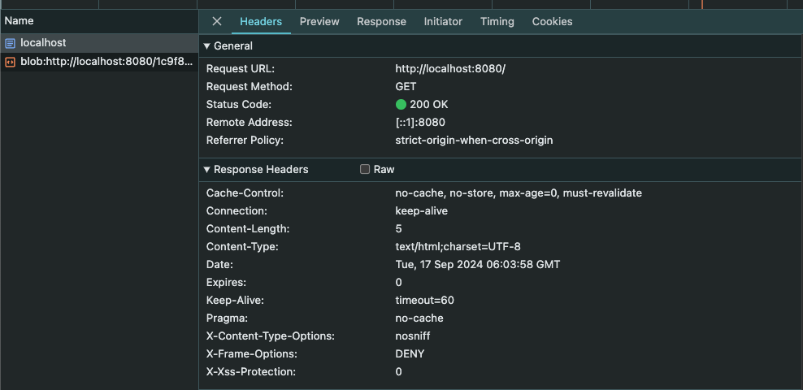

- 로그인에 성공하고 응답 헤더를 열어보면 `WWW-Authenticate` 헤더는 포함되지 않는 것을 확인할 수 있다.
  - 정상 로그인 했으므로 응답 헤더에 `WWW-Authenticate`를 심지 않았다.

### authenticationEntryPoint

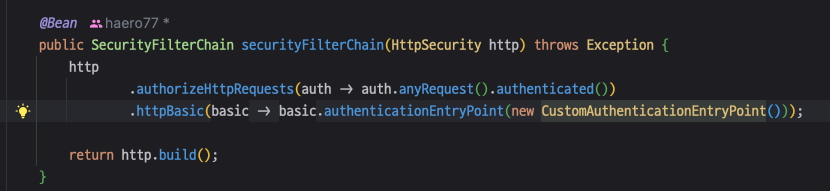

```java
public class CustomAuthenticationEntryPoint implements AuthenticationEntryPoint {

  @Override
  public void commence(
      final HttpServletRequest request,
      final HttpServletResponse response,
      final AuthenticationException authException
  ) throws IOException, ServletException {
    response.setHeader("CUSTOM-Authenticate", "Basic realm=security");
    response.sendError(HttpStatus.UNAUTHORIZED.value(), HttpStatus.UNAUTHORIZED.getReasonPhrase());
  }
}
```

- authenticationEntryPoint를 커스텀 해보자.

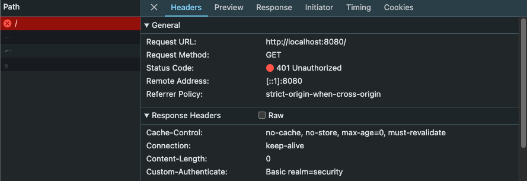

- Response 헤더에 커스텀한 헤더값이 들어있는 걸 확인할 수 있다.
  - 단 이것을 브라우저에서 해석할 수는 없으므로 프롬프트 창이 뜨지는 않는다.

# 기본 인증 필터 - BasicAuthenticationFilter

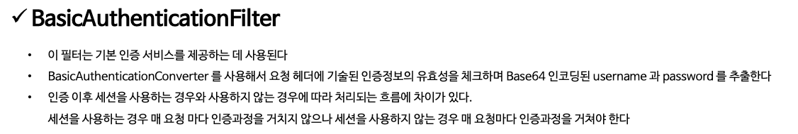

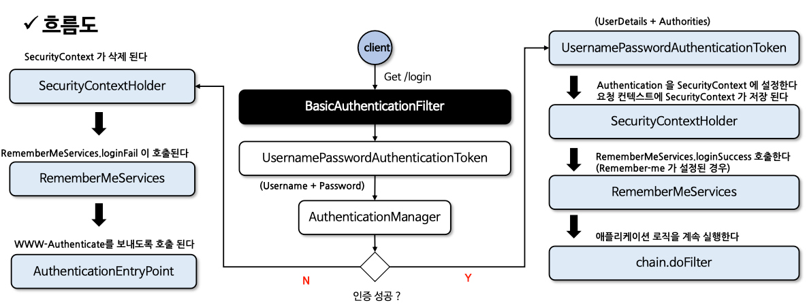

- 기본적으로 `BasicAuthenticationFilter`는 세션을 사용하지 않는다.
  - 세션을 사용하지 않으므로, 매 요청 시마다 인증을 해야한다.

## 실습

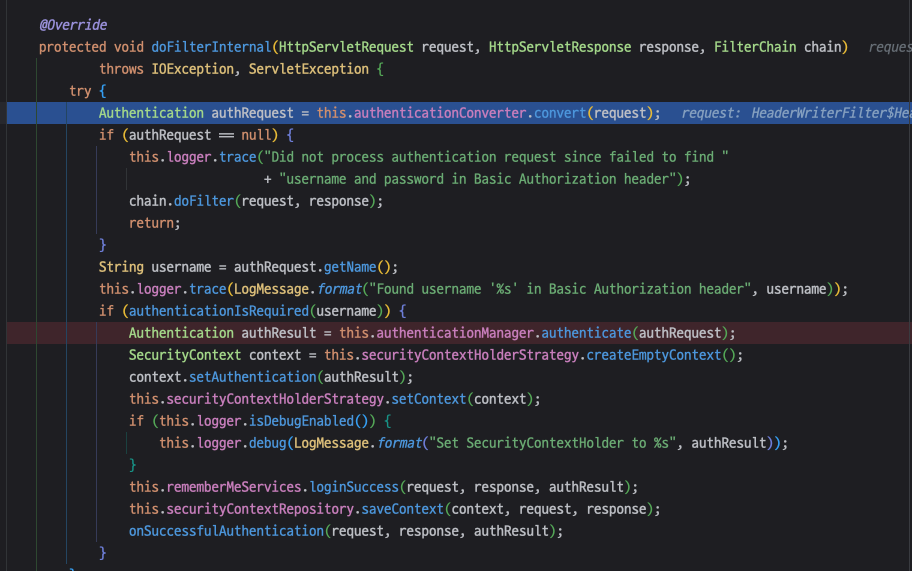

- `BasicAuthenticationFilter.doFilterInternal`

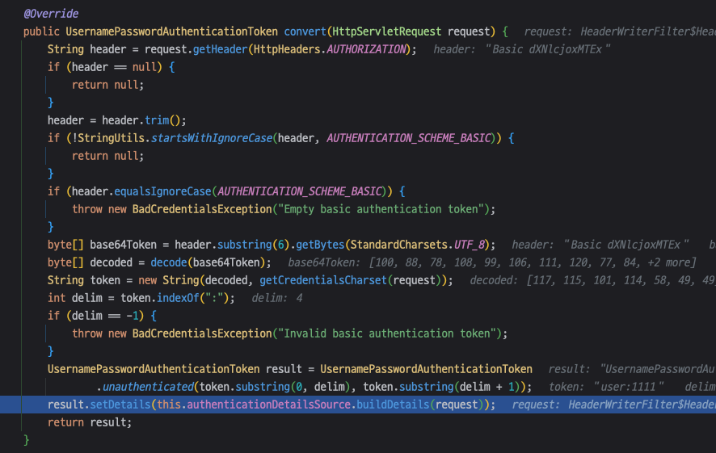

- `BasicAuthenticationConverter.convert`

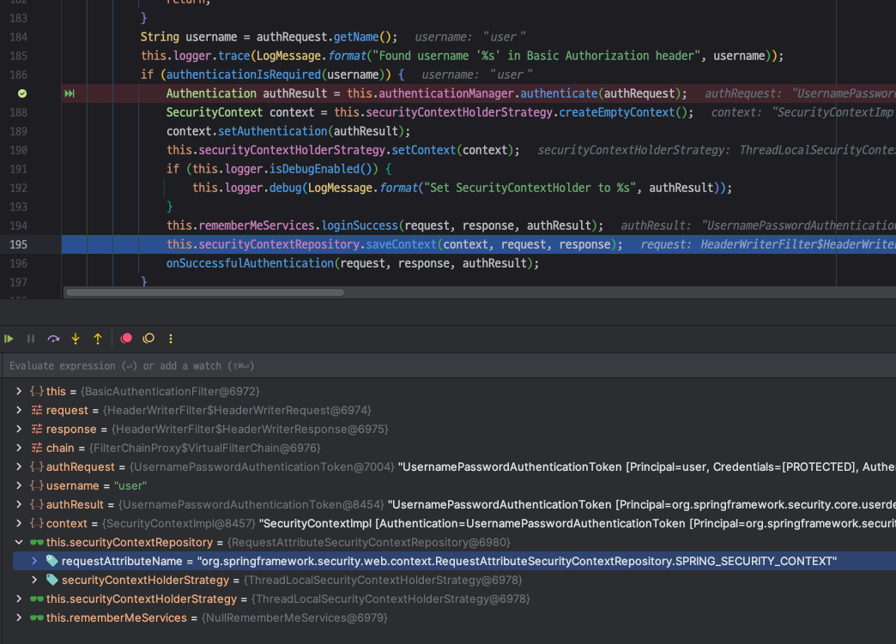

- `BasicAuthenticationFilter`는 세션을 쓰지 않는다고 했다. 
  - `UsernamePasswordAuthenticationFilter`의 `securityContextRepository`가 
    `HttpSessionSecurityContextRepository`(세션 스토리지)인 반면,
  - `BasicAuthenticationFilter`의 `securityContextRepository`는 요청당 인증이 유지되는 
    RequestAttributeSecurityContextRepository 이다.


# 기억하기 인증 - rememberMe()

## rememberMe()

## 기억하기 인증 필터 - RememberMeAuthenticationFilter

# 익명 인증 사용자 - anonymous

# 로그아웃 - logout()

# 요청 캐시 RequestCache / SavedRequest 

