<!-- TOC -->
* [폼 인증 - formLogin()](#폼-인증---formlogin)
  * [폼 인증?](#폼-인증)
  * [formLogin()](#formlogin)
    * [실습](#실습)
    * [loginPage](#loginpage)
    * [usernameParameter, passwordParameter](#usernameparameter-passwordparameter)
    * [loginProcessingUrl](#loginprocessingurl)
    * [defaultSuccessUrl](#defaultsuccessurl)
  * [폼 인증 필터 - UsernamePasswordAuthenticationFilter](#폼-인증-필터---usernamepasswordauthenticationfilter)
* [기본 인증 - httpBasic()](#기본-인증---httpbasic)
  * [httpBasic()](#httpbasic)
  * [기본 인증 필터 - BasicAuthenticationFilter](#기본-인증-필터---basicauthenticationfilter)
* [기억하기 인증 - rememberMe()](#기억하기-인증---rememberme)
  * [rememberMe()](#rememberme)
  * [기억하기 인증 필터 - RememberMeAuthenticationFilter](#기억하기-인증-필터---remembermeauthenticationfilter)
* [익명 인증 사용자 - anonymous](#익명-인증-사용자---anonymous)
* [로그아웃 - logout()](#로그아웃---logout)
* [요청 캐시 RequestCache / SavedRequest](#요청-캐시-requestcache--savedrequest-)
<!-- TOC -->

# 폼 인증 - formLogin()

## 폼 인증?

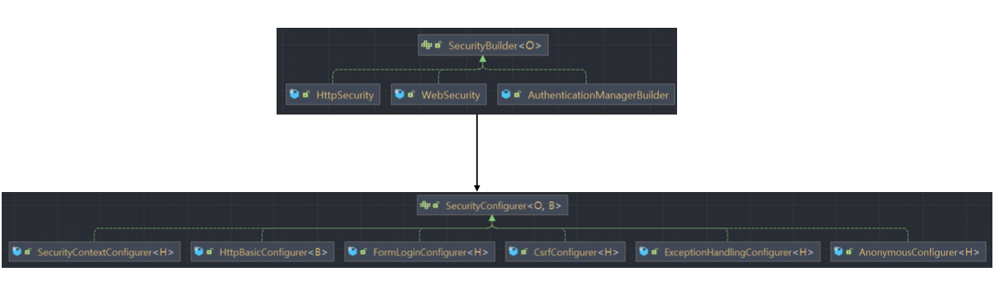

- 클라이언트가 `GET /user` API 로 요청을 보냈다고 하자.
- 그런데 이 API가 권한을 필요로 하는 API 였다고 하자.
- 그럼 시큐리티가 갖고 있는 필터 중 맨 마지막 필터인 AuthorizationFilter 권한 검사 필터가 있는데, 여기서 사용자가 권한이 있나 없나 검사하는데 여기서 
  권한이 없을 경우 접근 예외를 발생한다.
- 이 떄 예외 처리 필터(`ExceptionTranslationFilter`)가 이 예외를 받아서 처리하는데,
  - 이 예외를 처리하는 방법 중 하나가 **로그인 페이지로 리다이렉트** 로 처리하는 방식을 사용한다.
  - 그럼 유저는 다시 로그인 시도를 하게 된다.

## formLogin()

### 실습

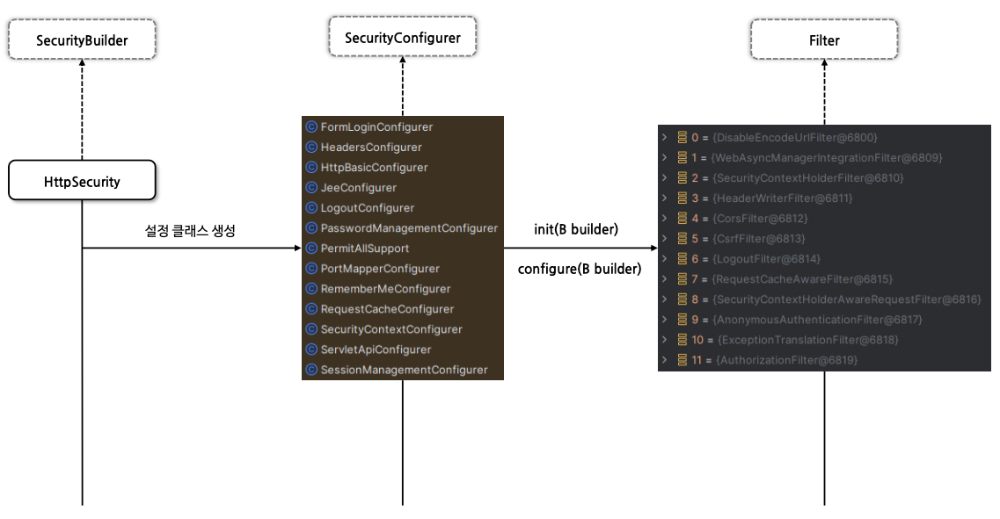

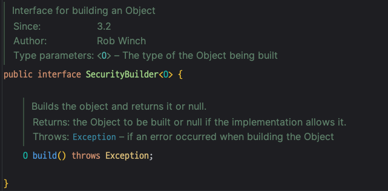

- 위처럼 설정하고 루트 (`localhost:8080/`)로 이동해보자.

### loginPage

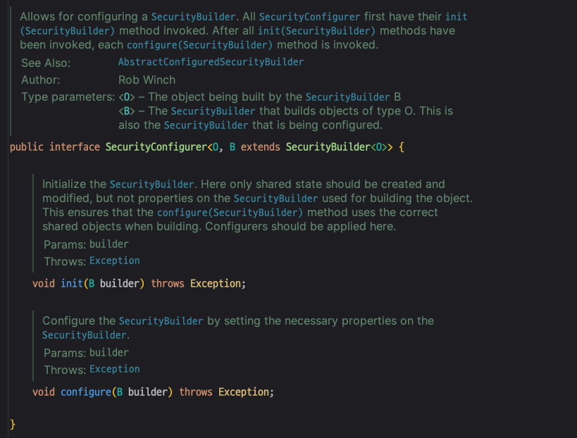

- 그럼 위와 같이 이동한다. 왜 그럴까?

- 인가 쪽을 보면, 어떤 요청이든간에 모두 인증을 필요로 한다. (`auth.anyRequest().authenticated()`)
- 그런데 루트로 이동하면 인증을 하지 않았으므로 로그인 페이지로 이동하는데, 이 때 사용자 정의 로그인 페이지를 `/loginPage`로 정의해놓았으니 그리로 이동한 것이다. 
- `/loginPage`의 경우 **`permitAll()`을 설정했으므로 인증을 받지 못한 사용자라 하더라도 `/loginPage`에 접속 가능**하다.

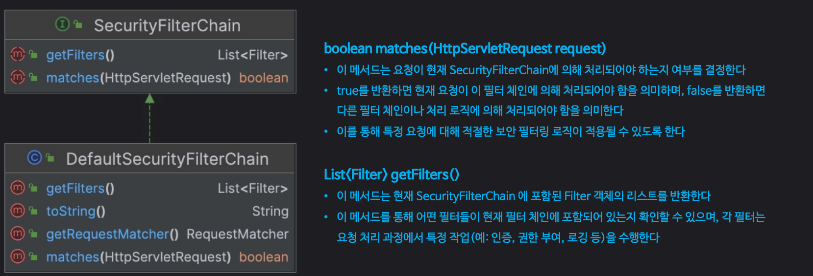

- `loginPage`를 주석 처리하고 다시 루트로 이동하면 위와 같이 기본 로그인 페이지로 이동하는 것을 볼 수 있다.

### usernameParameter, passwordParameter

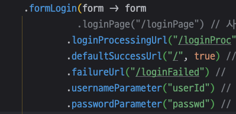

- `usernameParameter`를 `userId`로 지정하고,
- `passwordParameter`는 `passwd`로 지정했다. 
- 이러고나서 개발자도구를 이용하여 시큐리티 기본 로그인 페이지 도구를 검사하자 

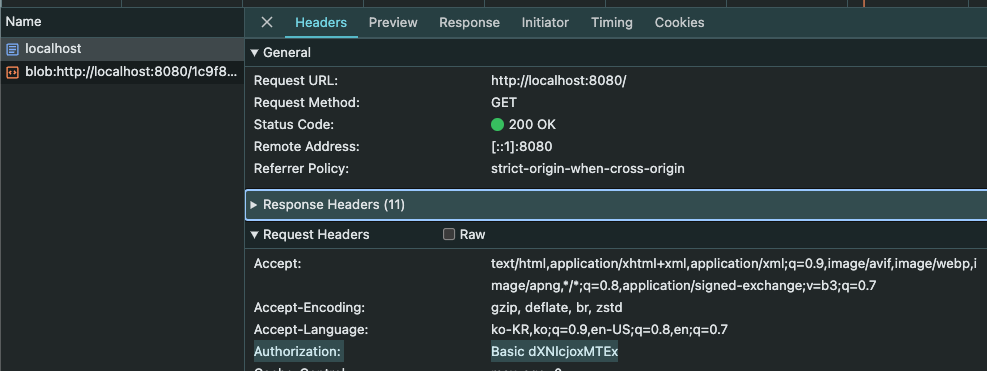

- 스프링에서는 HTML 태그의 `id`값이 아닌 `name`값을 이용하기 때문에 `name` 값이 각각 `userId`와 `passwd`로 변해있는 것을 확인할 수 있다.
  - 이것은 스프링 시큐리티가 자동으로 해준 것으로(우리가 설정을 직접 했으므로), 커스텀한 로그인 폼 페이지를 만든다면 이 name 부분을 설정한 값으로 맞춰줘야한다. 

### loginProcessingUrl

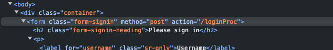

- form 태그의 action 값이 `loginProcessingUrl()` 설정한 경로로 변경되었다.

### defaultSuccessUrl

- 로그인 성공 이후 이동 페이지를 루트로 설정했다. 이 상태에서 로그인하면?

- 오호. 루트로 잘 이동한다.
- **_그럼 `alwaysUse` 값을 `false`로 주면 어떻게 될까?_**

- `alwaysUse` 값을 `false`로 변경한 다음에, 앱을 재기동하고 `/home`으로 요청을 보내보자.

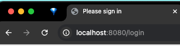

- `/home`으로 요청을 보냈지만, `/login`으로 리다이렉트 되었다. (스프링 기본 로그인 페이지로 리다이렉트 되었다.)

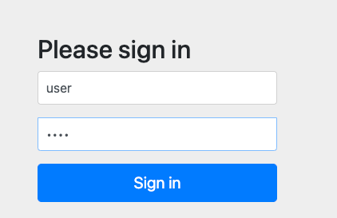

- 어라. 로그인에 성공하니, 이번에는 루트로 가는 것이 아니라 `/home`으로 이동한다. 
-  **_이것이 바로 `alwaysUse`값의 true/false 차이이다._**
  -  `alwaysUse`가 true 이면 어떤 경우든 상관 없이 defaultSuccessUrl 로 이동한다.
  -  `alwaysUse`가 false일 경우, 이전에 요청받은 주소로 리다이렉트 된다.
    -  즉, **_인증 전에 보안이 필요한 페이지를 방문하다가 인증에 성공한 경우이면 이전 위치로 리다이렉트 된다._** (=기본적인 스프링 시큐리티의 처리 방식)

     
### successHandler, failureHandler 

- successHandler, failureHandler 는 defaultSuccessUrl과 failureUrl보다 우선시 된다.

- 로그인 성공했을 때는 `/home`으로, 실패 했을 때는 `/login`으로 리다이렉트하도록 설정했다.

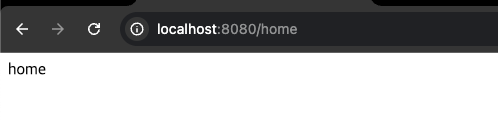

- 로그인에 성공했을 때 실제 `/home`으로 가는 것 확인 완료.

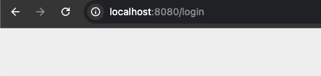

- 로그인에 실패했을 때 `/login`으로 리다이렉트 되는 것 확인 완료.

## FormLoginConfigurer

## 폼 인증 필터 - UsernamePasswordAuthenticationFilter

# 기본 인증 - httpBasic()

## httpBasic()

## 기본 인증 필터 - BasicAuthenticationFilter

# 기억하기 인증 - rememberMe()

## rememberMe()

## 기억하기 인증 필터 - RememberMeAuthenticationFilter

# 익명 인증 사용자 - anonymous

# 로그아웃 - logout()

# 요청 캐시 RequestCache / SavedRequest 

