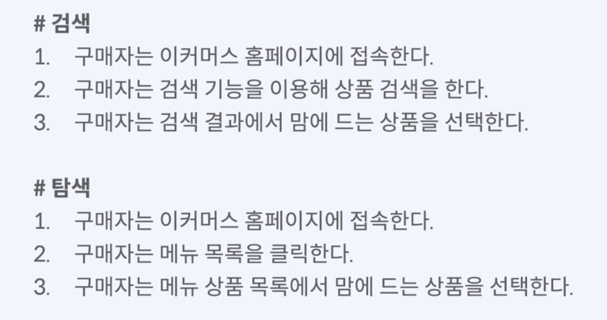
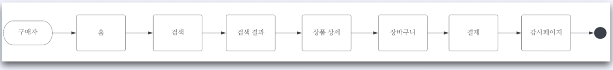
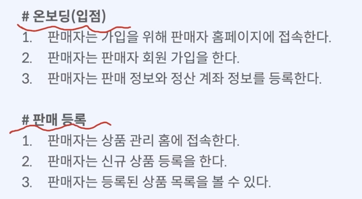
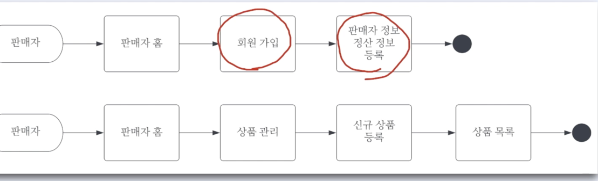
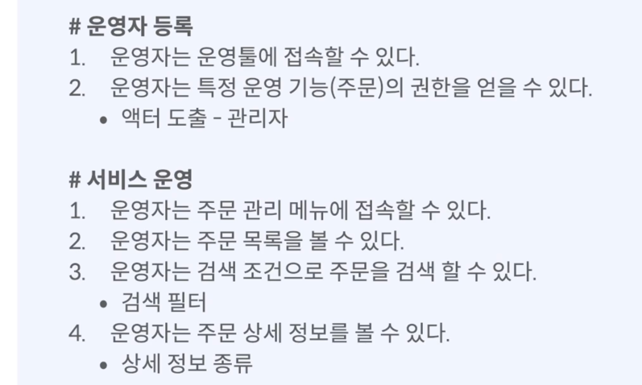

> **_"플로우차트로 흐름을 그려서, 동료에게 공유하라."_**

# 실전 Tips!

- **_동료의 얘기가 복잡하다고 느껴지면 바로 시각화해보자._**
  - 오프라인 도구(메모장, 화이트보드)
  - 온라인 도구(루시드 차트, 머메이드 등)
- **_시각화한 내용을 꼭 공유하자._**

---

# 구매자 서비스 흐름

> 이커머스 구매자의 구매 여정을 시각화한다.

## 구매자 유저스토리

### 구매자 플로우차트

(루시드차트)

# 판매자 서비스 흐름

## 판매자 유저스토리 

### 판매자 플로우차트

# 운영자 서비스 흐름

> 이커머스 운영자의 관리 서비스 여정을 시각화한다.

---

# 이번 세션에서

- 이커머스의 세 가지 사용자를 식별.
- 각각의 서비스 흐름과 플로우차트를 그렸음.
- 머리속에 있는 기획/아이디어를 글, 도형 등을 이용하여 시각화하면 동료들과 논의할 때 내용파악/이해도 높아짐
  - 부족한 내용을 식별하기도 쉬워짐.