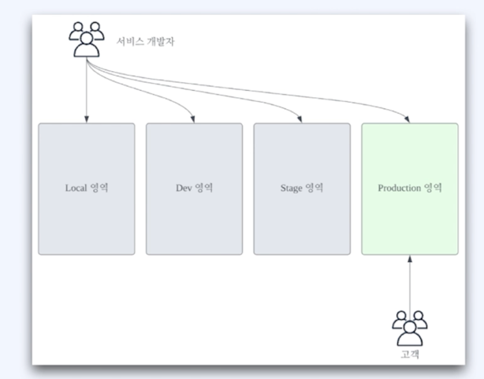
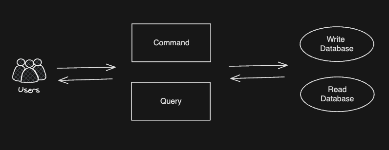
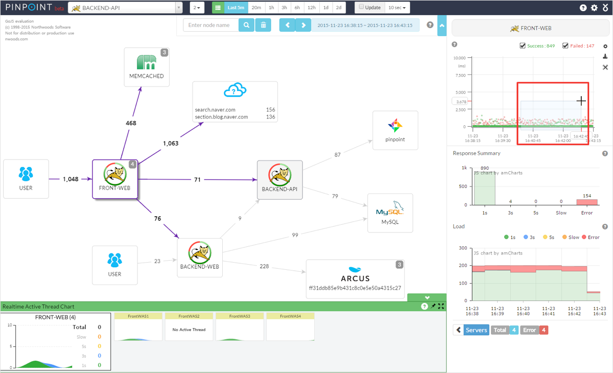

<!-- TOC -->
* [광운님이 전달할 메시지](#광운님이-전달할-메시지)
* [실습 지표](#실습-지표)
* [ABTest 도입하기](#abtest-도입하기)
* [시스템](#시스템-)
<!-- TOC -->

# 광운님이 전달할 메시지

- 기본이 중요하다.
    - 아무리 중요한 상황에도 기본을 되돌아봐야한다.
- 은총알은 없다.
    - 모든 것을 한 방에 해결해주는 솔루션은 거의 없다.
- 관례
  - 수많은 동료 개발자들의 경험은 중요
- WHY?
  - 솔루션이나 도구를 선택할 때 항상 이것을 생각하라.

## 우리의 마음가짐

- 우리는 실제 서비스 현장에서 사용되고 있는 것들을 배운다.
  - **_사용법을 배우기보다 왜 사용하는지를 명심할 것._**

# 실습 지표

- 분석을 통해 서비스를 성공적으로 이끌 수 있다.
- 지표를 시각화하면 분석하기 좋다. 현장에서는 대시보드는 기본.

# ABTest 도입하기

- 기존 기능을 A, 신 기능을 B라함.

# 시스템 서버를 영역으로 분리

- 프로젝트를 각 영역에 맞게 프로파일로 분리.
- 각 영역을 어떻게 운영할 건지 전략.

# 서비스 읽기와 쓰기 분리

- 코드 레벨의 분리
  - Controller, Service 등을 읽기와 쓰기로 분리
- 데이터베이스의 읽기와 쓰기를 분

# 도메인 단위 분리

## 이벤트 스토밍

- 서비스 규모가 커지면 하나의 시스템에서 모든 업무를 처리하기 어려움
- `DDD`와 `이벤트 스토밍` 이라는 방법으로 업무와 시스템 분리

# API Gateway

- Spring Cloud Gateway

# GraphQL

- Spring Boot GraphQL

# Pinpoint

- 시스템이 대규모로 커지게 되면 성능과 이슈를 관리하기 어렵다.
- Pinpoint 툴이 이를 쉽게 도와줌.

# 메시징 플랫폼 도입

- 시스템이 분산되는 경우 서로의 메시지를 주고 받는 방법이 다양
- 시스템 및 서비스 이벤트를 효과적으로 발행/구독하는 카프카.