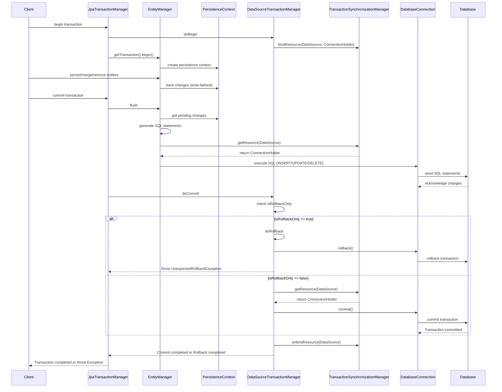

# 트랜잭션 전파

## REQUIRED

## REQUIRES_NEW 

# JpaTransactionManager 

## JpaTransactionManager 동작 과정

```mermaid
sequenceDiagram
    participant C as Client
    participant JTM as JpaTransactionManager
    participant EM as EntityManager
    participant PC as PersistenceContext
    participant DSTM as DataSourceTransactionManager
    participant TSM as TransactionSynchronizationManager
    participant Conn as DatabaseConnection
    participant DB as Database

    C->>JTM: begin transaction
    JTM->>DSTM: doBegin
    DSTM->>TSM: bindResource(DataSource, ConnectionHolder)
    JTM->>EM: getTransaction().begin()
    EM->>PC: create persistence context
    C->>EM: persist/merge/remove entities
    EM->>PC: track changes (write-behind)
    C->>JTM: commit transaction
    JTM->>EM: flush
    EM->>PC: get pending changes
    EM->>EM: generate SQL statements
    EM->>TSM: getResource(DataSource)
    TSM-->>EM: return ConnectionHolder
    EM->>Conn: execute SQL (INSERT/UPDATE/DELETE)
    Conn->>DB: send SQL statements
    DB-->>Conn: Acknowledge changes
    JTM->>DSTM: doCommit
    DSTM->>DSTM: check isRollbackOnly
    alt isRollbackOnly == true
        DSTM->>DSTM: doRollback
        DSTM->>Conn: rollback()
        Conn->>DB: rollback transaction
        DSTM-->>JTM: throw UnexpectedRollbackException
    else isRollbackOnly == false
        DSTM->>TSM: getResource(DataSource)
        TSM-->>DSTM: return ConnectionHolder
        DSTM->>Conn: commit()
        Conn->>DB: commit transaction
        DB-->>Conn: Transaction committed
    end
    DSTM->>TSM: unbindResource(DataSource)
    DSTM-->>JTM: Commit completed or Rollback completed
    JTM-->>C: Transaction completed or throw Exception
```
