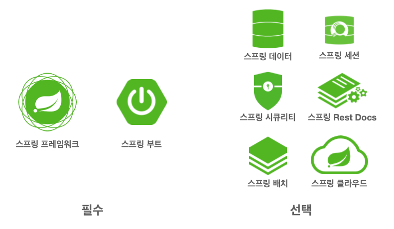
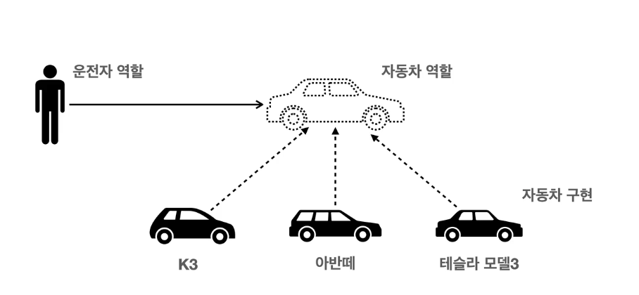
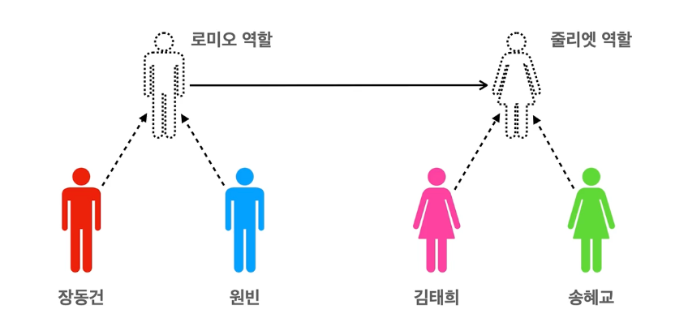
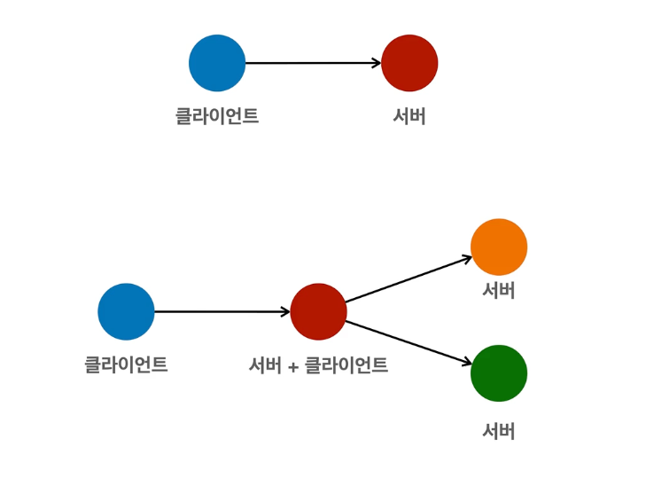
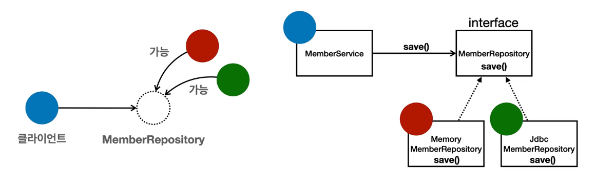

<!-- TOC -->
* [이야기 - 자바 진영의 추운 겨울과 스프링의 탄생](#이야기---자바-진영의-추운-겨울과-스프링의-탄생)
  * [EJB](#ejb)
    * [EJB 지옥](#ejb-지옥)
    * [스프링의 탄생](#스프링의-탄생)
  * [스프링 역사](#스프링-역사)
    * [로드 존슨의 책](#로드-존슨의-책)
  * [릴리즈](#릴리즈)
* [스프링이란?](#스프링이란)
  * [스프링 생태계](#스프링-생태계)
  * [스프링 프레임워크](#스프링-프레임워크)
  * [스프링 부트](#스프링-부트)
    * [스프링 부트는 단독으로 사용 불가능.](#스프링-부트는-단독으로-사용-불가능)
  * [문맥에 따라 달라지는 단어 '스프링'](#문맥에-따라-달라지는-단어-스프링)
  * [스프링 프레임워크를 왜 만들었는가? (핵심 컨셉) ⭐️](#스프링-프레임워크를-왜-만들었는가-핵심-컨셉-)
    * [핵심 컨셉에 대해 이해하고 사용하라](#핵심-컨셉에-대해-이해하고-사용하라)
    * [스프링의 핵심 개념, 컨셉?](#스프링의-핵심-개념-컨셉)
    * [스프링의 진짜 핵심: 객체 지향 애플리케이션 개발](#스프링의-진짜-핵심-객체-지향-애플리케이션-개발-)
* [좋은 객체 지향 프로그래밍이란?](#좋은-객체-지향-프로그래밍이란)
  * [객체지향](#객체지향)
    * [객체지향 특징](#객체지향-특징)
    * [객체지향 프로그래밍?](#객체지향-프로그래밍)
    * [유연하고, 변경이 용이?](#유연하고-변경이-용이)
  * [객체지향의 핵심 - 다형성](#객체지향의-핵심---다형성)
    * [다형성의 실세계 비유](#다형성의-실세계-비유-)
    * [운전자-자동차 예시](#운전자-자동차-예시)
    * [로미오와 줄리엣 공연 예시](#로미오와-줄리엣-공연-예시)
  * [역할과 구현을 분리](#역할과-구현을-분리)
    * [Java의 역할, 구현 분리](#java의-역할-구현-분리)
    * [객체의 협력이라는 관계부터 생각하라](#객체의-협력이라는-관계부터-생각하라)
    * [클라이언트는 상대적인 개념](#클라이언트는-상대적인-개념)
    * [Java 언어의 다형성(오버라이딩)](#java-언어의-다형성오버라이딩)
    * [다형성의 본질](#다형성의-본질)
    * [역할과 구현 분리의 한계](#역할과-구현-분리의-한계)
  * [스프링과 객체 지향](#스프링과-객체-지향)
* [좋은 객체 지향 설계의 5가지 원칙(SOLID)](#좋은-객체-지향-설계의-5가지-원칙solid)
* [객체 지향 설계와 스프링](#객체-지향-설계와-스프링)
<!-- TOC -->

# 이야기 - 자바 진영의 추운 겨울과 스프링의 탄생

## EJB

- 2000년대 초반에 EJB(Enterprise Java Beans)를 이용해서 개발을 많이 했음.
  - 트랜잭션 활용 등 고급 기술이 지원이 잘 되었음.
  - Entity Bean이라는 ORM도 있었음.
- 문제는 비쌌음. 수천만원 서버가 필요.

### EJB 지옥

- 이론은 좋은데, 복잡하고 어렵고, 느렸음.
- EJB 의존적인 개발, 코드 더러워지고, ... 
- EJB 컨테이너 띄우는 것도 오래 걸리고...

### 스프링의 탄생

- Rod Johnson을 필드로 스프링을 개발함.
- 개빈 킹은 JPA(Hibernate) 개발.
- 실무 개발자들이 필요한 걸로 만들다 보니, 사람들한테 잘 먹혔음.

## 스프링 역사

### 로드 존슨의 책

- 2002년에 로드 존슨 책 출간
- 책에 스프링 핵심 개념과 기반 코드가 다 들어있음.
  - BeanFactory, ApplicationContext, POJO, 제어의 역전, 의존 관계 주입 등
- 책이 유명해지고, 개발자들이 책의 예제 코드를 프로젝트에 적용(스프링 프레임워크 나오기 전에 스프링의 개념을 가져다쓴...)

---

- 책 출간 직후 유겐 휠러(Juergen Hoeller), 얀 카로프가 로드 존슨에게 오픈소스 프로젝트 제안
  - 스프링 핵심 코드 까보면 유겐 휠러가 쓴게 많음.
  - 스프링 이름은 전통적인 J2EE(EJB)라는 겨울을 넘어 새로운 시작이라는 뜻으로 이름 지음.

## 릴리즈

- 2014년 스프링 부트 1.0 출시
- 2017년 스프링 프레임워크 5.0 / 부트 2.0 출시 - 리액티브 프로그래밍 지원
  - 리액티브 프로그래밍: Java에서도 비동기, 논블로킹 기술을 사용해서 개발할 수 있음.
- 2020.9 현재 스프링 프레임워크 5.2.x, 스프링 부트 2.3.x

# 스프링이란?

## 스프링 생태계

(_https://spring.io/projects_)

- 스프링은 여러가지 기술들의 모음
  - 핵심은 스프링 프레임워크
  - 편리하게 사용하도록 돕는 것은 스프링 부트

## 스프링 프레임워크

- 핵심 기술: 스프링 DI 컨테이너, AOP, 이벤트, 기타
- 웹 기술: 스프링 MVC, 스프링 WebFlux
- 데이터 접근 기술: 트랜잭션, JDBC, ORM 지원, XML 지원
- 기술 통합: 캐시, 이메일, 원격접근, 스케줄링
- 테스트: 스프링 기반 테스트 지원
- 언어: 코틀린, 그루비
- 최근에는 스프링 부트를 통해서 스프링 프레임워크의 기술들을 편리하게 사용

## 스프링 부트

- **스프링을 편리하게 사용할 수 있도록 지원, 최근에는 기본으로 사용.**
  - 단독으로 실행할 수 있는 스프링 애플리케이션을 쉽게 생성.
    - Tomcat 같은 웹 서버를 내장해서 별도의 웹 서버를 설치하지 않아도 됨. 
      - 예전에는 프로젝트 빌드와 톰캣을 별도로 설치하는 등 불편한 점이 많았음.
- **손쉬운 빌드 구성을 위한 starter 종속성 제공**
  - 의존성 하나만 땡기면 나머지 라이브러리도 편하게 땡겨짐. 
- **스프링과 3rd party(외부) 라이브러리 자동 구성**
  - 메이저 라이브러리들은 스프링 프레임워크와 궁합이 잘 맞는지 알아서 구성.
- **메트릭, 상태 확인, 외부 구성 같은 프로덕션 준비 기능 제공** 
  - 운영 환경에서 모니터링이 중요한데, 이런 것들을 스프링 부트가 어느정도 기본적으로 제공.
- **관례에 의한 간결한 설정**
  - 관례로 사용하는 것들이 많고, 필요한 것만 커스텀 하게 설정.

### 스프링 부트는 단독으로 사용 불가능.

- 스프링 없이 단독으로 스프링 부트를 쓸 수 있는 것은 아님.

 

## 문맥에 따라 달라지는 단어 '스프링'

- 스프링이라는 단어는 문맥에 따라 다르게 사용.
  - 스프링 DI 컨테이너 기술
  - 스프링 프레임워크
  - 스프링 부트, 스프링 프레임워크를 모두 포함한 생태계

 

## 스프링 프레임워크를 왜 만들었는가? (핵심 컨셉) ⭐️

> 핵심 개념: 이 기술은 왜 만들었는가?, 이 기술의 핵심 컨셉은?

### 핵심 컨셉에 대해 이해하고 사용하라

- **이 기술을 왜 만들었는지,** 핵심 컨셉에 대해 이해하고 사용하지 않는다면, 그냥 API 사용법만 배우게 되는 것.
- **_핵심 컨셉을 이해하고 사용해야 내 것이 된다._**

### 스프링의 핵심 개념, 컨셉?

- 웹 애플리케이션 만들고, DB 접근 편리하게 해주는 기술인가?
- 단순 전자정부 프레임워크?
- 웹 서버도 자동으로 띄워주고?

👉 이런 것들은 스프링의 결과물일 뿐임.

### 스프링의 진짜 핵심: 객체 지향 애플리케이션 개발 

- 스프링은 Java 기반의 프레임워크이고, 자바 언어의 가장 큰 특징은 **객체 지향 언어**임.
  - 즉, 스프링은 객체 지향 언어가 가진 강력한 특징을 살려내는 프레임워크임.
  - 스프링은 **좋은 객체 지향** 애플리케이션을 개발할 수 있게 도와주는 프레임워크.

---

- 예전에 EJB를 사용할 때, 굉장히 지저분하게 EJB에 의존적으로 개발을 해야했음.
  - 👉 객체 지향적인 개발이 아닌, EJB에 종속되어 EJB 스타일로 개발할 수 밖에 없었음.
  - 그래서 순수한 자바로 돌아가자는 POJO라는 단어도 나온 것.

> 자 그럼, 대체 좋은 객체지향적인 프로그래밍은 무엇을 말하는 걸까?

# 좋은 객체 지향 프로그래밍이란?

## 객체지향

### 객체지향 특징

- 캡슐화
- 상속
- 추상화
- 다형성

### 객체지향 프로그래밍?

- 객체 지향 프로그래밍은 컴퓨터 프로그램을 명령어의 목록으로 보는 시각에서 벗어나 여러 개의 독립된 단위로 보는 것
  - 즉 '객체'들의 모임으로 파악하고자 하는 것임.
  - 각각의 객체는 메시지를 주고 받고, 데이터를 처리할 수 있다.(`협력`)
- 객체지향 프로그래밍은 프로그램을 유연하고 변경이 용이하게 만들기 때문에 대규모 소프트웨어 개발에 많이 사용된다.

### 유연하고, 변경이 용이?

- 레고 블럭 조립하듯이
- 키보드, 마우스 갈아 끼우듯이
- 컴포넌트를 쉽고 유연하게 변경하면서 개발하는 방법

 

## 객체지향의 핵심 - 다형성

- 궁극의 유연함과 궁극의 변경이 용이한 방법

### 다형성의 실세계 비유 

- 역할과 구현으로 세상을 구분

### 운전자-자동차 예시

- 자동차란 역할에 대한 구현만 바뀌었을 뿐.
  - **자동차가 바뀌어도 운전자한테 영향을 주지 않는다.** 👈 핵심
- 운전자는 자동차 인터페이스에 대해서만 의존을 함.
- **_자동차 역할을 나누고 구현을 분리한 것은 누구 좋으라고 한 걸까?_**
  - 클라이언트 객체인 '운전자'를 위해서.
  - 클라이언트는 자동차 내부 구현을 몰라도 된다.
  - 자동차가 새로 추가되어도 클라이언트는 변경 X (자동차의 세상을 무한히 확장)

### 로미오와 줄리엣 공연 예시

- 로미오와 줄리엣의 역할과 구현을 분리했다.
  - 누가 오더라도 그 역할을 수행가능하고, 클라이언트는 변경사항이 없다.
- 역할과 구현을 분리함으로써 변경 가능한 **대체 가능성**이 생긴다.
  - 👉 유연하고 변경이 용이하다는 것이 바로 이 의미이다.

 

## 역할과 구현을 분리

- 역할과 구현으로 구분하면 세상이 단순해지고, 유연해지며 변경도 편리해짐.
- 장점
  - 클라이언트는 대상으 역할(인터페이스)만 알면 됨.
  - 클라이언트는 구현 대상의 내부 구조를 몰라도되고, 내부 구조가 변경되더라도 영향을 받지 않음.
  - 클라이언트는 구현 대상 자체를 변경해도 영향을 받지 않음.

### Java의 역할, 구현 분리

> 구현보다 인터페이스가 먼저다. 역할을 먼저 생각해라.

- 자바 언어의 다형성을 활용
  - 역할 = 인터페이스
  - 구현 = 인터페이스를 구현한 클래스, 구현 객체
- 객체를 설계할 때 역할과 구현을 명확히 분리한다.
- 객체 설계시 역할(인터페이스)을 먼저 부여하고, 그 역할을 수행하는 구현 객체 만들기. 

### 객체의 협력이라는 관계부터 생각하라

- 혼자 있는 객체는 없다.
- 수 많은 객체 클라이언트와 객체 서버는 서로 협력 관계를 가짐.
  - 클라이언트: 요청
  - 서버: 응답

### 클라이언트는 상대적인 개념

- 객체가 요청하느냐, 응답하느냐에 따라 클라이언트가 될 수도, 서버가 될 수도 있다.

 

### Java 언어의 다형성(오버라이딩)

- 오버라이딩 할 경우, 오버라이딩된 메서드가 실행된다.
- 다형성으로 인터페이스를 구현한 객체를 실행 시점에 유연하게 변경 가능.

 

### 다형성의 본질

- **클라이언트를 변경하지 않고, 서버의 구현 기능을 유연하게 변경 가능하다.**(=확장 가능한 설계)
  - 인터페이스를 구현한 객체 인스턴스를 실행 시점에 유연하게 변경할 수 있다.
  - 다형성의 본질을 이해하려면 협력이라는 객체사이의 관계에서 시작해야함.
- **인터페이스를 안정적으로 잘 설계하는 것이 매우 중요함.**

### 역할과 구현 분리의 한계

- 역할 자체가 변하면, 클라이언트, 서버 모두에 큰 변경 발생.
  - 자동차를 비행기로 변경해야한다면?
  - 대본 자체가 변경된다면?
- 애플리케이션 레벨로 보자면,
  - 웹/앱 to 서버 통신이나, **서버 to 서버 통신에서도 API를 잘 설계하는 것이 정말 중요함.**

 

## 스프링과 객체 지향

- 다형성이 가장 중요함.
  - 👉 스프링은 다형성을 극대화해서 이용할 수 있게 도와준다.
  - 스프링은 다형성을 잘 지원해주는 프레임워크라고 봐도 무방.
- 스프링에서 이야기 하는 제어의 역전(Inversion of Control), 의존관계 주입(DI)은 다형성을 활용해서 역할과 구현을 편리하게 다룰 수 있도록 지원한다.
- 스프링을 사용하면 마치 레고 블럭 조립하듯이, 공연 무대의 배우를 선택하듯이, **구현을 편리하게 변경 가능하다.**

 

# 좋은 객체 지향 설계의 5가지 원칙(SOLID)

> 스프링과 객체 지향 설계에 대해서 제대로 이해하려면 다형성 이외에 한 가지를 더 알아야하는데, 그게 바로 `SOLID`

- SRP
- OCP
- LSP
- ISP
- DIP

## SRP

## OCP

## LSP

## DIP

# 객체 지향 설계와 스프링