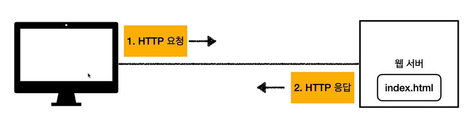
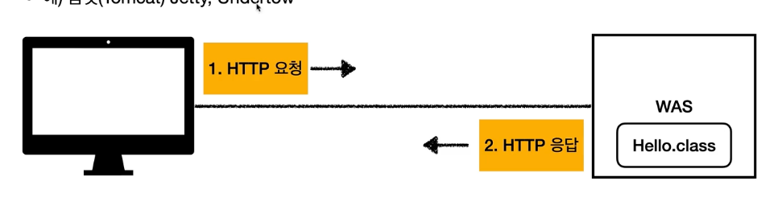

<!-- TOC -->
* [1.1 웹 서버, 웹 애플리케이션 서버](#11-웹-서버-웹-애플리케이션-서버)
  * [웹 서버(Web Server)](#웹-서버web-server)
  * [웹 애플리케이션 서버(WAS - Web Application Server)](#웹-애플리케이션-서버was---web-application-server)
* [1.2 서블릿](#12-서블릿)
* [1.3 동시 요청 - 멀티 쓰레드](#13-동시-요청---멀티-쓰레드)
* [1.4 HTML, HTTP API, CSR, SSR](#14-html-http-api-csr-ssr)
* [1.5 자바 백엔드 웹 기술 역사](#15-자바-백엔드-웹-기술-역사)
<!-- TOC -->

# 1.1 웹 서버, 웹 애플리케이션 서버

## 웹 서버(Web Server)

- HTTP 기반으로 동작
- 정적 리소스(html, css, js ..) 제공. 
- 예) Nginx, Apache

 

## 웹 애플리케이션 서버(WAS - Web Application Server)

- HTTP 기반으로 동작
- 웹 서버 기능(정적 리소스 제공)을 포함한다.
- 프로그램 코드를 실행해서 애플리케이션 로직을 수행 👉 프로그래밍이 가능하다.
  - 동적 HTML, HTTP API(JSON)
  - 서블릿, JSP, 스프링 MVC
- 예) 톰캣(Tomcat) Jetty, Undertow

## 웹 서버와 WAS의 차이?

# 1.2 서블릿

# 1.3 동시 요청 - 멀티 쓰레드

# 1.4 HTML, HTTP API, CSR, SSR

# 1.5 자바 백엔드 웹 기술 역사