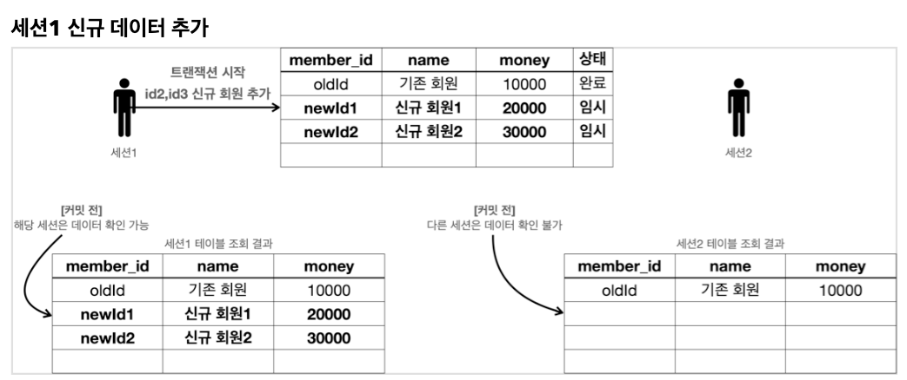
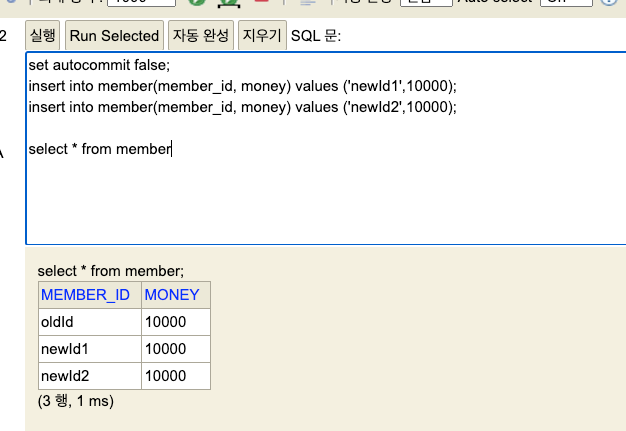
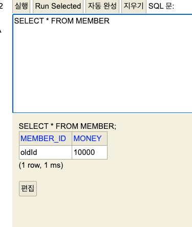
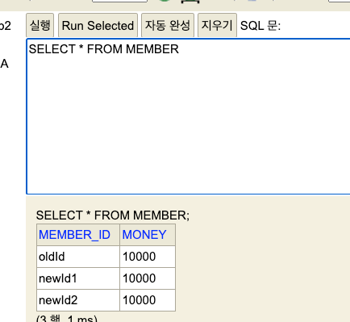

<!-- TOC -->
* [트랜잭션](#트랜잭션-)
  * [트랜잭션 - 자동 커밋, 수동 커밋](#트랜잭션---자동-커밋-수동-커밋)
    * [자동 커밋](#자동-커밋)
    * [수동 커밋](#수동-커밋)
  * [트랜잭션 - 트랜잭션 실습](#트랜잭션---트랜잭션-실습)
  * [트랜잭션 - 계좌 이체](#트랜잭션---계좌-이체)
* [DB 락](#db-락)
  * [DB 락 - 개념 이해](#db-락---개념-이해)
  * [DB 락 - 변경](#db-락---변경)
  * [DB 락 - 조회](#db-락---조회)
* [트랜잭션 적용](#트랜잭션-적용)
<!-- TOC -->

# 트랜잭션 

## 트랜잭션 - 자동 커밋, 수동 커밋

- 자동/수동 커밋 모드는 한 번 설정하면 해당 세션에서는 계속 유지됨. 중간에 변경은 가능

### 자동 커밋

```sql
set autocommit true; //자동 커밋 모드 설정
insert into member(member_id, money) values ('data1',10000); //자동 커밋 
insert into member(member_id, money) values ('data2',10000); //자동 커밋
```

- 쿼리 하나 하나 실행할 때마다 자동으로 커밋 되기 때문에 원하는 대로 트랜잭션 수행하기 어려움.

### 수동 커밋

```sql
set autocommit false; //수동 커밋 모드 설정

insert into member(member_id, money) values ('data3',10000);
insert into member(member_id, money) values ('data4',10000);

commit; //수동 커밋
```

- **수동 커밋 모드로 설정하는 것을 트랜잭션을 시작한다**고 표현한다.
- 수동 커밋 설정 이후에는 꼭 `commit` 또는 `rollback` 을 해야한다.
  - 커밋이나 롤백을 안 하면 timeout으로 인해 자동으로 롤백이 일어난다. 

## 트랜잭션 - 트랜잭션 실습

 


세션 1에서 신규 데이터를 수동 커밋으로 추가하고, 조회한다.

```sql
set autocommit false; 
insert into member(member_id, money) values ('newId1',10000); 
insert into member(member_id, money) values ('newId2',10000);

select * from member;
```




이 때 세션 2에서 조회하면, 트랜잭션 `commit` 전이므로 조회 안 된다.




세션 1에서 commit 하고 다시 조회하면 정상적으로 보인다.



([H2 Database의 기본 트랜잭션 격리 수준은 `Read Committed`](https://www.h2database.com/html/advanced.html#transaction_isolation))

## 트랜잭션 - 계좌 이체

# DB 락

## DB 락 - 개념 이해

## DB 락 - 변경

## DB 락 - 조회

# 트랜잭션 적용

