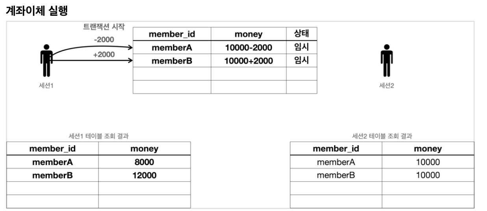
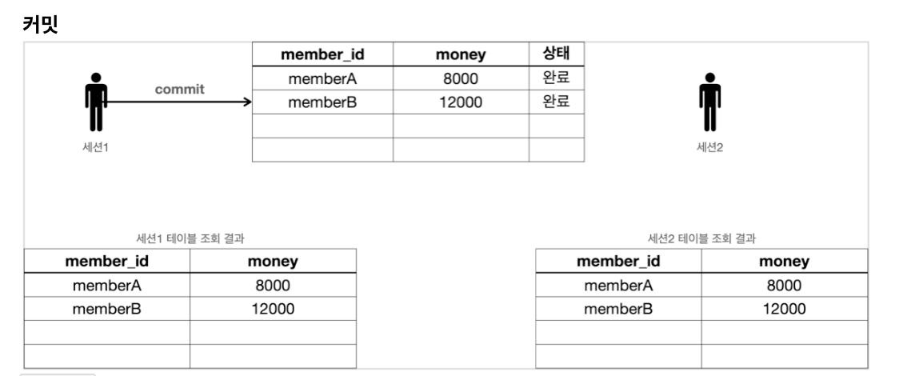
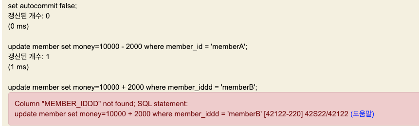
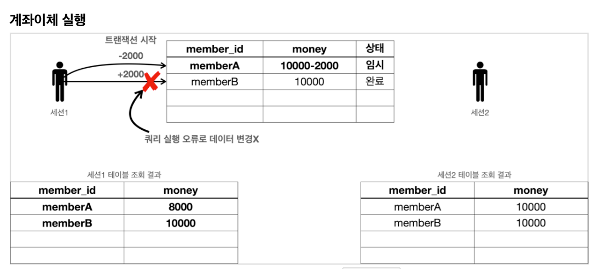
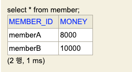
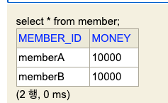
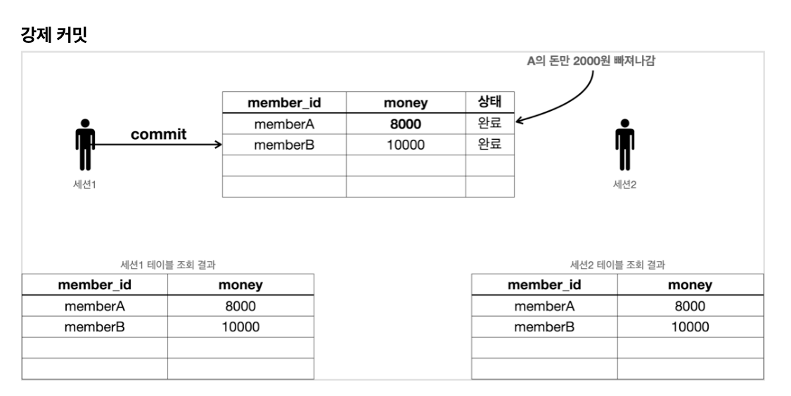
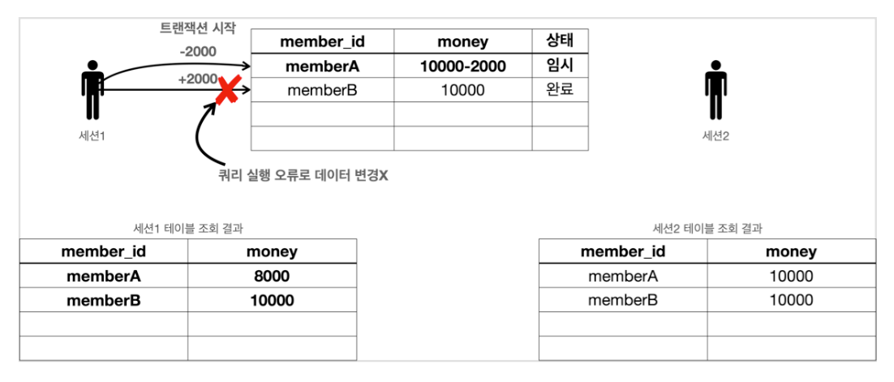
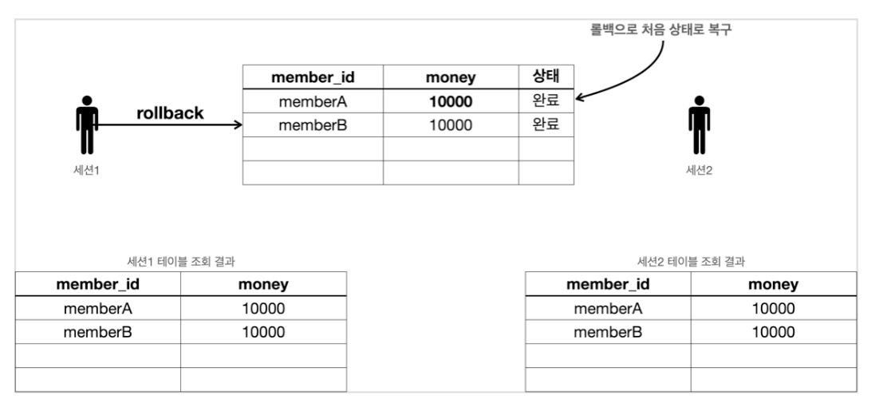

<!-- TOC -->
* [트랜잭션](#트랜잭션-)
  * [트랜잭션 개념 이해](#트랜잭션-개념-이해)
  * [데이터베이스 연결 구조와 DB 세션](#데이터베이스-연결-구조와-db-세션)
* [트랜잭션 DB 예제](#트랜잭션-db-예제)
  * [트랜잭션 - 자동 커밋, 수동 커밋](#트랜잭션---자동-커밋-수동-커밋)
    * [자동 커밋](#자동-커밋)
    * [수동 커밋](#수동-커밋)
  * [트랜잭션 - 트랜잭션 실습](#트랜잭션---트랜잭션-실습)
  * [트랜잭션 - 계좌 이체](#트랜잭션---계좌-이체)
    * [계좌이체 정상](#계좌이체-정상)
    * [계좌이체 문제 상황 - 커밋](#계좌이체-문제-상황---커밋)
    * [계좌이체 문제 상황 - 롤백](#계좌이체-문제-상황---롤백)
    * [정리 (원자성, 오토 커밋, 트랜잭션 시작)](#정리-원자성-오토-커밋-트랜잭션-시작)
* [DB 락](#db-락)
  * [DB 락 - 개념 이해](#db-락---개념-이해)
  * [DB 락 - 변경](#db-락---변경)
  * [DB 락 - 조회](#db-락---조회)
* [트랜잭션 적용](#트랜잭션-적용)
<!-- TOC -->


# 트랜잭션 

## 트랜잭션 개념 이해

## 데이터베이스 연결 구조와 DB 세션

# 트랜잭션 DB 예제

## 트랜잭션 - 자동 커밋, 수동 커밋

- 자동/수동 커밋 모드는 한 번 설정하면 해당 세션에서는 계속 유지됨. 중간에 변경은 가능

### 자동 커밋

```sql
set autocommit true; //자동 커밋 모드 설정
insert into member(member_id, money) values ('data1',10000); //자동 커밋 
insert into member(member_id, money) values ('data2',10000); //자동 커밋
```

- 쿼리 하나 하나 실행할 때마다 자동으로 커밋 되기 때문에 원하는 대로 트랜잭션 수행하기 어려움.

### 수동 커밋

```sql
set autocommit false; //수동 커밋 모드 설정

insert into member(member_id, money) values ('data3',10000);
insert into member(member_id, money) values ('data4',10000);

commit; //수동 커밋
```

- **수동 커밋 모드로 설정하는 것을 트랜잭션을 시작한다**고 표현한다.
- 수동 커밋 설정 이후에는 꼭 `commit` 또는 `rollback` 을 해야한다.
  - 커밋이나 롤백을 안 하면 timeout으로 인해 자동으로 롤백이 일어난다. 

## 트랜잭션 - 트랜잭션 실습

 


세션 1에서 신규 데이터를 수동 커밋으로 추가하고, 조회한다.

```sql
set autocommit false; 
insert into member(member_id, money) values ('newId1',10000); 
insert into member(member_id, money) values ('newId2',10000);

select * from member;
```


이 때 세션 2에서 조회하면, 트랜잭션 `commit` 전이므로 조회 안 된다.


세션 1에서 commit 하고 다시 조회하면 정상적으로 보인다.


([H2 Database의 기본 트랜잭션 격리 수준은 `Read Committed`](https://www.h2database.com/html/advanced.html#transaction_isolation))

## 트랜잭션 - 계좌 이체



### 계좌이체 정상

1. 초기화 SQL

```sql
set autocommit true;
delete from member;
insert into member(member_id, money) values ('memberA',10000);
insert into member(member_id, money) values ('memberB',10000);
```

2. 계좌이체 실행 SQL - 성공

```sql
# 세션 1에서 수행
set autocommit false;
update member set money=10000 - 2000 where member_id = 'memberA';
update member set money=10000 + 2000 where member_id = 'memberB';
```

- 이 시점에서 세션 1에서는 money는 각각 8000/12000으로 보이고,
  - 세션 2에서는 money는 각각 10000/10000으로 보인다.
    - 👉 트랜잭션 격리 레벨이 `Read Committed`라서, `Dirty Read`가 방지된다.

3. `commit`

```sql
commit; # 세션 1에서 수행
```



- 세션 2에서도 정상적으로 금액이 노출되는 것을 확인. 

<br>

### 계좌이체 문제 상황 - 커밋

1. 문제가 발생하는 SQL

```h2
// 초기화 SQL
set autocommit true;
delete from member;
insert into member(member_id, money) values ('memberA',10000);
insert into member(member_id, money) values ('memberB',10000);
  
// 문제 발생 SQL. 세션 1에서 실행
set autocommit false;
update member set money=10000 - 2000 where member_id = 'memberA'; // 성공 
update member set money=10000 + 2000 where member_iddd = 'memberB'; // 쿼리 예외 발생
```

- 초기화하고, 위 SQL을 세션 1에서 실행하면 다음과 같은 에러가 발생한다.



_(`MEMBER_IDDD` 라는 컬럼을 못 찾았다는 에러.)_





- 이 상황에서 세션 1에서 조회한 경우 memberA의 money는 -2000.



- 세션 2에서 조회한 경우는 커밋 전이므로 당연히 그대로이다.

2. `commit`



- 이 상태로 커밋하게 되면 세션 1, 2 모두 memberA의 잔액이 -2000 인 상태로 조회된다.
- **A의 돈만 빠져나간 아주 심각한 상태이다.**

<br>

### 계좌이체 문제 상황 - 롤백

1. 문제의 SQL 실행

```h2
// 초기화
set autocommit true;
delete from member;
insert into member(member_id, money) values ('memberA',10000);
insert into member(member_id, money) values ('memberB',10000);


set autocommit false;
update member set money=10000 - 2000 where member_id = 'memberA'; //성공 
update member set money=10000 + 2000 where member_iddd = 'memberB'; //쿼리 예외 발생
```



- 두 번째 update 문에서 에러가 난 상황에서, 이번엔 롤백을 해보자.

2. `rollback`

```h2
rollback;
```



- 롤백을 사용했으므로 계좌이체 실행 전 상태로 되돌아왔다.

### 정리 (원자성, 오토 커밋, 트랜잭션 시작)

- 원자성
  - 트랜잭션 내에서 실행된 작업은 하나의 작업처럼 모두 성공하거나 모두 실패해야함.
  - 원자성 덕분에 여러 SQL을 하나의 작업인 것처럼 처리 가능해진다.
    - 성공하면 한 번에 반영, 중간에 실패하면 하나의 작업처럼 되돌림.
- 오토 커밋
  - 오토 커밋을 쓰는데, 중간에 계좌 이체가 실패하면 심각한 문제가 발생함.
- 트랜잭션 시작
  - 위 같은 작업은 반드시 수동 커밋을 써야하며, 자동 커밋에서 수동 커밋 모드로 전환하는 것을 **트랜잭션을 시작한다고 표현한다.**


# DB 락

## DB 락 - 개념 이해

## DB 락 - 변경

## DB 락 - 조회

# 트랜잭션 적용

