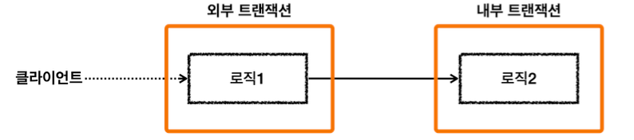
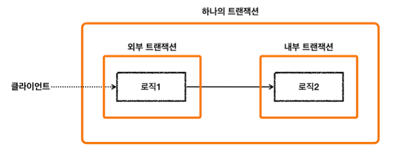
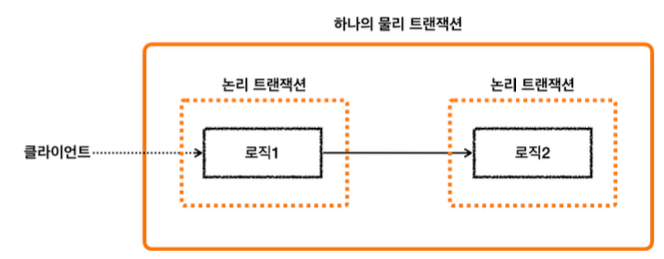

<!-- TOC -->
* [스프링 트랜잭션 전파 3 - 전파 기본](#스프링-트랜잭션-전파-3---전파-기본)
  * [트랜잭션 전파가 뭔데?](#트랜잭션-전파가-뭔데)
  * [트랜잭션 전파의 기본 옵션인 REQUIRED](#트랜잭션-전파의-기본-옵션인-required)
    * [외부 트랜잭션이 수행 중인데, 내부 트랜잭션이 추가로 수행되는 경우](#외부-트랜잭션이-수행-중인데-내부-트랜잭션이-추가로-수행되는-경우)
    * [스프링은 트랜잭션을 통합한다](#스프링은-트랜잭션을-통합한다)
  * [물리 트랜잭션과 논리 트랜잭션](#물리-트랜잭션과-논리-트랜잭션)
    * [물리 트랜잭션](#물리-트랜잭션)
    * [논리 트랜잭션](#논리-트랜잭션)
  * [논리 트랜잭션 대원칙 ⭐️⭐️⭐️](#논리-트랜잭션-대원칙-)
<!-- TOC -->

 

# 스프링 트랜잭션 전파 3 - 전파 기본

## 트랜잭션 전파가 뭔데?

- 트랜잭션을 각각 사용하는 것이 아니라, 트랜잭션이 이미 진행중인데, 여기에 추가로 트랜잭션을 수행하면 트랜잭션이 어떻게 되어야하지?? 
- 기존 트랜잭션과 별개의 트랜잭션을 시작할까? 
  - 아니면, 기존 트랜잭션을 그대로 이어받아서 같은 트랜잭션으로 진행할까? 
- 이럴 경우 어떻게 트랜잭션이 동작할지 결정하는 것이 바로 `트랜잭션 전파(propagation)`라고한다.
  - 스프링에서는 다양한 트랜잭션 전파 옵션(기존 거에 참여할 지, 새로 시작할 지 등..)을 제공함.

---
 

## 트랜잭션 전파의 기본 옵션인 REQUIRED

### 외부 트랜잭션이 수행 중인데, 내부 트랜잭션이 추가로 수행되는 경우

- 외부 트랜잭션이 시작했는데, 아직  안 끝난 상태에서 내부 트랜잭션이 추가된다.
  - 이 경우 스프링은 어떻게 해줄까?

### 스프링은 트랜잭션을 통합한다

- 외부 트랜잭션이 끝나지 않았는데, 내부 트랜잭션이 추가되는 경우 스프링은 외부/내부 트랜잭션을 묶어서 하나의 트랜잭션을 만든다.
- 즉, **내부 트랜잭션이 외부 트랜잭션에 참여한다.** (REQUIRED 옵션 기준)

---
 

## 물리 트랜잭션과 논리 트랜잭션

- 스프링은 이해를 돕기 위해 물리 트랜잭션과 논리 트랜잭션 개념이 존재

### 물리 트랜잭션
  
- **= 실제 데이터베이스에 적용되는 트랜잭션.**
- 실제 커넥션을 통해서 트랜잭션을 시작(=`setAutoCommit(false)`)하고, 실제 커넥션을 통해서 커밋, 롤백하는 단위를 의미한다.

### 논리 트랜잭션

- **= 트랜잭션 매니저를 통해 트랜잭션을 사용하는 단위.**
- 논리 트랜잭션 개념은 외부 트랜잭션이 진행되는 도중 내부에 추가적으로 트랜잭션이 사용되는 경우에만 나타난다.
  - (트랜잭션이 하나인 경우, 물리 트랜잭션 == 논리 트랜잭션이므로 물리/논리 개념을 나눌 필요가 없음.)
- 더 정확히는 `REQUIRED` 전파 옵션을 사용하는 경우에 논리 트랜잭션 개념이 나타난다. (자세한 내용은 추후 설명)

---
 

## 논리 트랜잭션 대원칙 ⭐️⭐️⭐️

> - **모든 논리 트랜잭션이 커밋되어야 물리 트랜잭션이 커밋된다.** 
> - **하나의 논리 트랜잭션이라도 롤백되면 물리 트랜잭션은 롤백된다.**

- 즉, 트랜잭션 매니저의 모든 트랜잭션의 커밋되어야 물리 트랜잭션이 커밋된다.
- 하나의 트랜잭션 매니저라도 롤백하면 물리 트랜잭션은 롤백된다.

