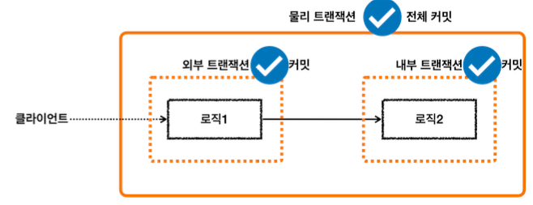
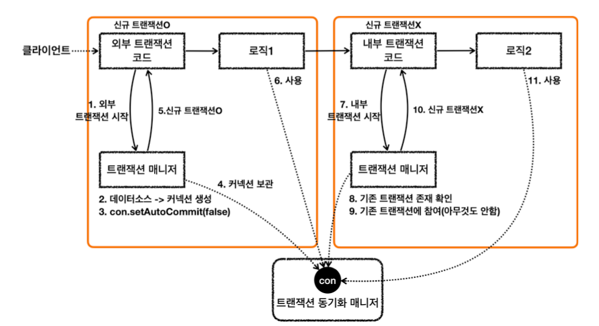
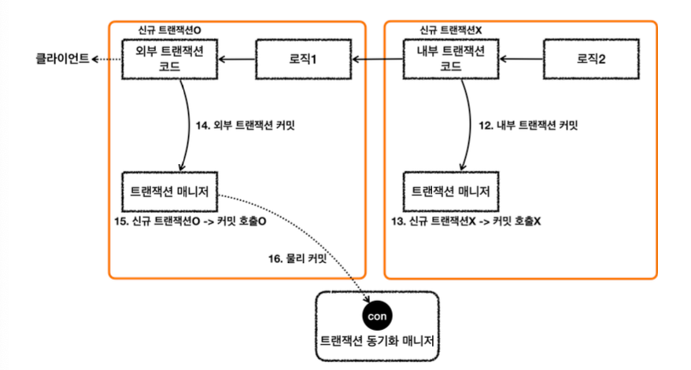

<!-- TOC -->
* [스프링 트랜잭션 전파 3 - 전파 기본](#스프링-트랜잭션-전파-3---전파-기본)
  * [트랜잭션 전파가 뭔데?](#트랜잭션-전파가-뭔데)
  * [트랜잭션 전파의 기본 옵션인 REQUIRED](#트랜잭션-전파의-기본-옵션인-required)
    * [외부 트랜잭션이 수행 중인데, 내부 트랜잭션이 추가로 수행되는 경우](#외부-트랜잭션이-수행-중인데-내부-트랜잭션이-추가로-수행되는-경우)
    * [스프링은 트랜잭션을 통합한다](#스프링은-트랜잭션을-통합한다)
  * [물리 트랜잭션과 논리 트랜잭션](#물리-트랜잭션과-논리-트랜잭션)
    * [물리 트랜잭션](#물리-트랜잭션)
    * [논리 트랜잭션](#논리-트랜잭션)
  * [논리 트랜잭션 대원칙 ⭐️⭐️⭐️](#논리-트랜잭션-대원칙-)
* [스프링 트랜잭션 전파4 - 전파 예제](#스프링-트랜잭션-전파4---전파-예제)
  * [외부, 내부 둘 다 커밋하는 경우](#외부-내부-둘-다-커밋하는-경우)
    * [외부 트랜잭션만 물리 트랜잭션을 시작하고 커밋한다](#외부-트랜잭션만-물리-트랜잭션을-시작하고-커밋한다)
    * [그림을 통해 실제 트랜잭션 동작 자세히 이해하기](#그림을-통해-실제-트랜잭션-동작-자세히-이해하기)
<!-- TOC -->

<br>

# 스프링 트랜잭션 전파 3 - 전파 기본

## 트랜잭션 전파가 뭔데?

- 트랜잭션을 각각 사용하는 것이 아니라, 트랜잭션이 이미 진행중인데, 여기에 추가로 트랜잭션을 수행하면 트랜잭션이 어떻게 되어야하지?? 
- 기존 트랜잭션과 별개의 트랜잭션을 시작할까? 
  - 아니면, 기존 트랜잭션을 그대로 이어받아서 같은 트랜잭션으로 진행할까? 
- 이럴 경우 어떻게 트랜잭션이 동작할지 결정하는 것이 바로 `트랜잭션 전파(propagation)`라고한다.
  - 스프링에서는 다양한 트랜잭션 전파 옵션(기존 거에 참여할 지, 새로 시작할 지 등..)을 제공함.

---
<br>

## 트랜잭션 전파의 기본 옵션인 REQUIRED

### 외부 트랜잭션이 수행 중인데, 내부 트랜잭션이 추가로 수행되는 경우


- 외부 트랜잭션이 시작했는데, 아직  안 끝난 상태에서 내부 트랜잭션이 추가된다.
  - 이 경우 스프링은 어떻게 해줄까?

### 스프링은 트랜잭션을 통합한다


- 외부 트랜잭션이 끝나지 않았는데, 내부 트랜잭션이 추가되는 경우 스프링은 외부/내부 트랜잭션을 묶어서 하나의 트랜잭션을 만든다.
- 즉, **내부 트랜잭션이 외부 트랜잭션에 참여한다.** (REQUIRED 옵션 기준)

---
<br>

## 물리 트랜잭션과 논리 트랜잭션


- 스프링은 이해를 돕기 위해 물리 트랜잭션과 논리 트랜잭션 개념이 존재

### 물리 트랜잭션
  
- **= 실제 데이터베이스에 적용되는 트랜잭션.**
- 실제 커넥션을 통해서 트랜잭션을 시작(=`setAutoCommit(false)`)하고, 실제 커넥션을 통해서 커밋, 롤백하는 단위를 의미한다.

### 논리 트랜잭션

- **= 트랜잭션 매니저를 통해 트랜잭션을 사용하는 단위.**
- 논리 트랜잭션 개념은 외부 트랜잭션이 진행되는 도중 내부에 추가적으로 트랜잭션이 사용되는 경우에만 나타난다.
  - (트랜잭션이 하나인 경우, 물리 트랜잭션 == 논리 트랜잭션이므로 물리/논리 개념을 나눌 필요가 없음.)
- 더 정확히는 `REQUIRED` 전파 옵션을 사용하는 경우에 논리 트랜잭션 개념이 나타난다. (자세한 내용은 추후 설명)

---
<br>

## 논리 트랜잭션 대원칙 ⭐️⭐️⭐️

> - **모든 논리 트랜잭션이 커밋되어야 물리 트랜잭션이 커밋된다.** 
> - **하나의 논리 트랜잭션이라도 롤백되면 물리 트랜잭션은 롤백된다.**

- 즉, 트랜잭션 매니저의 모든 트랜잭션의 커밋되어야 물리 트랜잭션이 커밋된다.
- 하나의 트랜잭션 매니저라도 롤백하면 물리 트랜잭션은 롤백된다.

---
<br>

# 스프링 트랜잭션 전파4 - 전파 예제

## 외부, 내부 둘 다 커밋하는 경우



```java
/**
 * o.f.s.propagation.BasicTxTest            : 외부 트랜잭션 시작 👈
 * o.s.j.d.DataSourceTransactionManager     : Creating new transaction with name [null]: PROPAGATION_REQUIRED,ISOLATION_DEFAULT
 * o.s.j.d.DataSourceTransactionManager     : Acquired Connection [HikariProxyConnection@629230908 wrapping conn0: url=jdbc:h2:mem:6dc24db1-a471-4342-91d0-1fe3c1ff985e user=SA] for JDBC transaction
 * o.s.j.d.DataSourceTransactionManager     : Switching JDBC Connection [HikariProxyConnection@629230908 wrapping conn0: url=jdbc:h2:mem:6dc24db1-a471-4342-91d0-1fe3c1ff985e user=SA] to manual commit
 * o.f.s.propagation.BasicTxTest            : outer.isNewTransaction()=true
 * <p>
 * o.f.s.propagation.BasicTxTest            : 내부 트랜잭션 시작 👈
 * o.s.j.d.DataSourceTransactionManager     : Participating in existing transaction
 * o.f.s.propagation.BasicTxTest            : inner.isNewTransaction()=false
 * o.f.s.propagation.BasicTxTest            : 내부 트랜잭션 커밋
 * <p>
 * o.f.s.propagation.BasicTxTest            : 외부 트랜잭션 커밋 👈
 * o.s.j.d.DataSourceTransactionManager     : Initiating transaction commit
 * o.s.j.d.DataSourceTransactionManager     : Committing JDBC transaction on Connection [HikariProxyConnection@629230908 wrapping conn0: url=jdbc:h2:mem:6dc24db1-a471-4342-91d0-1fe3c1ff985e user=SA]
 * o.s.j.d.DataSourceTransactionManager     : Releasing JDBC Connection [HikariProxyConnection@629230908 wrapping conn0: url=jdbc:h2:mem:6dc24db1-a471-4342-91d0-1fe3c1ff985e user=SA] after transaction*/
@Test
void inner_commit() {
    log.info("외부 트랜잭션 시작");
    TransactionStatus outer = txManager.getTransaction(new DefaultTransactionAttribute());
    log.info("outer.isNewTransaction()={}", outer.isNewTransaction());
    
    log.info("내부 트랜잭션 시작");
    TransactionStatus inner = txManager.getTransaction(new DefaultTransactionAttribute()); // 외부 트랜잭션을 하고 있는데 또 트랜잭션을 시작. 이것이 바로 내부 트랜잭션.
    log.info("inner.isNewTransaction()={}", inner.isNewTransaction());
    log.info("내부 트랜잭션 커밋");
    txManager.commit(inner);
    
    log.info("외부 트랜잭션 커밋");
    txManager.commit(outer);
}
```

- 외부 트랜잭션은 처음 시작하는 트랜잭션이므로 `isNewTransaction() = true`
- 내부 트랜잭션 시작하는 시점에서, 이미 외부 트랜잭션이 진행 중이다.
  - 👉 **이 때 내부 트랜잭션이 외부 트랜잭션에 참여!**
- 트랜잭션에 참여한다의 뜻
  - 👉 **외부 트랜잭션과 내부 트랜잭션이 하나의 트랜잭션으로 묶이는 것!**
- 외부 & 내부 모두 트랜잭션에 커밋할 경우 해당 통합된 트랜잭션은 커밋된다.


## 외부 트랜잭션만 물리 트랜잭션을 시작하고 커밋한다

- 예제에서는 외부 트랜잭션과 내부 트랜잭션이 하나의 물리 트랜잭션으로 묶인다고 설명했다.
- 그런데 코드를 잘보면, 다음과 같이 내부-외부 순서로 각각 커밋했다.

```java
txManager.commit(inner);
txManager.commit(outer);
```

- 트랜잭션은 생각해보면 하나의 커넥션에 커밋은 한 번만 호출할 수 있는데, 어떻게 이렇게 **_하나의 커넥션에 커밋을 두 번이나 호출할 수 있는 걸까?_**

```text
 * o.f.s.propagation.BasicTxTest            : 외부 트랜잭션 시작 👈
 * o.s.j.d.DataSourceTransactionManager     : Creating new transaction with name [null]: PROPAGATION_REQUIRED,ISOLATION_DEFAULT
 * o.s.j.d.DataSourceTransactionManager     : Acquired Connection [HikariProxyConnection@629230908 wrapping conn0: url=jdbc:h2:mem:6dc24db1-a471-4342-91d0-1fe3c1ff985e user=SA] for JDBC transaction
 * o.s.j.d.DataSourceTransactionManager     : Switching JDBC Connection [HikariProxyConnection@629230908 wrapping conn0: url=jdbc:h2:mem:6dc24db1-a471-4342-91d0-1fe3c1ff985e user=SA] to manual commit
 * o.f.s.propagation.BasicTxTest            : outer.isNewTransaction()=true
 * <p>
 * o.f.s.propagation.BasicTxTest            : 내부 트랜잭션 시작 👈
 * o.s.j.d.DataSourceTransactionManager     : Participating in existing transaction
 * o.f.s.propagation.BasicTxTest            : inner.isNewTransaction()=false
 * o.f.s.propagation.BasicTxTest            : 내부 트랜잭션 커밋
 * <p>
 * o.f.s.propagation.BasicTxTest            : 외부 트랜잭션 커밋 👈
 * o.s.j.d.DataSourceTransactionManager     : Initiating transaction commit
 * o.s.j.d.DataSourceTransactionManager     : Committing JDBC transaction on Connection [HikariProxyConnection@629230908 wrapping conn0: url=jdbc:h2:mem:6dc24db1-a471-4342-91d0-1fe3c1ff985e user=SA]
 * o.s.j.d.DataSourceTransactionManager     : Releasing JDBC Connection [HikariProxyConnection@629230908 wrapping conn0: url=jdbc:h2:mem:6dc24db1-a471-4342-91d0-1fe3c1ff985e user=SA] after transaction*/
```

- 로그를 잘보자. 내부 트랜잭션이 시작할 때 발생한 `Participating in existing transaction`로그에 주목하자.
  - 이 메시지는 내부 트랜잭션이 기존 내부 트랜잭션에 참여한다는 뜻이다.
- 다른 로그도 살펴보자. 외부 트랜잭션을 시작하거나 커밋할 때는 DB 커넥션을 이용해서 물리 트랜잭션을 시작(=`setAutoCommit(false)`)하고 & DB 커넥션을 통해 커밋하는 것을 확인할 수 있다.
  - 👉 즉 외부 트랜잭션만 물리 트랜잭션을 시작하고, 커밋한다.
  -  `Switching JDBC Connection [HikariProxyConnection@629230908 wrapping conn0: url=jdbc:h2:mem:6dc24db1-a471-4342-91d0-1fe3c1ff985e user=SA] to manual commit`
- 생각해보라. 내부 트랜잭션이 실제 물리 트랜잭션을 커밋한다면 그 자체로 트랜잭션이 끝나기 때문에, 이렇게 되면 처음 시작된 외부 트랜잭션을 이어갈 수 없다. 
  - 그래서 내부 트랜잭션은 물리 트랜잭션을 커밋할 수 없고, 내부 트랜잭션이 커밋되어도 아무런 동작을 하지 않는다.
- 스프링에서는 이렇게 여러 트랜잭션이 사용되는 경우, **처음 트랜잭션을 시작한 외부 트랜잭션만 실제 물리 트랜잭션을 관리하도록 한다.** 
  - 스프링은 이를 통해 **트랜잭션 중복 커밋 문제를 해결**한다.

## 그림을 통해 실제 트랜잭션 동작 자세히 이해하기



### 요청 흐름 - 외부 트랜잭션

1. `txManager.getTransaction()` 를 호출해서 외부 트랜잭션을 시작한다.
2. 트랜잭션 매니저는 데이터소스를 통해 커넥션을 생성한다.
3. 생성한 커넥션을 수동 커밋 모드( `setAutoCommit(false)` )로 설정한다. - **물리 트랜잭션 시작**
4. 트랜잭션 매니저는 트랜잭션 동기화 매니저에 커넥션을 보관한다.
5. 트랜잭션 매니저는 트랜잭션을 생성한 결과를 `TransactionStatus` 에 담아서 반환하는데, 여기에 신규
   트랜잭션의 여부가 담겨 있다. `isNewTransaction` 를 통해 신규 트랜잭션 여부를 확인할 수 있다. 트랜
   잭션을 처음 시작했으므로 신규 트랜잭션이다.( `true` )
6. 로직1이 사용되고, 커넥션이 필요한 경우 트랜잭션 동기화 매니저를 통해 트랜잭션이 적용된 커넥션을 획득
      해서 사용한다.

### 요청 흐름 - 내부 트랜잭션

7. `txManager.getTransaction()` 를 호출해서 내부 트랜잭션을 시작한다.
8. 트랜잭션 매니저는 트랜잭션 동기화 매니저를 통해서 기존 트랜잭션이 존재하는지 확인한다.
9. 기존 트랜잭션이 존재하므로 기존 트랜잭션에 참여한다. 기존 트랜잭션에 참여한다는 뜻은 사실 아무것도
   하지 않는다는 뜻이다.
   이미 기존 트랜잭션인 외부 트랜잭션에서 물리 트랜잭션을 시작했다. 그리고 물리 트랜잭션이 시작된 커넥 션을 트랜잭션 동기화 매니저에 담아두었다. 따라서 이미 물리 트랜잭션이 진행중이므로 그냥 두면 이후 로직(여기서는 `로직2`)이 기존에 시작된 트랜잭션을 자연스럽게 사용하게 되는 것이다. 이후 로직은 자연스럽게 트랜잭션 동기화 매니저에 보관된 기존 커넥션을 사용하게 된다.
10. 트랜잭션 매니저는 트랜잭션을 생성한 결과를 `TransactionStatus` 에 담아서 반환하는데, 여기에서 `isNewTransaction` 를 통해 신규 트랜잭션 여부를 확인할 수 있다. 여기서는 기존 트랜잭션에 참여했기 때문에 신규 트랜잭션이 아니다. ( `false` )
11. 로직2가 사용되고, 커넥션이 필요한 경우 트랜잭션 동기화 매니저를 통해 외부 트랜잭션이 보관한 커넥션을
    획득해서 사용한다.



### 응답 흐름 - 내부 트랜잭션

12. 로직2가 끝나고 트랜잭션 매니저를 통해 내부 트랜잭션을 커밋.
13. 트랜잭션 매니저는 커밋 시점에 신규 트랜잭션 여부에 따라 다르게 처리.
    - 여기서는 신규 트랜잭션이 아니기 때문에(=내부 트랜잭션이므로), 실제 커밋을 호출하지 않는다.
    - DB 커넥션의 커밋을 호출해버리면 물리 트랜잭션이 끝나버리니까, 실제 커밋을 호출하지는 않는다. 

### 응답 흐름 - 외부 트랜잭션

14. 로직1이 끝나고, 트랜잭션 매니저를 통해 외부 트랜잭션을 커밋.
15. 트랜잭션 매니저는 커밋 시점에 따라 다르게 처리한다.
    - **여기서는 신규 트랜잭션이 맞기 때문에, DB 커넥션에 실제 커밋을 호출한다.** 
16. 트랜잭션 매니저 커밋하는 것이 논리적인 커밋이라면, 실제 커넥션에 커밋하는 것은 물리 커밋으로 볼 수 있다. 
    - **외부 트랜잭션이 커밋되면, 실제 데이터베이스에 커밋이 
        반영되고, 물리 트랜잭션도 끝이난다.**
