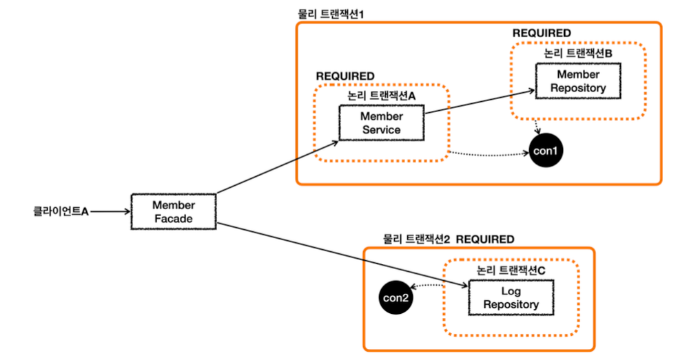

# REQUIRES_NEW 대신 단순한 방법을 지향하라

- 물리 트랜잭션을 REQUIRED로 나누는 방법으로 구조를 변경해보자
- **REQUIRES_NEW를 쓰게 되면 HTTP 커넥션 하나에 동시에 2개의 DB 커넥션을 사용하게 된다.**
- 위 구조로 바꾸면 1개의 HTTP 요청에 2개의 DB 커넥션을 사용하지는 않는다. 
  - **순차적으로 사용하고, 반환하는 장점이 있다!**
- 물론 구조상 REQUIRES_NEW를 사용하는 것이 더 깔끔할 수도 있으므로 장단점 이해하고 트레이드 오프를 잘 따져서 사용하자.
