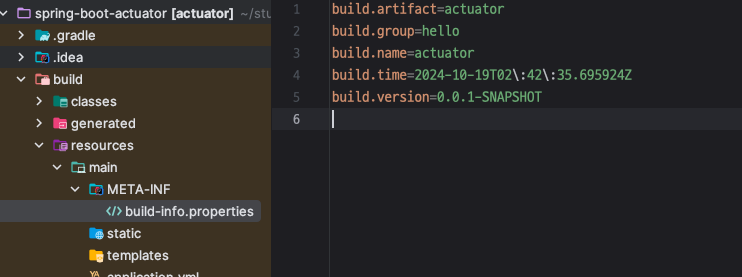
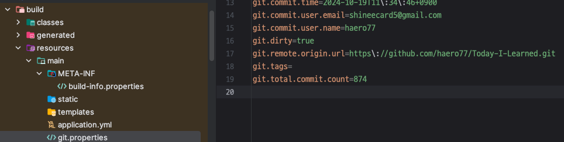

<!-- TOC -->
* [다양한 엔드 포인트](#다양한-엔드-포인트)
<!-- TOC -->

# 다양한 엔드 포인트

> 전체 엔드포인트 목록 <br>
> https://docs.spring.io/spring-boot/docs/current/reference/html/actuator.html#actuator.endpoints

## 엔드 포인트 목록

- `beans` : 스프링 컨테이너에 등록된 스프링 빈을 보여준다.
- `conditions` : `condition` 을 통해서 빈을 등록할 때 평가 조건과 일치하거나 일치하지 않는 이유를 표- 시한다.
- `configprops` : `@ConfigurationProperties` 를 보여준다.
- `env` : `Environment` 정보를 보여준다.
- `health` : 애플리케이션 헬스 정보를 보여준다.
- `httpexchanges` : HTTP 호출 응답 정보를 보여준다. `HttpExchangeRepository` 를 구현한 빈을 별
- 도로 등록해야 한다.
- `info` : 애플리케이션 정보를 보여준다.
- `loggers` : 애플리케이션 로거 설정을 보여주고 변경도 할 수 있다.
- `metrics` : 애플리케이션의 메트릭 정보를 보여준다.
- `mappings` : `@RequestMapping` 정보를 보여준다.
- `threaddump` : 쓰레드 덤프를 실행해서 보여준다.
- `shutdown` : 애플리케이션을 종료한다. 이 기능은 **기본으로 비활성화** 되어 있다.

---

# 헬스 정보

> 자세한 헬스 기본 정보
> https://docs.spring.io/spring-boot/docs/current/reference/html/actuator.html#actuator.endpoints.health.auto-configured-health-indicators


- 헬스 정보를 사용하면 애플리케이션에 문제가 발생했을 때 문제를 빠르게 인지 가능
- `http://localhost:8080/actuator/health`

```json
# 기본 리턴 정보
{"status": "UP"}
```

## 자세한 헬스 정보

```yaml
 management:
   endpoint:
     health:
      show-details: always
```
```json
{
    "status": "UP",
    "components": {
        "db": {
            "status": "UP",
            "details": {
                "database": "H2",
                "validationQuery": "isValid()"
            }
        },
        "diskSpace": {
            "status": "UP",
            "details": {
                "total": 494384795648,
                "free": 233289097216,
                "threshold": 10485760,
                "path": "/Users/shkim/study/Today-I-Learned/Spring/projects/kimyounghan/spring-boot/spring-boot-actuator/.",
                "exists": true
            }
        },
        "ping": {
            "status": "UP"
        }
    }
}
```

- validationQuery: JDBC 드라이버에서 DB 살아있는지 확인하는 기능

### 너무 상세한 정보는 부담스러울 경우
  
```yaml
 management:
   endpoint:
     health:
      show-components: always
```
```json
{
    "status": "UP",
    "components": {
        "db": {
            "status": "UP"
        },
        "diskSpace": {
            "status": "UP"
        },
        "ping": {
            "status": "UP"
        }
    }
}
```

# 애플리케이션 정보

## 기본 제공 정보

- `java` : 자바 런타임 정보
- `os` : OS 정보
- `env` : `Environment` 에서 `info.` 로 시작하는 정보
- `build` : 빌드 정보, `META-INF/build-info.properties` 파일이 필요하다. 
- `git` : `git` 정보, `git.properties` 파일이 필요하다.

---

`env` , `java` , `os` 는 기본으로 비활성화 되어 있고,<br>
`build`, `git` 도 사용하려면  별도의 설정 필요.

## Java, OS 정보

```yaml
management:
  info:
    java:
      enabled: true
    os:
      enabled: true
```

```json
{
    "java": {
        "version": "17.0.3",
        "vendor": {
            "name": "JetBrains s.r.o.",
            "version": "JBR-17.0.3+7-469.37-jcef"
        },
        "runtime": {
            "name": "OpenJDK Runtime Environment",
            "version": "17.0.3+7-b469.37"
        },
        "jvm": {
            "name": "OpenJDK 64-Bit Server VM",
            "vendor": "JetBrains s.r.o.",
            "version": "17.0.3+7-b469.37"
        }
    },
    "os": {
        "name": "Mac OS X",
        "version": "12.5.1",
        "arch": "aarch64"
    }
}
```

## env 정보

```yaml
management:
   info:
     env:
       enabled: true
       
info: 
  app:
    name: hello-actuator
    company: yh
```

```json
{
    "app": {
       "name":"hello-actuator",
       "company":"yh"
    }
...
}
```

- `application.yml` 에서 `info` 로 시작하는 부분의 정보가 노출되는 것을 가능

## 빌드 정보

```java
// build.gradle
springBoot {
    buildInfo() // `build/resources/main/META-INF/build-info.properties` 생성
}
```



- `build.gradle`에 `buildInfo()` 추가하면 빌드 시 `build/resources/main/META-INF/build-info.properties`가 생긴다.

### 실행 결과

- `GET http://localhost:8080/actuator/info`

```json
{
    "build": {
        "artifact": "actuator",
        "name": "actuator",
        "time": "2024-10-19T02:42:35.695Z",
        "version": "0.0.1-SNAPSHOT",
        "group": "hello"
    },
    ...
}
```

## Git 정보

- 애플리케이션을 배포할 때 가끔 기대와 전혀 다르게 동작할 때가 있는데,(특정 기능이 빠져있다던가) 
  - 확인해보면 다른 커밋이나 다른 브랜치의 내용이 배포된 경우가 종종 있다. 이럴 때 꽤 도움 됨.

```java
// build.gradle
plugins {
    id "com.gorylenko.gradle-git-properties" version "2.4.1" // git info 추가 
}
```

- plugin에 위 정보 추가하면 `build/resources/main/git.properties` 생성됨.



### 실행 결과

- `GET http://localhost:8080/actuator/info`

```json
{
    "git": {
        "branch": "ver2",
        "commit": {
            "id": "afbebf8",
            "time": "2024-10-19T02:34:46Z"
        }
    },
    ...
}
```
