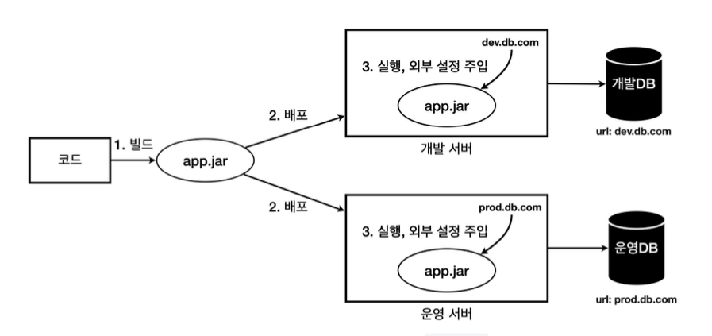

<!-- TOC -->
* [1. 외부 설정이란?](#1-외부-설정이란)
  * [빌드를 여러번 하는 방식](#빌드를-여러번-하는-방식)
  * [빌드를 한 번만 하고 환경에 맞춰 외부 설정값을 주입하는 방식](#빌드를-한-번만-하고-환경에-맞춰-외부-설정값을-주입하는-방식)
  * [👨🏻‍🏫 변하는 것과 변하지 않는 것을 구분하는 것이 중요하다.](#-변하는-것과-변하지-않는-것을-구분하는-것이-중요하다-)
  * [외부 설정의 4가지 방법](#외부-설정의-4가지-방법)
* [2. 외부 설정 - OS 환경 변수](#2-외부-설정---os-환경-변수)
* [3.](#3-)
<!-- TOC -->

# 1. 외부 설정이란?

## 빌드를 여러번 하는 방식

## 빌드를 한 번만 하고 환경에 맞춰 외부 설정값을 주입하는 방식

## 👨🏻‍🏫 변하는 것과 변하지 않는 것을 구분하는 것이 중요하다. 

- 유지보수하기 좋은 애플리케이션 개발의 가장 기본 원칙은 **변하는 것과 변하지 않는 것을 분리하는 것.**
- 변하는 것
  - 외부 설정값 - 환경에 따라 변함
- 변하지 않는 것
  - 코드와 빌드 결과물
    - (_빌드 시점에 코드가 바뀌진 않으니까_)

## 외부 설정의 4가지 방법

1. OS 환경 변수
2. 자바 시스템 속성
3. 자바 커맨드 라인 인수
4. 외부 파일(설정 데이터)

 

# 2. 외부 설정 - OS 환경 변수

# 3. 