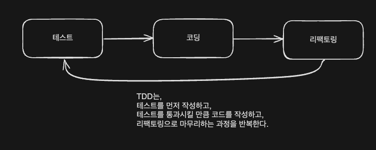

<!-- TOC -->
* [TDD 흐름](#tdd-흐름)
* [테스트가 개발을 주도](#테스트가-개발을-주도)
* [지속적인 코드 정리](#지속적인-코드-정리)
  * [과감한 리팩토링](#과감한-리팩토링)
* [빠른 피드백](#빠른-피드백)
<!-- TOC -->

# TDD 흐름

- TDD는 기능을 검증하는 테스트를 먼저 작성.
- 작성한 테스트를 통과하지 못하면, **_통과할 만큼만 코드 작성._**
- 통과 뒤 개선할 코드가 있으면 리팩토링.
  - 리팩토링 수행 후에는 테스트를 재실행해서 기존 기능이 망가지지 않았는지 확인
- 위 과정을 반복하면서 점진적으로 기능을 완성해나가는 것이 전형적인 TDD의 흐름.

> 위 TDD 사이클을 레드-그린-리팩터 라고도 한다.

--- 

# 테스트가 개발을 주도

- **_구현 시, 아직 추가하지 않은 테스트를 고려해서 구현하지 않았다._**
- 테스트 코드를 만들면 다음 개발 범위가 정해지고,
  - 테스트 코드가 추가되면서 검증 범위가 넓어질수록 구현도 점차 완성되어간다.
  - 👉 이런 방식으로 **_테스트가 개발을 주도해나간다._

---

# 지속적인 코드 정리

- 구현을 완료한 뒤에는 리팩토링을 진행했다.
- 리팩토링 대상 또는 리팩토링 방법이 당장 떠오르지 않으면, 다음 테스트를 진행했다.
- **테스트 코드 역시 리팩토링 대상에 넣었다**.

## 과감한 리팩토링

- 테스트 코드가 있으면 리팩토링을 보다 과감하게 진행할 수 있다.
- 기존에 잘 동작하는 코드를 수정하는 것은 심리적인 불안감을 초래하고,
  - **_이는 곧 수정 자체를 꺼리게 된다._**
- 테스트를 통해 심리적 불안감을 줄이고, 리팩토링을 통해 품질 좋은 코드로 계속 탈바꿈해간다.
  - TDD는 개발 과정에서 지속적으로 코드 정리를 하므로, 코드 품질이 급격히 나빠지는 것을 방지.
    - 👉 유지보수 비용 감소에 기여

---

# 빠른 피드백

- TDD를 통해 코드 수정에 대한 빠른 피드백이 가능.
- 새로운 코드 추가나 기존 코드 수정 시 테스트를 돌려서 추가/수정된 코드가 올바른지 바로 확인 가능
  - 👉 **_잘못된 코드가 배포되는 것을 방지_**